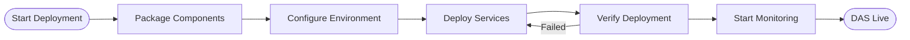

# Building DAS (Digital Assistance System) with BPMN Processes

## Overview

This document outlines how to build DAS (Digital Assistance System) - the ambient intelligence core of KnowOS - using BPMN processes. Following KnowOS philosophy, we'll model the entire DAS construction as a series of orchestrated BPMN workflows that can be executed by PDOs and TDEs.

## Master DAS Construction Process


## Process 1: DAS Architecture Planning Process

**Purpose**: Define the DAS architecture and component relationships

**Process Definition**:
```xml
<?xml version="1.0" encoding="UTF-8"?>
<bpmn:definitions xmlns:bpmn="http://www.omg.org/spec/BPMN/20100524/MODEL">
  <bpmn:process id="DAS_Architecture_Planning" name="DAS Architecture Planning Process">
    
    <bpmn:startEvent id="StartPlanning" name="Start DAS Planning"/>
    
    <bpmn:task id="AnalyzeRequirements" name="Analyze DAS Requirements">
      <bpmn:documentation>
        TDE Task: Use LLM to analyze KnowOS requirements and define DAS capabilities
        - Vector store requirements (embeddings, search, storage)
        - Graph database needs (relationships, schema flexibility)
        - Learning system specifications (feedback loops, model updates)
        - Monitoring requirements (process tracking, performance metrics)
      </bpmn:documentation>
    </bpmn:task>
    
    <bpmn:task id="DesignComponents" name="Design DAS Components">
      <bpmn:documentation>
        TDE Task: Create detailed component specifications
        - Define interfaces between components
        - Specify data flow patterns
        - Design error handling strategies
        - Plan scalability architecture
      </bpmn:documentation>
    </bpmn:task>
    
    <bpmn:task id="CreateDeploymentPlan" name="Create Deployment Plan">
      <bpmn:documentation>
        TDE Task: Generate deployment strategy
        - Container orchestration plan
        - Environment configuration
        - Security requirements
        - Monitoring and alerting setup
      </bpmn:documentation>
    </bpmn:task>
    
    <bpmn:endEvent id="PlanningComplete" name="Architecture Plan Ready"/>
    
    <!-- Sequence flows -->
    <bpmn:sequenceFlow sourceRef="StartPlanning" targetRef="AnalyzeRequirements"/>
    <bpmn:sequenceFlow sourceRef="AnalyzeRequirements" targetRef="DesignComponents"/>
    <bpmn:sequenceFlow sourceRef="DesignComponents" targetRef="CreateDeploymentPlan"/>
    <bpmn:sequenceFlow sourceRef="CreateDeploymentPlan" targetRef="PlanningComplete"/>
    
  </bpmn:process>
</bpmn:definitions>
```

**TDE Execution Notes**:
- **Requirements Analysis TDE**: Uses LLM to parse KnowOS specification and extract DAS requirements
- **Component Design TDE**: Creates detailed technical specifications using engineering prompts
- **Deployment Planning TDE**: Generates infrastructure-as-code templates and deployment scripts

## Process 2: Vector Store Setup Process

**Purpose**: Initialize and configure the vector database for semantic search and context storage


**Key Tasks**:
1. **Vector DB Selection TDE**: Analyzes requirements and selects appropriate vector database
2. **Schema Creation TDE**: Designs vector schema for different data types (processes, contexts, learnings)
3. **Index Configuration TDE**: Optimizes search indices for performance
4. **Data Seeding TDE**: Loads initial BPMN process library and foundational knowledge

## Process 3: Graph Database Setup Process

**Purpose**: Establish knowledge graph for relationship tracking and inference


**Schema Design**:
```cypher
// Example Node Types
CREATE CONSTRAINT ON (p:Process) ASSERT p.id IS UNIQUE;
CREATE CONSTRAINT ON (t:Task) ASSERT t.id IS UNIQUE;
CREATE CONSTRAINT ON (u:User) ASSERT u.id IS UNIQUE;
CREATE CONSTRAINT ON (d:Domain) ASSERT d.name IS UNIQUE;

// Example Relationships
(:Process)-[:CONTAINS]->(:Task)
(:Process)-[:BELONGS_TO]->(:Domain)
(:Task)-[:USES]->(:Tool)
(:User)-[:CREATED]->(:Process)
(:Process)-[:SIMILAR_TO]->(:Process)
```

## Process 4: Core DAS Engine Process

**Purpose**: Build the central DAS orchestration engine


**Core Engine Components**:

### Event Loop TDE
```python
# Pseudo-code for Event Loop TDE
class EventLoopTDE:
    def execute(self):
        while True:
            events = self.poll_events()
            for event in events:
                self.route_to_processor(event)
            self.sleep(100)  # 100ms polling
```

### Context Analyzer TDE
- **Purpose**: Analyzes incoming contexts and extracts actionable insights
- **LLM Prompt**: "Analyze this context and identify: 1) User intent, 2) Required processes, 3) Missing information"

### Process Generator TDE
- **Purpose**: Creates new BPMN processes based on user input or system needs
- **LLM Prompt**: "Generate a BPMN process for: {user_request}. Include proper task definitions, error handling, and success criteria."

## Process 5: Learning System Process

**Purpose**: Implement continuous learning and improvement capabilities


**Learning Components**:

### Pattern Analyzer TDE
```xml
<bpmn:task id="PatternAnalysis" name="Analyze Usage Patterns">
  <bpmn:documentation>
    Analyze process execution patterns to identify:
    - Frequently used process combinations
    - Common failure points
    - Optimization opportunities
    - User behavior patterns
  </bpmn:documentation>
</bpmn:task>
```

### Knowledge Updater TDE
- Updates vector embeddings based on new learnings
- Updates graph relationships based on usage patterns
- Maintains knowledge freshness and relevance

## Process 6: Monitoring System Process

**Purpose**: Implement comprehensive monitoring and alerting


**Monitoring Targets**:
- Process execution success rates
- TDE performance metrics
- Vector store query performance
- Graph database query performance
- System resource usage
- User satisfaction indicators

## Process 7: Process Generation Process

**Purpose**: Implement the core capability to generate new BPMN processes


**Generation TDE Example**:
```python
class ProcessGeneratorTDE:
    def execute(self, user_request):
        # 1. Parse user request
        intent = self.llm_parse_intent(user_request)
        
        # 2. Search for similar processes
        similar = self.vector_search(intent)
        
        # 3. Generate new process
        bpmn_xml = self.llm_generate_bpmn(intent, similar)
        
        # 4. Validate and store
        if self.validate_bpmn(bpmn_xml):
            return self.store_process(bpmn_xml)
        else:
            return self.retry_generation(intent)
```

## Process 8: DAS API Layer Process

**Purpose**: Expose DAS capabilities through well-defined APIs


**API Endpoints**:
```yaml
# DAS API Specification
/api/v1/das/generate-process:
  post:
    summary: Generate new BPMN process
    parameters:
      - description: Natural language process description
    responses:
      200: Generated BPMN XML

/api/v1/das/analyze-context:
  post:
    summary: Analyze context and suggest actions
    
/api/v1/das/search-knowledge:
  get:
    summary: Search vector store and graph database
```

## Process 9: DAS Testing Process

**Purpose**: Comprehensive testing of all DAS components


**Test Scenarios**:
- Process generation accuracy
- Vector search performance
- Graph query correctness
- Learning system effectiveness
- API response times
- System scalability

## Process 10: DAS Deployment Process

**Purpose**: Deploy DAS to production environment



**Deployment Components**:
- Docker containers for each DAS component
- Kubernetes manifests for orchestration
- Configuration management
- Secret management
- Service mesh configuration
- Monitoring and alerting setup

## Implementation Timeline

| Week | Processes to Implement |
|------|----------------------|
| 1 | Architecture Planning, Vector Store Setup |
| 2 | Graph Database Setup, Core Engine (basic) |
| 3 | Learning System, Monitoring System |
| 4 | Process Generation, API Layer |
| 5 | Testing, Deployment |
| 6 | Integration and optimization |
| 7 | Production deployment and validation |

## Success Metrics

- **Process Generation**: 90% of generated processes are valid BPMN
- **Learning**: System improves process suggestions over time
- **Performance**: Sub-second response times for common operations
- **Reliability**: 99.9% uptime for core DAS services
- **User Satisfaction**: Users can successfully create processes without coding

## Conclusion

By modeling DAS construction as BPMN processes, we follow KnowOS's core principle that "everything is a process." This approach ensures that:

1. **The construction is documentable and repeatable**
2. **Each step can be executed by TDEs with intelligent decision-making**
3. **The build process itself becomes part of the knowledge base**
4. **Future improvements to DAS can follow the same pattern**

This meta-approach - using BPMN processes to build the system that generates BPMN processes - exemplifies the recursive, self-improving nature of KnowOS.
