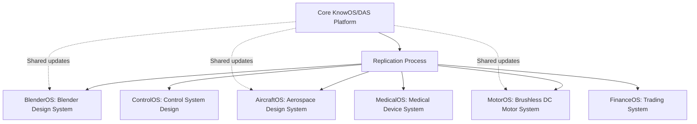
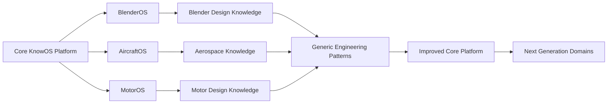
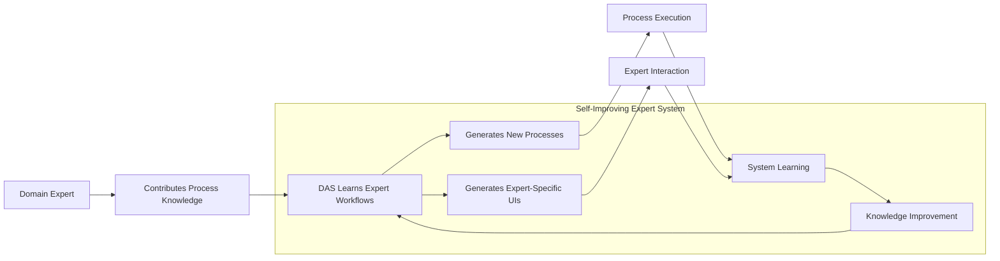

# Building DAS (Digital Assistance System) with BPMN Processes - Version 2

## The Recursion Problem

Let's be honest: **Building a system that creates processes using processes is mind-bending**. But here's the thing - once you crack it, everything becomes possible. The challenge isn't technical complexity, it's conceptual.

**The Core Challenge**: How do you bootstrap a self-creating system without hard-coding everything?

**The Answer**: You start with ONE hand-crafted BPMN process that can create other BPMN processes, BUT you front-load it with extensive a priori knowledge so it doesn't start from zero.

## The Enhanced Bootstrap Strategy

Think of it like teaching someone to teach, but first giving them a university education:

1. **Pre-load DAS with extensive knowledge** (hundreds of BPMN examples, patterns, domain knowledge)
2. **Manually create the first "teacher process"** (the DAS Core Generator)
3. **Give it the ability to create other processes** using its pre-loaded knowledge
4. **Let it learn and improve its own process creation**
5. **Eventually, it redesigns itself**


## A Priori Knowledge: Pre-Loading DAS Intelligence

**Critical insight**: We don't start from zero! DAS should be pre-loaded with extensive knowledge to make bootstrap much easier and more successful.

### Pre-Load Strategy: Give DAS a "University Education"

Instead of DAS learning everything from scratch, we front-load it with:


### 1. BPMN Process Library (Vector Store)

**Pre-load hundreds of working BPMN processes:**

#### File Operations Library
```xml
<!-- File Creation Process -->
<bpmn:process id="create_file_v1" name="Create File Process">
  <bpmn:startEvent id="start"/>
  <bpmn:task id="validate_path" name="Validate File Path"/>
  <bpmn:task id="check_permissions" name="Check Write Permissions"/>
  <bpmn:task id="write_file" name="Write File Content"/>
  <bpmn:task id="verify_creation" name="Verify File Created"/>
  <bpmn:endEvent id="end"/>
</bpmn:process>

<!-- File Reading Process -->
<bpmn:process id="read_file_v1" name="Read File Process">
  <bpmn:startEvent id="start"/>
  <bpmn:task id="validate_path" name="Validate File Path"/>
  <bpmn:task id="check_exists" name="Check File Exists"/>
  <bpmn:task id="read_content" name="Read File Content"/>
  <bpmn:task id="parse_content" name="Parse Content"/>
  <bpmn:endEvent id="end"/>
</bpmn:process>

<!-- File Update Process -->
<bpmn:process id="update_file_v1" name="Update File Process">
  <bpmn:startEvent id="start"/>
  <bpmn:task id="validate_path" name="Validate File Path"/>
  <bpmn:task id="backup_original" name="Backup Original"/>
  <bpmn:task id="update_content" name="Update Content"/>
  <bpmn:task id="verify_update" name="Verify Update"/>
  <bpmn:endEvent id="end"/>
</bpmn:process>
```

#### Data Processing Library
```xml
<!-- CSV Processing Process -->
<bpmn:process id="process_csv_v1" name="Process CSV Data">
  <bpmn:startEvent id="start"/>
  <bpmn:task id="load_csv" name="Load CSV File"/>
  <bpmn:task id="validate_schema" name="Validate Data Schema"/>
  <bpmn:task id="clean_data" name="Clean Data"/>
  <bpmn:task id="transform_data" name="Transform Data"/>
  <bpmn:task id="export_results" name="Export Results"/>
  <bpmn:endEvent id="end"/>
</bpmn:process>

<!-- JSON Processing Process -->
<bpmn:process id="process_json_v1" name="Process JSON Data">
  <bpmn:startEvent id="start"/>
  <bpmn:task id="load_json" name="Load JSON File"/>
  <bpmn:task id="validate_structure" name="Validate JSON Structure"/>
  <bpmn:task id="extract_data" name="Extract Required Data"/>
  <bpmn:task id="process_data" name="Process Data"/>
  <bpmn:task id="output_results" name="Output Results"/>
  <bpmn:endEvent id="end"/>
</bpmn:process>
```

#### API Integration Library
```xml
<!-- HTTP Request Process -->
<bpmn:process id="http_request_v1" name="HTTP Request Process">
  <bpmn:startEvent id="start"/>
  <bpmn:task id="prepare_request" name="Prepare Request"/>
  <bpmn:task id="send_request" name="Send HTTP Request"/>
  <bpmn:task id="handle_response" name="Handle Response"/>
  <bpmn:task id="parse_response" name="Parse Response Data"/>
  <bpmn:task id="error_handling" name="Handle Errors"/>
  <bpmn:endEvent id="end"/>
</bpmn:process>

<!-- API Authentication Process -->
<bpmn:process id="api_auth_v1" name="API Authentication Process">
  <bpmn:startEvent id="start"/>
  <bpmn:task id="get_credentials" name="Get API Credentials"/>
  <bpmn:task id="authenticate" name="Authenticate with API"/>
  <bpmn:task id="get_token" name="Get Access Token"/>
  <bpmn:task id="validate_token" name="Validate Token"/>
  <bpmn:endEvent id="end"/>
</bpmn:process>
```

### 2. Design Patterns Library (Vector Store)

**Pre-load proven BPMN design patterns:**

#### Error Handling Patterns
```xml
<!-- Standard Error Handling Pattern -->
<bpmn:subProcess id="error_handler_pattern" name="Error Handler Pattern">
  <bpmn:startEvent id="error_start"/>
  <bpmn:task id="detect_error" name="Detect Error"/>
  <bpmn:exclusiveGateway id="error_type" name="Error Type?"/>
  <bpmn:task id="retry_operation" name="Retry Operation"/>
  <bpmn:task id="fallback_operation" name="Fallback Operation"/>
  <bpmn:task id="log_error" name="Log Error"/>
  <bpmn:task id="notify_user" name="Notify User"/>
  <bpmn:endEvent id="error_end"/>
</bpmn:subProcess>

<!-- Retry Pattern -->
<bpmn:subProcess id="retry_pattern" name="Retry Pattern">
  <bpmn:startEvent id="retry_start"/>
  <bpmn:task id="attempt_operation" name="Attempt Operation"/>
  <bpmn:exclusiveGateway id="success_check" name="Success?"/>
  <bpmn:task id="increment_counter" name="Increment Retry Counter"/>
  <bpmn:exclusiveGateway id="max_retries" name="Max Retries Reached?"/>
  <bpmn:endEvent id="retry_success"/>
  <bpmn:endEvent id="retry_failed"/>
</bpmn:subProcess>
```

#### Validation Patterns
```xml
<!-- Input Validation Pattern -->
<bpmn:subProcess id="validation_pattern" name="Input Validation Pattern">
  <bpmn:startEvent id="validation_start"/>
  <bpmn:task id="check_required" name="Check Required Fields"/>
  <bpmn:task id="validate_format" name="Validate Format"/>
  <bpmn:task id="check_constraints" name="Check Business Constraints"/>
  <bpmn:task id="sanitize_input" name="Sanitize Input"/>
  <bpmn:exclusiveGateway id="valid_input" name="Valid Input?"/>
  <bpmn:endEvent id="validation_success"/>
  <bpmn:endEvent id="validation_failed"/>
</bpmn:subProcess>
```

#### Parallel Processing Patterns
```xml
<!-- Parallel Task Pattern -->
<bpmn:process id="parallel_pattern" name="Parallel Processing Pattern">
  <bpmn:startEvent id="parallel_start"/>
  <bpmn:parallelGateway id="split_tasks" name="Split Tasks"/>
  <bpmn:task id="task_a" name="Task A"/>
  <bpmn:task id="task_b" name="Task B"/>
  <bpmn:task id="task_c" name="Task C"/>
  <bpmn:parallelGateway id="join_tasks" name="Join Tasks"/>
  <bpmn:task id="consolidate_results" name="Consolidate Results"/>
  <bpmn:endEvent id="parallel_end"/>
</bpmn:process>
```

### 3. Working Examples Library (Vector Store)

**Pre-load complete, tested examples with natural language descriptions:**

**Key Insight**: These natural language descriptions are perfect for a priori knowledge because:
- **Non-technical users can contribute** - Domain experts can describe their processes without knowing BPMN
- **Much easier to create** - Writing plain English is simpler than creating BPMN XML
- **Still valuable for DAS** - LLMs can understand these descriptions and use them as templates
- **Scalable knowledge collection** - Domain experts from different fields can contribute their process knowledge
- **Democratizes process creation** - A trader, engineer, or doctor can describe their workflows and DAS generates the BPMN

**Collaborative Knowledge Building Strategy**:
- **Technical users** contribute actual BPMN processes and patterns
- **Business users** contribute natural language process descriptions  
- **Domain experts** write pseudo-code workflows for their specialties
- **DAS learns from all formats** and can generate BPMN from any of these inputs

#### Business Process Examples
```yaml
customer_order_processing:
  description: "Complete customer order fulfillment workflow"
  natural_language: "Process customer orders from receipt to delivery"
  steps:
    - "Receive customer order"
    - "Validate order details and inventory"
    - "Process payment authorization"
    - "Reserve inventory items"
    - "Generate shipping labels"
    - "Package and ship items"
    - "Send confirmation to customer"
    - "Update order status"

data_analysis_workflow:
  description: "End-to-end data analysis and reporting"
  natural_language: "Analyze data and generate business insights"
  steps:
    - "Load data from multiple sources"
    - "Clean and validate data quality"
    - "Apply statistical analysis"
    - "Identify patterns and trends"
    - "Generate visualizations"
    - "Create executive summary"
    - "Distribute report to stakeholders"

system_monitoring_process:
  description: "Automated system health monitoring"
  natural_language: "Monitor system health and alert on issues"
  steps:
    - "Check system health metrics"
    - "Monitor resource utilization"
    - "Detect performance anomalies"
    - "Classify issue severity"
    - "Alert appropriate personnel"
    - "Log incidents for analysis"
    - "Generate status reports"
```

#### Technical Process Examples
```yaml
machine_learning_pipeline:
  description: "Complete ML model development pipeline"
  natural_language: "Train and deploy machine learning models"
  steps:
    - "Load and explore training dataset"
    - "Preprocess and feature engineer data"
    - "Split data for training and validation"
    - "Train multiple model candidates"
    - "Evaluate and compare model performance"
    - "Select best performing model"
    - "Deploy model to production"
    - "Monitor model performance"

ci_cd_pipeline:
  description: "Continuous integration and deployment"
  natural_language: "Automatically build, test, and deploy code"
  steps:
    - "Pull latest code from repository"
    - "Run automated unit tests"
    - "Build application artifacts"
    - "Run integration tests"
    - "Deploy to staging environment"
    - "Run acceptance tests"
    - "Deploy to production"
    - "Monitor deployment health"

backup_process:
  description: "Automated data backup workflow"
  natural_language: "Create and verify system backups"
  steps:
    - "Identify critical data sources"
    - "Create incremental backups"
    - "Compress backup files"
    - "Upload to secure storage"
    - "Verify backup integrity"
    - "Clean up temporary files"
    - "Update backup logs"
    - "Generate backup reports"
```

### 4. Domain Knowledge Library (Vector Store)

**Pre-load domain-specific knowledge and patterns:**

#### Software Development Patterns
```yaml
common_patterns:
  crud_operations:
    name: "CRUD Operations"
    description: "Create, Read, Update, Delete data operations"
    typical_tasks: ["validate input", "perform operation", "return result", "handle errors"]
    common_variations: ["batch operations", "transactional operations", "async operations"]
  
  etl_process:
    name: "ETL Process" 
    description: "Extract, Transform, Load data pipeline"
    typical_tasks: ["extract data", "validate data", "transform data", "load data", "verify results"]
    common_variations: ["real-time ETL", "batch ETL", "streaming ETL"]
  
  request_response:
    name: "Request-Response Pattern"
    description: "Handle incoming requests and generate responses"
    typical_tasks: ["receive request", "validate request", "process request", "generate response", "send response"]
    common_variations: ["async responses", "batch requests", "streaming responses"]
```

#### Business Process Patterns
```yaml
business_patterns:
  approval_workflow:
    name: "Approval Workflow"
    description: "Multi-stage approval process"
    typical_tasks: ["submit request", "route for review", "collect approvals", "make decision", "notify stakeholders"]
    common_variations: ["parallel approvals", "conditional approvals", "escalation workflows"]
    
  order_fulfillment:
    name: "Order Fulfillment"
    description: "Customer order processing workflow"
    typical_tasks: ["receive order", "validate order", "process payment", "fulfill order", "deliver product"]
    common_variations: ["digital products", "physical products", "subscription orders"]
  
  incident_management:
    name: "Incident Management"
    description: "Handle system incidents and outages"
    typical_tasks: ["detect incident", "classify severity", "assign resources", "resolve issue", "conduct review"]
    common_variations: ["automated resolution", "escalation procedures", "major incident procedures"]
```

### 5. Process Relationships (Graph Database)

**Pre-load known relationships between processes:**

```cypher
// Process similarity relationships
CREATE (file_create:Process {name: "Create File", category: "file_ops"})
CREATE (file_write:Process {name: "Write File", category: "file_ops"})
CREATE (file_update:Process {name: "Update File", category: "file_ops"})
CREATE (file_create)-[:SIMILAR_TO {weight: 0.8}]->(file_write)
CREATE (file_create)-[:SIMILAR_TO {weight: 0.7}]->(file_update)

// Process composition relationships  
CREATE (etl:Process {name: "ETL Pipeline", category: "data_processing"})
CREATE (extract:Process {name: "Extract Data", category: "data_processing"})
CREATE (transform:Process {name: "Transform Data", category: "data_processing"})
CREATE (load:Process {name: "Load Data", category: "data_processing"})
CREATE (etl)-[:CONTAINS]->(extract)
CREATE (etl)-[:CONTAINS]->(transform)
CREATE (etl)-[:CONTAINS]->(load)

// Task dependencies
CREATE (extract)-[:PRECEDES]->(transform)
CREATE (transform)-[:PRECEDES]->(load)

// Pattern relationships
CREATE (validation:Pattern {name: "Input Validation"})
CREATE (error_handling:Pattern {name: "Error Handling"})
CREATE (retry:Pattern {name: "Retry Logic"})
CREATE (file_create)-[:USES_PATTERN]->(validation)
CREATE (file_create)-[:USES_PATTERN]->(error_handling)
CREATE (extract)-[:USES_PATTERN]->(retry)

// Domain relationships
CREATE (software_dev:Domain {name: "Software Development"})
CREATE (data_ops:Domain {name: "Data Operations"})
CREATE (business:Domain {name: "Business Process"})
CREATE (file_create)-[:BELONGS_TO]->(software_dev)
CREATE (etl)-[:BELONGS_TO]->(data_ops)
CREATE (order_fulfillment:Process)-[:BELONGS_TO]->(business)
```

### 6. Generation Templates (Vector Store)

**Pre-load process generation templates:**

```yaml
file_operation_template:
  pattern: |
    <bpmn:process id="{process_id}" name="{process_name}">
      <bpmn:startEvent id="start" name="Start"/>
      <bpmn:task id="validate_{operation}" name="Validate {Operation} Request"/>
      <bpmn:task id="check_permissions" name="Check Permissions"/>
      <bpmn:exclusiveGateway id="permission_check" name="Authorized?"/>
      <bpmn:task id="perform_{operation}" name="Perform {Operation}"/>
      <bpmn:task id="verify_{operation}" name="Verify {Operation} Success"/>
      <bpmn:task id="log_operation" name="Log Operation"/>
      <bpmn:endEvent id="end" name="End"/>
      <bpmn:endEvent id="error_end" name="Error End"/>
    </bpmn:process>
  applicable_to: ["file creation", "file reading", "file updating", "file deletion"]
  
data_processing_template:
  pattern: |
    <bpmn:process id="{process_id}" name="{process_name}">
      <bpmn:startEvent id="start" name="Start"/>
      <bpmn:task id="load_data" name="Load {DataType} Data"/>
      <bpmn:task id="validate_data" name="Validate Data Quality"/>
      <bpmn:exclusiveGateway id="data_valid" name="Data Valid?"/>
      <bpmn:task id="process_data" name="Process Data"/>
      <bpmn:task id="validate_results" name="Validate Results"/>
      <bpmn:task id="export_results" name="Export Results"/>
      <bpmn:endEvent id="end" name="End"/>
      <bpmn:endEvent id="error_end" name="Error End"/>
    </bpmn:process>
  applicable_to: ["csv processing", "json processing", "xml processing", "data transformation"]

api_integration_template:
  pattern: |
    <bpmn:process id="{process_id}" name="{process_name}">
      <bpmn:startEvent id="start" name="Start"/>
      <bpmn:task id="prepare_request" name="Prepare API Request"/>
      <bpmn:task id="authenticate" name="Authenticate"/>
      <bpmn:task id="send_request" name="Send {RequestType} Request"/>
      <bpmn:task id="handle_response" name="Handle API Response"/>
      <bpmn:exclusiveGateway id="response_ok" name="Response OK?"/>
      <bpmn:task id="parse_response" name="Parse Response Data"/>
      <bpmn:task id="return_data" name="Return Processed Data"/>
      <bpmn:endEvent id="end" name="End"/>
      <bpmn:endEvent id="error_end" name="Error End"/>
    </bpmn:process>
  applicable_to: ["api calls", "web requests", "service integration", "data fetching"]
```

### 7. LLM Prompt Templates (Vector Store)

**Pre-load optimized prompts for process generation:**

```yaml
bpmn_generation_prompt:
  template: |
    You are a BPMN process generator with extensive knowledge of business processes and software workflows.
    
    Create a valid BPMN process for: "{user_request}"
    
    Context from similar processes:
    {similar_processes}
    
    Applicable templates:
    {applicable_templates}
    
    Requirements:
    1. Include proper start and end events with meaningful names
    2. Add input validation and error handling tasks
    3. Use descriptive, action-oriented task names
    4. Include necessary gateways for decision points
    5. Add logging and verification steps where appropriate
    6. Ensure the process is complete and executable
    7. Follow BPMN 2.0 XML standards
    
    Return only valid BPMN XML without additional explanation.

task_analysis_prompt:
  template: |
    Analyze this user request for process creation: "{user_request}"
    
    Based on the process library knowledge, identify:
    
    1. PROCESS TYPE (select one):
       - file_operation, data_processing, api_integration, workflow_orchestration, monitoring, other
    
    2. MAIN OPERATION:
       - What is the primary action to be performed?
    
    3. REQUIRED INPUTS:
       - What data/parameters does this process need?
    
    4. EXPECTED OUTPUTS:
       - What should this process produce/return?
    
    5. VALIDATION STEPS:
       - What validations are necessary?
    
    6. ERROR CONDITIONS:
       - What could go wrong and how to handle it?
    
    7. SIMILAR PROCESSES:
       - Which existing processes are most similar?
    
    Return structured analysis in JSON format.

pattern_selection_prompt:
  template: |
    Given this process requirement: "{user_request}"
    And this analysis: {process_analysis}
    
    Select the most appropriate patterns from:
    {available_patterns}
    
    Consider:
    1. Which patterns best fit the process type?
    2. What error handling is needed?
    3. Are there validation requirements?
    4. Is parallel processing beneficial?
    5. What logging/monitoring is needed?
    
    Return selected patterns with justification.
```

### 8. The Enhanced DAS Core Generator

**Now with access to all this a priori knowledge:**

```xml
<?xml version="1.0" encoding="UTF-8"?>
<bpmn:definitions xmlns:bpmn="http://www.omg.org/spec/BPMN/20100524/MODEL">
  <bpmn:process id="DAS_Core_Generator_V2" name="Enhanced DAS Core Process Generator">
    
    <bpmn:startEvent id="StartGenerator" name="Start Enhanced Generator"/>
    
    <bpmn:task id="ReceiveRequest" name="Receive Process Request">
      <bpmn:documentation>
        INPUT: Natural language description of needed process
        OUTPUT: Structured request object
        TDE: Uses LLM to parse user intent into actionable requirements
      </bpmn:documentation>
    </bpmn:task>
    
    <bpmn:task id="AnalyzeRequest" name="Analyze Request with A Priori Knowledge">
      <bpmn:documentation>
        INPUT: Structured request
        OUTPUT: Process analysis (type, patterns, similar processes)
        TDE: Uses pre-loaded domain knowledge to classify and analyze request
      </bpmn:documentation>
    </bpmn:task>
    
    <bpmn:task id="SearchSimilarProcesses" name="Search Similar Processes">
      <bpmn:documentation>
        INPUT: Process analysis
        OUTPUT: Ranked list of similar processes and examples
        TDE: Queries vector store for semantically similar processes
      </bpmn:documentation>
    </bpmn:task>
    
    <bpmn:task id="SelectPatterns" name="Select Applicable Patterns">
      <bpmn:documentation>
        INPUT: Process analysis + similar processes
        OUTPUT: Selected design patterns and templates
        TDE: Uses pattern library to select appropriate patterns
      </bpmn:documentation>
    </bpmn:task>
    
    <bpmn:task id="SelectTemplate" name="Select Generation Template">
      <bpmn:documentation>
        INPUT: Process analysis + selected patterns
        OUTPUT: Most appropriate generation template
        TDE: Chooses best template from pre-loaded template library
      </bpmn:documentation>
    </bpmn:task>
    
    <bpmn:task id="GenerateBPMN" name="Generate BPMN Process">
      <bpmn:documentation>
        INPUT: Template + patterns + similar processes + analysis
        OUTPUT: New BPMN XML
        TDE: Uses LLM with comprehensive context to generate process
      </bpmn:documentation>
    </bpmn:task>
    
    <bpmn:task id="ValidateProcess" name="Validate Generated Process">
      <bpmn:documentation>
        INPUT: BPMN XML
        OUTPUT: Validation results and quality score
        TDE: Validates syntax, completeness, and best practices
      </bpmn:documentation>
    </bpmn:task>
    
    <bpmn:exclusiveGateway id="ValidationGateway" name="Process Valid?"/>
    
    <bpmn:task id="RefineProcess" name="Refine Process">
      <bpmn:documentation>
        INPUT: Invalid BPMN + validation errors
        OUTPUT: Improvement suggestions
        TDE: Uses error patterns to suggest refinements
      </bpmn:documentation>
    </bpmn:task>
    
    <bpmn:task id="StoreProcess" name="Store Process in Knowledge Base">
      <bpmn:documentation>
        INPUT: Valid BPMN XML + metadata
        OUTPUT: Stored process with updated relationships
        TDE: Updates vector store, graph relationships, and pattern usage
      </bpmn:documentation>
    </bpmn:task>
    
    <bpmn:task id="ExecuteTest" name="Execute Test Run">
      <bpmn:documentation>
        INPUT: Stored process + test data
        OUTPUT: Execution results and performance metrics
        TDE: Runs process with test scenarios, measures success
      </bpmn:documentation>
    </bpmn:task>
    
    <bpmn:task id="UpdateKnowledge" name="Update Knowledge Base">
      <bpmn:documentation>
        INPUT: Execution results + process metadata
        OUTPUT: Enhanced knowledge base
        TDE: Updates pattern effectiveness, similarity weights, template success rates
      </bpmn:documentation>
    </bpmn:task>
    
    <bpmn:endEvent id="ProcessCreated" name="Enhanced Process Created"/>
    
    <!-- Sequence flows -->
    <bpmn:sequenceFlow sourceRef="StartGenerator" targetRef="ReceiveRequest"/>
    <bpmn:sequenceFlow sourceRef="ReceiveRequest" targetRef="AnalyzeRequest"/>
    <bpmn:sequenceFlow sourceRef="AnalyzeRequest" targetRef="SearchSimilarProcesses"/>
    <bpmn:sequenceFlow sourceRef="SearchSimilarProcesses" targetRef="SelectPatterns"/>
    <bpmn:sequenceFlow sourceRef="SelectPatterns" targetRef="SelectTemplate"/>
    <bpmn:sequenceFlow sourceRef="SelectTemplate" targetRef="GenerateBPMN"/>
    <bpmn:sequenceFlow sourceRef="GenerateBPMN" targetRef="ValidateProcess"/>
    <bpmn:sequenceFlow sourceRef="ValidateProcess" targetRef="ValidationGateway"/>
    <bpmn:sequenceFlow sourceRef="ValidationGateway" targetRef="StoreProcess" name="Valid"/>
    <bpmn:sequenceFlow sourceRef="ValidationGateway" targetRef="RefineProcess" name="Invalid"/>
    <bpmn:sequenceFlow sourceRef="RefineProcess" targetRef="GenerateBPMN"/>
    <bpmn:sequenceFlow sourceRef="StoreProcess" targetRef="ExecuteTest"/>
    <bpmn:sequenceFlow sourceRef="ExecuteTest" targetRef="UpdateKnowledge"/>
    <bpmn:sequenceFlow sourceRef="UpdateKnowledge" targetRef="ProcessCreated"/>
    
  </bpmn:process>
</bpmn:definitions>
```

## The Enhanced Evolution Path

### Phase 0: A Priori Knowledge Loading (Week 1)
**Pre-load DAS with comprehensive knowledge base using BPMN processes**

**Key Insight**: Even the bootstrap phase should follow KnowOS methodology - make it a BPMN process!

#### Master Knowledge Loading Process

```xml
<?xml version="1.0" encoding="UTF-8"?>
<bpmn:definitions xmlns:bpmn="http://www.omg.org/spec/BPMN/20100524/MODEL">
  <bpmn:process id="DAS_Knowledge_Preload" name="DAS A Priori Knowledge Loading Process">
    
    <bpmn:startEvent id="start_preload" name="Start Knowledge Loading"/>
    
    <bpmn:scriptTask id="setup_infrastructure" name="Setup Basic Infrastructure" scriptFormat="python">
      <bpmn:script>
        # Minimal infrastructure setup - vector store, graph DB, basic PDS
        import chromadb
        import neo4j
        
        print("🏗️ Setting up minimal infrastructure...")
        
        # Initialize vector store
        chroma_client = chromadb.Client()
        vector_collection = chroma_client.create_collection("das_knowledge")
        
        # Initialize graph database
        graph_driver = neo4j.GraphDatabase.driver("bolt://localhost:7687")
        
        # Initialize basic PDS connection
        pds_client = setup_basic_pds()
        
        print("✅ Basic infrastructure ready")
        return {"status": "infrastructure_ready"}
      </bpmn:script>
    </bpmn:scriptTask>
    
    <bpmn:scriptTask id="load_bpmn_library" name="Load BPMN Process Library" scriptFormat="python">
      <bpmn:script>
        # Load 500+ working BPMN processes
        import glob
        import xml.etree.ElementTree as ET
        
        print("📚 Loading BPMN process library...")
        
        bpmn_count = 0
        for bpmn_file in glob.glob("knowledge/bpmn_processes/**/*.bpmn", recursive=True):
            # Parse BPMN file
            tree = ET.parse(bpmn_file)
            root = tree.getroot()
            
            # Extract process metadata
            process_name = root.find(".//bpmn:process").get("name")
            process_id = root.find(".//bpmn:process").get("id")
            
            # Create embeddings for process description
            embedding = create_process_embedding(process_name, root)
            
            # Store in vector database
            vector_collection.add(
                embeddings=[embedding],
                documents=[ET.tostring(root, encoding='unicode')],
                ids=[process_id],
                metadatas=[{"name": process_name, "type": "bpmn_process"}]
            )
            bpmn_count += 1
        
        print(f"✅ Loaded {bpmn_count} BPMN processes")
        return {"bpmn_processes_loaded": bpmn_count}
      </bpmn:script>
    </bpmn:scriptTask>
    
    <bpmn:scriptTask id="load_patterns" name="Load Design Patterns" scriptFormat="python">
      <bpmn:script>
        # Load proven design patterns
        print("🎨 Loading design patterns...")
        
        patterns = load_pattern_library("knowledge/patterns/")
        pattern_count = 0
        
        for pattern in patterns:
            # Create pattern embedding
            embedding = create_pattern_embedding(pattern)
            
            # Store pattern in vector store
            vector_collection.add(
                embeddings=[embedding],
                documents=[pattern['description']],
                ids=[pattern['id']],
                metadatas=[{"name": pattern['name'], "type": "design_pattern"}]
            )
            
            # Create pattern relationships in graph
            create_pattern_relationships(pattern)
            pattern_count += 1
        
        print(f"✅ Loaded {pattern_count} design patterns")
        return {"patterns_loaded": pattern_count}
      </bpmn:script>
    </bpmn:scriptTask>
    
    <bpmn:scriptTask id="load_examples" name="Load Working Examples" scriptFormat="python">
      <bpmn:script>
        # Load natural language examples and pseudo-code
        print("📋 Loading working examples...")
        
        examples = load_examples_library("knowledge/examples/")
        example_count = 0
        
        for example in examples:
            # Create embedding from natural language description
            embedding = create_example_embedding(example['natural_language'], example['steps'])
            
            # Store in vector store
            vector_collection.add(
                embeddings=[embedding],
                documents=[example['natural_language']],
                ids=[example['id']],
                metadatas=[{
                    "name": example['name'], 
                    "type": "working_example",
                    "domain": example.get('domain', 'general')
                }]
            )
            example_count += 1
        
        print(f"✅ Loaded {example_count} working examples")
        return {"examples_loaded": example_count}
      </bpmn:script>
    </bpmn:scriptTask>
    
    <bpmn:scriptTask id="load_domain_knowledge" name="Load Domain Knowledge" scriptFormat="python">
      <bpmn:script>
        # Load domain-specific knowledge
        print("🧠 Loading domain knowledge...")
        
        domains = load_domain_library("knowledge/domains/")
        domain_count = 0
        
        for domain in domains:
            # Create domain knowledge embeddings
            for knowledge_item in domain['knowledge']:
                embedding = create_knowledge_embedding(knowledge_item)
                
                vector_collection.add(
                    embeddings=[embedding],
                    documents=[knowledge_item['description']],
                    ids=[knowledge_item['id']],
                    metadatas=[{
                        "name": knowledge_item['name'],
                        "type": "domain_knowledge", 
                        "domain": domain['name']
                    }]
                )
            domain_count += 1
        
        print(f"✅ Loaded knowledge for {domain_count} domains")
        return {"domains_loaded": domain_count}
      </bpmn:script>
    </bpmn:scriptTask>
    
    <bpmn:scriptTask id="load_relationships" name="Load Process Relationships" scriptFormat="python">
      <bpmn:script>
        # Load process relationships into graph database
        print("🕸️ Loading process relationships...")
        
        relationships = load_relationships_library("knowledge/relationships/")
        relationship_count = 0
        
        with graph_driver.session() as session:
            for rel in relationships:
                # Create relationship in graph
                query = """
                MERGE (a:Process {id: $source_id, name: $source_name})
                MERGE (b:Process {id: $target_id, name: $target_name})
                CREATE (a)-[r:""" + rel['type'] + """ {weight: $weight}]->(b)
                """
                session.run(query, 
                    source_id=rel['source_id'], source_name=rel['source_name'],
                    target_id=rel['target_id'], target_name=rel['target_name'],
                    weight=rel.get('weight', 1.0)
                )
                relationship_count += 1
        
        print(f"✅ Loaded {relationship_count} process relationships")
        return {"relationships_loaded": relationship_count}
      </bpmn:script>
    </bpmn:scriptTask>
    
    <bpmn:scriptTask id="load_templates" name="Load Generation Templates" scriptFormat="python">
      <bpmn:script>
        # Load process generation templates
        print("📝 Loading generation templates...")
        
        templates = load_template_library("knowledge/templates/")
        template_count = 0
        
        for template in templates:
            # Create template embedding
            embedding = create_template_embedding(template)
            
            # Store template in vector store
            vector_collection.add(
                embeddings=[embedding],
                documents=[template['pattern']],
                ids=[template['id']],
                metadatas=[{
                    "name": template['name'],
                    "type": "generation_template",
                    "applicable_to": template['applicable_to']
                }]
            )
            template_count += 1
        
        print(f"✅ Loaded {template_count} generation templates")
        return {"templates_loaded": template_count}
      </bpmn:script>
    </bpmn:scriptTask>
    
    <bpmn:scriptTask id="load_prompts" name="Load LLM Prompts" scriptFormat="python">
      <bpmn:script>
        # Load optimized LLM prompts
        print("🤖 Loading LLM prompt templates...")
        
        prompts = load_prompt_library("knowledge/prompts/")
        prompt_count = 0
        
        for prompt in prompts:
            # Create prompt embedding
            embedding = create_prompt_embedding(prompt)
            
            # Store prompt in vector store
            vector_collection.add(
                embeddings=[embedding],
                documents=[prompt['template']],
                ids=[prompt['id']],
                metadatas=[{
                    "name": prompt['name'],
                    "type": "llm_prompt",
                    "purpose": prompt['purpose']
                }]
            )
            prompt_count += 1
        
        print(f"✅ Loaded {prompt_count} LLM prompt templates")
        return {"prompts_loaded": prompt_count}
      </bpmn:script>
    </bpmn:scriptTask>
    
    <bpmn:scriptTask id="validate_knowledge" name="Validate Knowledge Base" scriptFormat="python">
      <bpmn:script>
        # Validate the loaded knowledge base
        print("✅ Validating knowledge base...")
        
        # Check vector store integrity
        collection_count = vector_collection.count()
        
        # Check graph database connectivity
        with graph_driver.session() as session:
            result = session.run("MATCH (n) RETURN count(n) as node_count")
            node_count = result.single()['node_count']
        
        # Verify knowledge distribution
        knowledge_distribution = get_knowledge_distribution()
        
        print(f"📊 Knowledge Base Summary:")
        print(f"   - Total embeddings: {collection_count}")
        print(f"   - Graph nodes: {node_count}")
        print(f"   - Distribution: {knowledge_distribution}")
        
        return {
            "validation_status": "success",
            "total_embeddings": collection_count,
            "graph_nodes": node_count
        }
      </bpmn:script>
    </bpmn:scriptTask>
    
    <bpmn:endEvent id="knowledge_loaded" name="A Priori Knowledge Loaded"/>
    
    <!-- Sequence flows -->
    <bpmn:sequenceFlow sourceRef="start_preload" targetRef="setup_infrastructure"/>
    <bpmn:sequenceFlow sourceRef="setup_infrastructure" targetRef="load_bpmn_library"/>
    <bpmn:sequenceFlow sourceRef="load_bpmn_library" targetRef="load_patterns"/>
    <bpmn:sequenceFlow sourceRef="load_patterns" targetRef="load_examples"/>
    <bpmn:sequenceFlow sourceRef="load_examples" targetRef="load_domain_knowledge"/>
    <bpmn:sequenceFlow sourceRef="load_domain_knowledge" targetRef="load_relationships"/>
    <bpmn:sequenceFlow sourceRef="load_relationships" targetRef="load_templates"/>
    <bpmn:sequenceFlow sourceRef="load_templates" targetRef="load_prompts"/>
    <bpmn:sequenceFlow sourceRef="load_prompts" targetRef="validate_knowledge"/>
    <bpmn:sequenceFlow sourceRef="validate_knowledge" targetRef="knowledge_loaded"/>
    
  </bpmn:process>
</bpmn:definitions>
```

#### Why BPMN for Bootstrap?

**Benefits of making bootstrap a BPMN process:**

1. **True to KnowOS Philosophy** - Even bootstrap follows "everything is a process"
2. **Visual Documentation** - The loading process is visually documented and understandable
3. **Modifiable and Evolvable** - The bootstrap process itself can be improved over time
4. **Reusable and Debuggable** - Can re-run individual steps, add monitoring, error handling
5. **Self-Documenting** - The process becomes part of the knowledge base it's creating
6. **Auditable** - Clear record of what knowledge was loaded when

**The "Visual Hieroglyphics" Insight:**

BPMN processes act as **universal visual language** - like hieroglyphics that anyone can read and understand:
- **At a glance**: See the entire bootstrap flow visually
- **Universal understanding**: Technical and non-technical users understand the sequence
- **Process structure**: Clear start, steps, decisions, end - like reading a story
- **Collaborative editing**: Anyone can propose changes to the visual flow

**Externally Sourced Script Tasks:**

The real power comes from script tasks that can be sourced from anywhere:

```xml
<bpmn:scriptTask id="load_bpmn_library" name="Load BPMN Process Library" scriptFormat="python">
  <bpmn:script src="https://raw.githubusercontent.com/knowos/scripts/main/load_bpmn_library.py"/>
</bpmn:scriptTask>

<bpmn:scriptTask id="load_patterns" name="Load Design Patterns" scriptFormat="python">
  <bpmn:script src="https://raw.githubusercontent.com/community/das-scripts/main/load_patterns.py"/>
</bpmn:scriptTask>

<bpmn:scriptTask id="load_examples" name="Load Working Examples" scriptFormat="python">
  <bpmn:script src="https://gist.githubusercontent.com/expert/12345/raw/load_examples.py"/>
</bpmn:scriptTask>
```

**Collaborative Script Management:**
- **GitHub repos**: Community-maintained script libraries
- **Version control**: Scripts evolve with proper versioning
- **Distributed development**: Different teams can own different scripts
- **Easy updates**: Change the script URL to use improved versions
- **Security**: Can validate script sources and signatures

**The Power Combination:**
```
Visual BPMN Process (Hieroglyphics) + External Scripts (Collaborative Code) = 
Understandable + Powerful + Collaborative + Evolvable
```

**Example Bootstrap Evolution:**
1. **Initial**: Scripts embedded in BPMN
2. **Community**: Scripts moved to GitHub repos
3. **Specialized**: Domain experts contribute their own script libraries
4. **Global**: International community maintains script collections
5. **AI-Enhanced**: AI contributes improved script versions

**The Bootstrap Process Execution:**
```
1. Deploy minimal PDS + basic TDE infrastructure
2. Load the "DAS Knowledge Preload" BPMN process into PDS  
3. Execute the process via PDO → TDEs fetch and execute scripts from external sources
4. Result: Fully loaded knowledge base with community-contributed capabilities
```

**Visual Process + Distributed Scripts Benefits:**
- **Process flow**: Anyone can understand the bootstrap sequence visually
- **Script implementation**: Experts can contribute and improve individual steps
- **Collaborative evolution**: Process structure and implementation evolve independently
- **Global scalability**: Scripts can be maintained by worldwide community
- **Trust and transparency**: Both process flow and script implementation are visible

### Phase 1: Enhanced Bootstrap (Week 2)
**Deploy enhanced DAS Core Generator with full knowledge access**

1. **Deploy Enhanced DAS Core Generator** (with a priori knowledge integration)
2. **Create enhanced TDEs** that leverage pre-loaded knowledge
3. **Test with complex requests** that would have failed without knowledge

**Example test:**
```
User: "Create a process to analyze customer data from CSV files and generate monthly reports"

Expected: DAS combines CSV processing patterns + data analysis patterns + reporting patterns to generate a sophisticated multi-step process

Reality: High success rate due to pre-loaded knowledge of similar processes
```

### Phase 2: Knowledge-Accelerated Generation (Week 3)
**DAS leverages extensive knowledge for sophisticated process creation**

1. **Complex process requests** handled successfully from day one
2. **Pattern combination** creates novel but well-structured processes
3. **Quality metrics** show high success rates
4. **Knowledge gaps identified** and filled through targeted learning

### Phase 3: Knowledge-Driven Self-Improvement (Week 4+)
**DAS improves its knowledge base and generation capabilities**

1. **Pattern effectiveness analysis** - which patterns work best together
2. **Template optimization** - improving generation templates based on success rates
3. **Knowledge gap filling** - identifying and acquiring missing knowledge
4. **Meta-learning** - learning how to learn more effectively

### Phase 4: Self-Modifying with Knowledge Context (Week 5+)
**DAS modifies its own processes using deep knowledge understanding**

1. **Generator process analysis** - DAS analyzes its own Core Generator process
2. **Improvement identification** - uses knowledge base to identify enhancement opportunities
3. **Generator enhancement** - creates improved version of its own Core Generator
4. **Knowledge-driven evolution** - evolution guided by comprehensive understanding

## Why A Priori Knowledge Changes Everything

### 1. **Massive Head Start**
- DAS doesn't learn basic patterns from scratch
- Can handle complex requests immediately
- Builds on proven, working examples

### 2. **Higher Quality Generation**
- Access to hundreds of validated patterns
- Can combine and adapt existing successful processes
- Understands best practices from day one

### 3. **Faster Learning Curve**
- Learns by building on existing knowledge
- Focuses on novel combinations rather than basic patterns
- Can identify knowledge gaps and fill them efficiently

### 4. **Immediate Practical Value**
- Users see sophisticated results from first use
- System demonstrates intelligence immediately
- Builds confidence and adoption

### 5. **Guided Evolution**
- Self-improvement is guided by comprehensive knowledge
- Evolution follows proven patterns and principles
- Reduces risk of detrimental mutations

## The Enhanced Recursion Breakthrough

**With a priori knowledge, the recursion becomes much more manageable:**

```
Comprehensive Knowledge Base → Enhanced Generator → Sophisticated First Generation → Knowledge-Driven Improvement → Knowledge-Guided Self-Modification → Intelligent Autonomous Evolution
```

**The key insight**: Instead of starting with a blank slate and hoping the system learns everything from scratch, we give it a "university education" first. This makes the recursive self-improvement both more predictable and more powerful.

The system still achieves true recursion and self-modification, but it does so from a position of strength rather than ignorance. The result is a DAS that can create sophisticated processes from day one and evolve intelligently rather than randomly.

## Implementation Priority

### Week 1: Knowledge Preparation
- Collect and organize 500+ BPMN processes
- Document design patterns and templates  
- Create natural language mappings
- Build knowledge loading scripts

### Week 2: Knowledge Loading
- Load all a priori knowledge into vector store and graph database
- Verify knowledge integrity and relationships
- Test knowledge retrieval and search capabilities

### Week 3: Enhanced Generator Deployment
- Deploy Enhanced DAS Core Generator
- Create knowledge-aware TDEs
- Test with increasingly complex requests

### Week 4: Evolution Monitoring
- Monitor knowledge usage patterns
- Identify knowledge gaps
- Begin knowledge-driven self-improvement

This approach transforms the mind-bending recursion problem into a manageable, knowledge-driven evolution process.

## The Domain Specialization Vision: KnowOS as a Replicable Platform

**Key Insight**: Once we master growing DAS and the generic process-driven system, we can **replicate and specialize** it into domain-specific operating systems.

### The Franchise Model

Rather than building one massive general-purpose KnowOS that tries to do everything, we create:



### Domain-Specific KnowOS Examples

#### BlenderOS: The Blender Design Operating System
```yaml
specialization:
  domain: "Blender design and engineering"
  purpose: "Conceptualize, design, and develop blenders"
  
a_priori_knowledge:
  - "500+ blender design processes"
  - "Motor selection and sizing workflows"
  - "Blade geometry optimization processes"
  - "Safety testing and certification workflows"
  - "Manufacturing and assembly processes"
  - "Cost optimization and BOM management"
  
specialized_processes:
  - "Analyze blending requirements → Select motor specs"
  - "Design blade geometry → CFD simulation → Optimization"
  - "Create housing design → Material selection → Prototyping"
  - "Safety analysis → UL certification → Production readiness"
  
domain_experts:
  - "Mechanical engineers specializing in small appliances"
  - "CFD simulation experts for fluid dynamics"
  - "Manufacturing engineers for injection molding"
  - "Safety certification specialists"
```

#### AircraftOS: The Aerospace Design Operating System
```yaml
specialization:
  domain: "Aircraft design and engineering" 
  purpose: "Design, analyze, and certify aircraft systems"
  
a_priori_knowledge:
  - "Aerodynamics simulation processes"
  - "Structural analysis workflows"
  - "Flight control system design"
  - "FAA certification processes"
  - "Manufacturing and assembly procedures"
  
specialized_processes:
  - "Requirements analysis → Conceptual design → Detailed design"
  - "Aerodynamic modeling → CFD analysis → Wind tunnel validation"
  - "Structural design → FEA analysis → Load testing"
  - "Control system design → Simulation → Flight testing"
  
domain_experts:
  - "Aerospace engineers"
  - "Flight test engineers" 
  - "Certification specialists"
  - "Manufacturing engineers"
```

#### MotorOS: The Brushless DC Motor Design System
```yaml
specialization:
  domain: "Brushless DC motor design"
  purpose: "Design, optimize, and manufacture BLDC motors"
  
a_priori_knowledge:
  - "Electromagnetic field analysis processes"
  - "Rotor and stator design workflows"
  - "Control algorithm development"
  - "Thermal management processes"
  - "Manufacturing and testing procedures"
  
specialized_processes:
  - "Performance requirements → Magnetic circuit design"
  - "Winding design → Electromagnetic simulation → Optimization"
  - "Control algorithm → Simulation → Hardware testing"
  - "Thermal analysis → Cooling system design"
```

### The Replication Strategy

#### 1. Core Platform Development
```yaml
core_capabilities:
  - "Generic DAS with learning and evolution"
  - "BPMN process generation and management"
  - "Vector store and graph database infrastructure"
  - "TDE and PDO orchestration system"
  - "Community script management"
  
replication_tools:
  - "Domain knowledge import tools"
  - "Specialization configuration system"
  - "Domain expert onboarding processes"
  - "Knowledge base seeding utilities"
```

#### 2. Domain Specialization Process
```yaml
specialization_workflow:
  1. "Identify domain (e.g., blender design)"
  2. "Recruit domain experts"
  3. "Collect domain-specific knowledge"
  4. "Create specialized a priori knowledge base"
  5. "Configure domain-specific processes"
  6. "Train domain-specific DAS"
  7. "Deploy specialized KnowOS"
  8. "Enable domain community"
```

#### 3. Business Model Implications
```yaml
centralized_control:
  - "Core platform maintained by you/open source community"
  - "Platform updates propagate to all domains"
  - "Security and infrastructure managed centrally"
  
domain_autonomy:
  - "Each domain KnowOS operates independently"
  - "Domain experts control their specialized knowledge"
  - "Domain-specific processes and workflows"
  - "Specialized user interfaces and tools"
  
revenue_models:
  - "Platform licensing for commercial domains"
  - "Support and consulting for specialization"
  - "Marketplace for domain knowledge and processes"
  - "Premium features for enterprise domains"
```

### Engaging Domain Experts: The "No UI" Challenge

**The Core Problem**: How do you get blender designers involved when they don't think in terms of BPMN processes or traditional software UIs?

**The Solution**: Meet domain experts where they are, in their natural workflow environment.

#### Strategy 1: Knowledge Extraction Sessions

**Instead of asking blender designers to learn BPMN, extract their knowledge naturally:**

```yaml
knowledge_extraction_approach:
  format: "Collaborative design sessions"
  setting: "In their existing CAD/design environment"
  method: "Watch, learn, document their actual workflow"
  
example_session:
  scenario: "Design a new blender for smoothies"
  participants: 
    - "Experienced blender designer (domain expert)"
    - "KnowOS knowledge engineer (translator)"
    - "Optional: Product manager"
  
  process:
    1. "Designer walks through their normal design process"
    2. "Knowledge engineer observes and asks clarifying questions"
    3. "Record decision points, tools used, validation steps"
    4. "Document the 'why' behind each step"
    5. "Capture failure modes and troubleshooting approaches"
  
  output:
    - "Natural language workflow descriptions"
    - "Decision criteria and rules of thumb"
    - "Tool integration points"
    - "Quality gates and validation steps"
```

#### Strategy 2: Domain-Native Interfaces

**Create interfaces that speak the domain expert's language:**

```yaml
blender_designer_interface:
  looks_like: "CAD plugin or Excel spreadsheet"
  feels_like: "Familiar engineering tool"
  actually_is: "KnowOS process definition interface"
  
  example_workflow_capture:
    title: "Blender Design Checklist Builder"
    format: |
      ┌─ New Blender Design Process ─────────────────┐
      │                                              │
      │ 1. ☐ Define target capacity (oz): _____      │
      │ 2. ☐ Select motor power requirements         │
      │     → If smoothies: ≥ 1000W                 │
      │     → If ice crushing: ≥ 1500W              │
      │ 3. ☐ Design blade geometry                   │
      │     → Run CFD simulation                     │
      │     → Validate mixing efficiency ≥ 95%      │
      │ 4. ☐ Housing design and material selection   │
      │     → Check FDA food safety requirements     │
      │ 5. ☐ Safety analysis                         │
      │     → UL certification requirements          │
      │                                              │
      │ [Save as Process] [Test Workflow]            │
      └──────────────────────────────────────────────┘
  
  behind_the_scenes: "This familiar interface generates BPMN processes automatically"
```

#### Strategy 3: Reverse Engineering Existing Workflows

**Study how domain experts already work and codify it:**

```yaml
workflow_reverse_engineering:
  approach: "Shadow experts doing real work"
  tools: "Screen recording, interviews, document analysis"
  
  blender_design_example:
    observe: 
      - "How they use SolidWorks for 3D modeling"
      - "CFD simulation setup and analysis"
      - "Material selection databases they consult"
      - "Safety standard documents they reference"
      - "Testing procedures they follow"
    
    document:
      - "Sequence of tools and decisions"
      - "Information sources and references"
      - "Quality checkpoints and validation"
      - "Common problems and solutions"
    
    translate_to_knowos:
      - "Each tool becomes a script task"
      - "Decision points become BPMN gateways"
      - "Quality checks become validation processes"
      - "The entire workflow becomes a reusable process"
```

#### Strategy 4: Incremental Value Delivery

**Start with immediate value, grow into full KnowOS:**

```yaml
incremental_approach:
  phase_1: "Smart checklists and templates"
    value: "Standardize and improve existing workflows"
    example: "Automated blender design checklist with smart defaults"
  
  phase_2: "Workflow automation"
    value: "Automate repetitive tasks and calculations"
    example: "Auto-generate CFD setup from design parameters"
  
  phase_3: "Intelligent suggestions"
    value: "AI-powered design recommendations"
    example: "Suggest motor specs based on capacity and use case"
  
  phase_4: "Full process orchestration"
    value: "Complete design-to-manufacturing workflow"
    example: "End-to-end blender development process"
```

#### Strategy 5: Domain Expert Champions

**Find and cultivate domain expert advocates:**

```yaml
champion_strategy:
  identify: "Progressive experts who are technology-curious"
  characteristics:
    - "Experienced in their domain"
    - "Frustrated with current tools/processes" 
    - "Open to new approaches"
    - "Influential in their community"
  
  engagement_approach:
    1. "Solve a real pain point for them"
    2. "Show immediate value without complexity"
    3. "Let them contribute in their natural way"
    4. "Make them heroes in their domain community"
  
  blender_designer_champion_example:
    pain_point: "Motor selection is always trial-and-error"
    solution: "Smart motor recommendation process"
    value: "Reduces design iterations by 60%"
    result: "Champion evangelizes to other designers"
```

#### Strategy 6: Translation Layer

**Create a translation layer between domain experts and KnowOS:**

```yaml
translation_layer:
  role: "Knowledge engineers who understand both domains"
  skills:
    - "Domain knowledge (blender design)"
    - "KnowOS/BPMN expertise" 
    - "Process analysis and documentation"
  
  workflow:
    1. "Meet with domain expert in their environment"
    2. "Observe and document their natural process"
    3. "Translate to BPMN and script tasks"
    4. "Validate translation with domain expert"
    5. "Deploy and refine based on feedback"
  
  example_translation:
    domain_expert_says: "First I check if the capacity makes sense for the motor size"
    translation_creates: |
      <bpmn:task id="validate_capacity_motor" name="Validate Capacity-Motor Relationship">
        <bpmn:script>
          # Check if motor power is appropriate for container capacity
          if capacity_oz <= 32 and motor_watts < 600:
              return {"status": "warning", "message": "Motor may be underpowered"}
          elif capacity_oz > 64 and motor_watts < 1200:
              return {"status": "error", "message": "Motor insufficient for large capacity"}
          else:
              return {"status": "ok"}
        </bpmn:script>
      </bpmn:task>
```

#### The Key Insight: Domain Experts Don't Need to Understand KnowOS

**They just need to see value in their own language:**

- **Blender designers** see better design workflows and fewer iterations
- **KnowOS** gets domain expertise encoded as processes
- **Translation layer** handles the complexity
- **Everyone wins** without anyone leaving their comfort zone

**Implementation Priority:**
1. Find domain expert champions with real pain points
2. Solve their immediate problems with simple tools
3. Gradually expand into more sophisticated workflows
4. Let success stories attract more domain experts
5. Build community around domain-specific value

This approach turns the "no UI" challenge into an advantage - domain experts contribute in their natural environment, and KnowOS adapts to them rather than forcing them to adapt to it.

### The Network Effect

#### Inter-Domain Learning
```yaml
knowledge_sharing:
  - "Generic engineering processes shared across domains"
  - "Safety and certification patterns reused"
  - "Manufacturing workflows adapted for different products"
  - "Testing and validation processes cross-pollinate"
  
examples:
  - "CFD simulation processes: BlenderOS → AircraftOS → MotorOS"
  - "Safety testing workflows: Any consumer product domain"
  - "Cost optimization: Manufacturing-focused domains"
  - "Control system design: MotorOS → AircraftOS → RoboticsOS"
```

#### Ecosystem Evolution


### Benefits of Domain Specialization

#### 1. **Focused Excellence**
- Each KnowOS becomes world-class in its specific domain
- Deep specialization rather than shallow generalization
- Domain experts can contribute without learning general computing

#### 2. **Rapid Market Entry**
- Specialists can quickly deploy domain-specific systems
- No need to build general OS from scratch
- Focus on domain knowledge, not infrastructure

#### 3. **Community Building**
- Domain-specific communities form around each KnowOS
- Experts share knowledge within their field
- Collaborative improvement of domain processes

#### 4. **Commercial Viability**
- Clear value proposition for specific industries
- Easier to price and sell domain-specific solutions
- Specialists can become domain KnowOS providers

### Implementation Path

#### Phase 1: Perfect the Core (Current Focus)
- Build robust DAS and generic KnowOS
- Prove the recursive self-improvement
- Establish replication methodology

#### Phase 2: First Domain Specialization
- Choose initial domain (maybe one you're expert in)
- Recruit domain experts
- Build first specialized KnowOS
- Prove the specialization model

#### Phase 3: Platform Scaling
- Develop replication tools and processes
- Enable other specialists to create domain KnowOS
- Build marketplace and community
- Scale the franchise model

### The Vision Realized

**Instead of**: One massive, complex, general-purpose operating system that tries to do everything

**We get**: A **constellation of specialized operating systems**, each world-class in its domain, but all built on the same proven, evolvable platform

**Each domain KnowOS becomes**:
- A **conceptualizer** for that domain's problems
- A **developer** of domain-specific solutions  
- A **knowledge repository** for that field
- A **community platform** for domain experts

This transforms KnowOS from a single system into a **platform for creating intelligent, domain-specific operating systems** - much more powerful and commercially viable.

## Appendix A: UI as Process and True Expert Systems

### The Expert System Holy Grail

**What we've been trying to build for decades**: True Expert Systems that capture how humans actually work.

**The Traditional Failure**: Static databases, rule engines, and knowledge bases that don't reflect how experts actually think and work.

**The KnowOS Breakthrough**: Experts work as processes, not static rules. Capture their knowledge as executable workflows.

### The Traditional Expert System Problem

```yaml
traditional_expert_systems:
  approach: "Extract rules and store in databases"
  format: "IF-THEN rules and decision trees"
  problems:
    - "Static knowledge that doesn't evolve"
    - "Rules don't capture workflow context"
    - "Difficult to maintain and update"
    - "Doesn't reflect how experts actually work"
    - "Limited to narrow, well-defined domains"
  
  example_traditional_rule:
    rule: "IF motor_power < 1000W AND capacity > 48oz THEN flag_warning"
    problems:
      - "Doesn't capture WHY this matters"
      - "Doesn't show the design process context"
      - "Can't evolve based on new experience"
      - "Doesn't integrate with actual design workflow"
```

### The KnowOS Expert System Revolution

**Key Insight**: Experts don't work with static rules - they follow dynamic processes that adapt based on context.

```yaml
knowos_expert_systems:
  approach: "Capture expert workflows as executable processes"
  format: "BPMN processes with embedded domain knowledge"
  advantages:
    - "Dynamic processes that evolve with experience"
    - "Captures workflow context and decision points"
    - "Self-improving through execution feedback"
    - "Reflects how experts actually work"
    - "Integrates naturally with existing tools"
  
  example_process_knowledge:
    process: "Motor Selection and Validation Process"
    captures:
      - "Sequence of analysis steps experts follow"
      - "Decision criteria at each step"
      - "Tools and resources experts consult"
      - "Validation and testing procedures"
      - "Common failure modes and solutions"
      - "Continuous improvement based on outcomes"
```

### UI as Process: The Final Piece

**The Traditional UI Problem**: Static interfaces that don't adapt to user expertise or context.

**The Process UI Solution**: UIs that are generated and evolved as processes, adapting to persona and task.

#### Dynamic UI Generation Process

```xml
<bpmn:process id="generate_ui_for_expert" name="Generate Expert-Specific UI">
  
  <bpmn:startEvent id="ui_request" name="Expert Needs Interface"/>
  
  <bpmn:task id="analyze_expert_profile" name="Analyze Expert Profile">
    <bpmn:documentation>
      Analyze expert's domain, experience level, preferred tools, and current task
    </bpmn:documentation>
    <bpmn:script>
      expert_profile = analyze_user_context(user_id)
      task_context = extract_current_task(user_request)
      preferred_patterns = get_ui_preferences(expert_profile)
      return {"profile": expert_profile, "task": task_context, "patterns": preferred_patterns}
    </bpmn:script>
  </bpmn:task>
  
  <bpmn:task id="select_ui_components" name="Select Appropriate UI Components">
    <bpmn:script>
      # Search UI component library for expert's domain and task
      relevant_components = vector_search_ui_components(
          domain=expert_profile['domain'],
          task_type=task_context['type'],
          expertise_level=expert_profile['level']
      )
      
      # Select components that match expert's workflow
      selected_components = filter_by_workflow_compatibility(relevant_components)
      return {"components": selected_components}
    </bpmn:script>
  </bpmn:task>
  
  <bpmn:task id="generate_ui_process" name="Generate UI Interaction Process">
    <bpmn:script>
      # Create BPMN process that defines UI behavior
      ui_process = generate_ui_interaction_process(
          components=selected_components,
          expert_workflow=expert_profile['typical_workflow'],
          task_requirements=task_context['requirements']
      )
      
      # Embed domain knowledge into UI process
      enhanced_ui_process = embed_domain_knowledge(ui_process, expert_profile['domain'])
      return {"ui_process": enhanced_ui_process}
    </bpmn:script>
  </bpmn:task>
  
  <bpmn:task id="deploy_dynamic_ui" name="Deploy Dynamic UI">
    <bpmn:script>
      # Deploy UI as executable process
      ui_instance_id = deploy_ui_process(enhanced_ui_process)
      
      # Monitor UI effectiveness
      setup_ui_monitoring(ui_instance_id, expert_profile)
      
      return {"ui_deployed": True, "ui_id": ui_instance_id}
    </bpmn:script>
  </bpmn:task>
  
  <bpmn:endEvent id="ui_active" name="Expert UI Active"/>
  
</bpmn:process>
```

#### UI Process A Priori Knowledge

```yaml
ui_component_library:
  engineering_interfaces:
    - name: "CAD Parameter Input"
      pattern: "Smart form with real-time validation"
      domains: ["mechanical_design", "aerospace", "automotive"]
      validation_rules: "Domain-specific engineering constraints"
    
    - name: "Simulation Launcher"
      pattern: "One-click simulation with progress tracking"
      domains: ["CFD", "FEA", "thermal_analysis"]
      integration: "Connects to simulation tools via API"
    
    - name: "Design Review Workflow"
      pattern: "Collaborative review with approval gates"
      domains: ["all_engineering"]
      process: "Automated routing based on design complexity"
  
  business_interfaces:
    - name: "Financial Dashboard"
      pattern: "Real-time data with drill-down capability"
      domains: ["trading", "accounting", "investment"]
      data_sources: "Market feeds, accounting systems, portfolios"
    
    - name: "Approval Workflow UI"
      pattern: "Task-based interface with notification system"
      domains: ["procurement", "HR", "finance"]
      routing: "Role-based approval chains"
```

### The Recursive Expert System

**The Ultimate Vision**: Expert systems that capture, generate, and evolve both domain knowledge AND the interfaces to access that knowledge.



### Why This Changes Everything

#### 1. **True Knowledge Capture**
- **Traditional**: Static rules disconnected from workflow
- **KnowOS**: Dynamic processes that reflect how experts actually work

#### 2. **Adaptive Interfaces**  
- **Traditional**: One-size-fits-all interfaces
- **KnowOS**: Generated UIs that adapt to expert expertise and task

#### 3. **Continuous Evolution**
- **Traditional**: Knowledge bases that decay over time
- **KnowOS**: Systems that improve through use and expert feedback

#### 4. **Natural Integration**
- **Traditional**: Experts must learn new systems
- **KnowOS**: Systems adapt to how experts already work

### Implementation Strategy for Expert Systems

#### Phase 1: Domain Knowledge Extraction
```yaml
approach: "Shadow domain experts in their natural environment"
methods:
  - "Workflow observation and documentation"
  - "Decision point identification"
  - "Tool integration mapping"
  - "Failure mode analysis"

output: "Natural language process descriptions"
example: "When designing a blender, I first check the target capacity, then calculate motor requirements based on intended use..."
```

#### Phase 2: Process Translation
```yaml
approach: "Convert natural language workflows to executable BPMN"
methods:
  - "Automated process generation using LLMs"
  - "Expert validation and refinement"
  - "Integration with existing tools"
  - "Performance optimization"

output: "Executable BPMN processes with embedded domain knowledge"
```

#### Phase 3: UI Generation
```yaml
approach: "Generate expert-specific interfaces for process interaction"
methods:
  - "Persona-based UI generation"
  - "Task-specific interface optimization"
  - "Real-time adaptation based on usage"
  - "Cross-domain pattern sharing"

output: "Dynamic, adaptive interfaces that feel native to domain experts"
```

#### Phase 4: Self-Improvement
```yaml
approach: "Continuous learning and evolution"
methods:
  - "Process execution analysis"
  - "Expert feedback integration"
  - "Performance metrics tracking"
  - "Knowledge gap identification"

output: "Expert systems that become more expert over time"
```

### The Expert System Transformation

**From**: Static knowledge bases with rigid interfaces
**To**: Dynamic, adaptive, self-improving systems that capture and amplify human expertise

**Key Breakthrough**: Recognizing that both domain knowledge AND user interfaces are processes that can be generated, optimized, and evolved.

**Result**: True expert systems that don't just store expertise, but actively participate in and enhance expert workflows.

This represents the culmination of decades of expert system research - finally achieving systems that truly capture and amplify human expertise by recognizing that expertise itself is fundamentally process-based, not rule-based.
