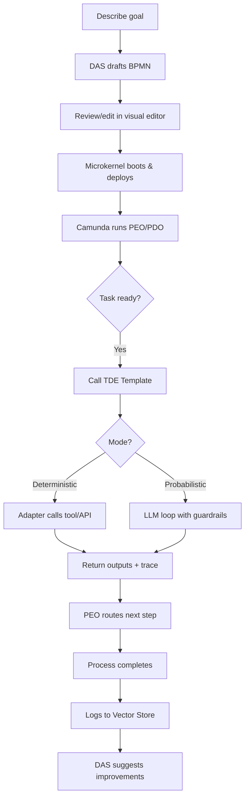
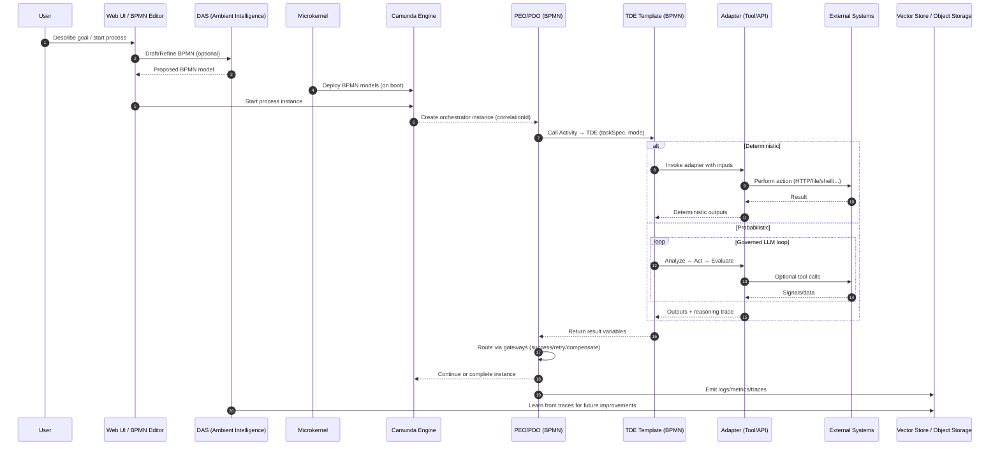
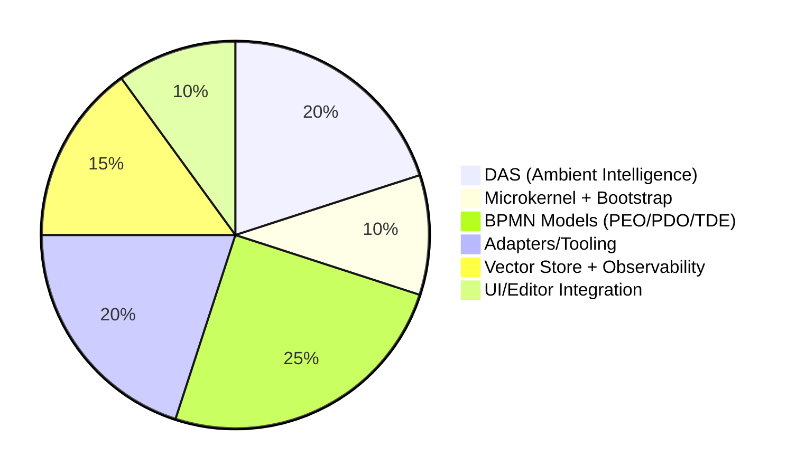
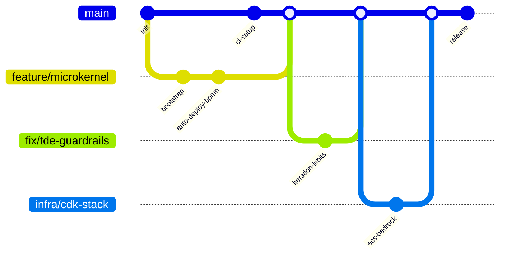
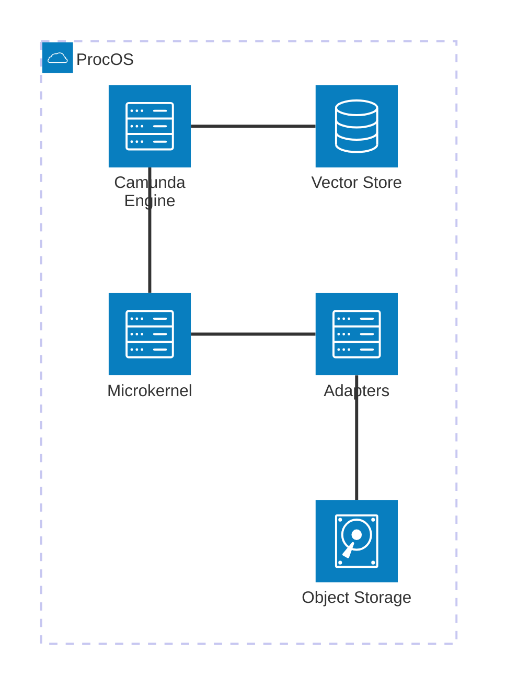

# ProcOS Walkthrough (First Cut)

This document explains, at a novice level, how ProcOS works and how the main pieces fit together. Each section includes a short explanation and a diagram you can show in presentations.

ProcOS is a BPMN-first, process-oriented OS. You describe goals, ProcOS (via the DAS ambient intelligence) drafts BPMN processes, and the microkernel deploys and monitors execution on a BPMN engine. Orchestration lives in BPMN (PEO/PDO), and work is executed by TDE templates that can run deterministic tools or probabilistic LLM loops with guardrails.



### Key ideas (in plain language)
- ProcOS uses diagrams (BPMN) to describe work. The diagrams run on a process engine.
- The microkernel is tiny; it only boots, deploys models, and monitors.
- PEO/PDO orchestrate steps; TDE executes one task at a time, either deterministic or probabilistic.
- Everything is logged for learning and auditability.


## Database Schema

Core entities for processes, tasks, adapters, and learning artifacts. This is a conceptual schema for understanding (actual implementation may differ).

```mermaid
erDiagram
    USER ||--o{ PROCESS_INSTANCE : starts
    PROCESS_DEFINITION ||--o{ PROCESS_INSTANCE : versioned
    PROCESS_INSTANCE ||--o{ TASK_RUN : has
    TASK_RUN ||--o{ ATTACHMENT : has
    TASK_RUN ||--o{ VECTOR_EVENT : logs
    ADAPTER ||--o{ TASK_RUN : executes_via

    USER {
        int id
        string email
        string name
        datetime created_at
    }
    PROCESS_DEFINITION {
        int id
        string key
        int version
        string name
        string bpmn_xml_ref
        datetime created_at
    }
    PROCESS_INSTANCE {
        int id
        int definition_id
        string correlation_id
        string status // running, completed, failed
        datetime started_at
        datetime completed_at
    }
    TASK_RUN {
        int id
        int process_instance_id
        string name
        string mode // deterministic | probabilistic
        string status // started, succeeded, failed
        datetime started_at
        datetime completed_at
    }
    ADAPTER {
        int id
        string type // http, file, shell, python
        string spec // adapter configuration
    }
    ATTACHMENT {
        int id
        int task_run_id
        string uri
        string filename
        string mime_type
        int size_bytes
    }
    VECTOR_EVENT {
        int id
        string correlation_id
        string kind // prompt, result, error, metric
        string payload_ref // points to object storage
        datetime created_at
    }
```

### Notes
- `PROCESS_DEFINITION` holds versioned BPMN models.
- `PROCESS_INSTANCE` tracks a running process and its `correlation_id`.
- `TASK_RUN` captures each TDE execution, with mode and status.
- `VECTOR_EVENT` stores learning/audit artifacts for the DAS and observability.


## Process Flow

A typical run from user intent to execution and learning.




## Budget Breakdown

High-level initial effort allocation (customize as needed):




## Git Workflow

We use feature branches; avoid committing significant changes directly to `main`.



### Rules
- Create `feature/...`, `fix/...`, or `infra/...` branches.
- Open PRs; tests must pass before merging to `main`.


## System Architecture

High-level architecture with clean boundaries and external integrations.

```mermaid
graph TB
    subgraph Client
        UI[Web UI / BPMN Editor]
    end

    subgraph Kernel
        K[Microkernel]
    end

    subgraph Engine
        C[Camunda BPMN Engine]
    end

    subgraph Services
        EVT[Event Bus]
        NOTIF[Notifier]
        ADP[Adapters Runner]
    end

    subgraph Data
        DB[(Relational DB)]
        VEC[(Vector Store)]
        OBJ[(Object Storage)]
        CACHE[(Redis Cache)]
    end

    subgraph External
        IDP[Identity Provider (OIDC)]
        LLM[LLM Provider]
        API[External APIs/Tools]
    end

    UI --> C
    K --> C
    C --> ADP
    ADP --> API
    ADP --> OBJ
    C --> DB
    C --> CACHE
    C --> EVT
    EVT --> NOTIF
    C --> VEC
    VEC --> LLM

    style UI fill:#e1f5fe,stroke:#90caf9
    style K fill:#ede7f6,stroke:#b39ddb
    style C fill:#e8f5e9,stroke:#a5d6a7
    style ADP fill:#fffde7,stroke:#ffe082
    style VEC fill:#f3e5f5,stroke:#ce93d8
```


## Network Architecture

Rendered with icons for quick comprehension.




## Display not just diagrams, but also images

Image taken from https://en.wikipedia.org/wiki/Business_Process_Model_and_Notation


---

### Where to go next
- Add reference BPMN models for a sample PEO/PDO and a TDE template under `src/processes/`.
- Wire a minimal deterministic adapter (e.g., HTTP or file) and run end-to-end.
- Expand governance templates (timeouts, retries, compensations) and observability.
