# ProcOS Process Definition Executor (PDE) Architecture Specification

**Version**: 1.0  
**Date**: January 2025  
**Status**: Architecture Design  

---

## Table of Contents

1. [Executive Summary](#1-executive-summary)
2. [System Architecture Overview](#2-system-architecture-overview)
3. [Process Definition Executor (PDE) Design](#3-process-definition-executor-pde-design)
4. [Multi-Layer Process Architecture](#4-multi-layer-process-architecture)
5. [Execution Flows and Sequences](#5-execution-flows-and-sequences)
6. [Integration with Current Architecture](#6-integration-with-current-architecture)
7. [Implementation Strategy](#7-implementation-strategy)

---

## 1. Executive Summary

### 1.1 Vision Statement

ProcOS introduces the **Process Definition Executor (PDE)** - a revolutionary CPU-like execution architecture that processes individual tasks from BPMN process definitions with intelligent routing, built-in testing, and adaptive endpoint selection. This creates a truly process-oriented operating system where every operation, from system management to user applications, is executed through composable, intelligent process units.

### 1.2 Core Innovation

The PDE represents a paradigm shift from traditional task execution to **intelligent, adaptive task processing**:

- **CPU-like Architecture**: PDEs act as specialized processor cores for process tasks
- **Built-in Intelligence**: Each PDE contains evaluation, routing, and validation logic *(may be fuzzy == AI/ML)*
- **Composable Execution**: PDEs can call other PDEs, creating hierarchical execution patterns
- **Control System Design**: Incorporates built-in-testing (BIT), continuose testing (PBIT), and traditional testing, validation, and error handling at the execution unit level

### 1.3 Key Benefits

1. **Scalable Execution**: Multiple PDEs can process tasks in parallel, like CPU cores
2. **Intelligent Routing**: Tasks are dynamically routed to optimal endpoints based on evaluation
3. **System Reliability**: Built-in testing and validation ensure robust operation
4. **Adaptive Behavior**: PDEs can evolve and improve their execution strategies over time
5. **Unified Architecture**: System and user processes use the same execution paradigm

---

## 2. System Architecture Overview

### 2.1 High-Level Architecture

```mermaid
graph TB
    subgraph "ProcOS - Process-Oriented Virtual Operating System"
        subgraph "🔬 Microkernel Layer"
            MK[ProcOS Microkernel<br/>Bootstrap & Management]
            MK --> CAM[BPMN Execution Runtime]
            MK --> PDEM[PDE Manager<br/>PDE Lifecycle & Scheduling]
        end
        
        subgraph "⚡ Process Definition Executor (PDE) Layer"
            PDE1[General Purpose PDE<br/>Multi-endpoint execution]
            PDE2[AI Specialized PDE<br/>Optimized for AI workflows]  
            PDE3[Integration PDE<br/>API & Data operations]
            MPDE[Meta-PDE<br/>PDE orchestration]
            
            PDEM --> PDE1
            PDEM --> PDE2
            PDEM --> PDE3
            PDEM --> MPDE
        end
        
        subgraph "📋 Process Layer - 3-Tier Architecture"
            subgraph "🔧 System Processes"
                SYSPROC[System Orchestrator]
                RAGPROC[RAG Pipeline Process]
                DASPROC[DAS Supervisory Process]
                MONPROC[Health Monitoring Process]
            end
            
            subgraph "👤 User Processes"
                USERPROC1[Business Logic Process]
                USERPROC2[Application Workflow]
                USERPROC3[Custom User Process]
            end
            
            subgraph "🔄 Process Management"
                PROCMGR[Process Registry]
                DEPLOY[Process Deployment]
                LIFECYCLE[Process Lifecycle]
            end
        end
        
        subgraph "🔌 Endpoint Layer"
            subgraph "AI Endpoints"
                OAI[OpenAI API]
                OLL[Ollama Local]
                CUSTOM_AI[Custom AI Models]
            end
            
            subgraph "Integration Endpoints"
                HTTP[HTTP Client]
                EMAIL[Email Service]
                DB[Database Access]
                FILE[File Operations]
            end
            
            subgraph "Execution Endpoints"
                PY[Python Scripts]
                WORKER[Worker Pools]
                SUB[Sub-PDE Calls]
            end
        end
    end
    
    CAM --> SYSPROC
    CAM --> USERPROC1
    CAM --> USERPROC2
    CAM --> USERPROC3
    
    SYSPROC -.->|tasks| PDE1
    USERPROC1 -.->|tasks| PDE2
    USERPROC2 -.->|tasks| PDE3
    USERPROC3 -.->|tasks| MPDE
    
    PDE1 --> OAI
    PDE1 --> HTTP
    PDE1 --> PY
    PDE2 --> OLL
    PDE2 --> CUSTOM_AI
    PDE3 --> DB
    PDE3 --> EMAIL
    MPDE --> SUB
    
    classDef microkernel fill:#ffebee,stroke:#d32f2f,stroke-width:3px
    classDef pde fill:#e8f5e8,stroke:#2e7d32,stroke-width:3px
    classDef process fill:#e3f2fd,stroke:#1976d2,stroke-width:2px
    classDef endpoint fill:#fff3e0,stroke:#f57c00,stroke-width:2px
    
    class MK,CAM,PDEM microkernel
    class PDE1,PDE2,PDE3,MPDE pde
    class SYSPROC,RAGPROC,DASPROC,USERPROC1,USERPROC2,USERPROC3 process
    class OAI,OLL,HTTP,EMAIL,PY,WORKER endpoint
```



### 2.2 Layer Responsibilities

#### **Microkernel Layer**
- **Minimal Bootstrap**: Start Camunda, deploy processes, enter monitoring mode
- **PDE Management**: Spawn, schedule, and monitor PDE instances
- **System Health**: Monitor overall system health and resource utilization

#### **PDE Layer** 
- **Task Execution**: Process individual tasks from BPMN process definitions
  - *Each task is managed and executied in isolation - on a task by task basis*
- **Intelligent Routing**: Evaluate tasks and route to optimal endpoints
  - *Using both deterministic and prbabilistic (AI/ML) methods*
- **Quality Control**: Built-in testing, validation, and error handling
- **Resource Management**: Manage endpoint connections and worker pools

#### **Process Layer**
- **System Processes**: Infrastructure services (file-level, RAG, DAS, monitoring)
- **User Processes**: Business logic and application workflows  
- **Process Management**: Registration, deployment, versioning, and lifecycle management

#### **Endpoint Layer**
- **Execution Capability**: Actual task execution (AI, HTTP, scripts, etc.)
- **Resource Pooling**: Shared access to external services and workers
- **Abstraction**: Uniform interface regardless of underlying technology

---

## 3. Process Definition Executor (PDE) Design

### 3.1 PDE Internal Architecture


### 3.2 PDE Block Specifications

#### **Start Block**
- **Purpose**: Initialize task execution context
- **Functions**:
  - Parse task input and parameters
  - Set up execution environment
  - Initialize monitoring and logging
  - Prepare context for downstream blocks

#### **Test Block (Built-In Test - BIT)**
- **Purpose**: Evaluate task requirements and system readiness
- **Functions**:
  - Analyze task complexity and requirements
  - Check endpoint availability and health
  - Validate input parameters and constraints
  - Determine execution strategy options

#### **Gateway Block**
- **Purpose**: Route task to optimal endpoint based on evaluation
- **Functions**:
  - Process evaluation results from Test Block
  - Apply routing logic (rule-based or AI-driven)
  - Select primary and fallback endpoints
  - Initialize endpoint-specific parameters

#### **Validation Block**
- **Purpose**: Verify execution results meet quality standards
- **Functions**:
  - Validate output format and structure
  - Check result quality and completeness
  - Compare against expected outcomes
  - Trigger retry if validation fails

#### **Completion Block**
- **Purpose**: Finalize task execution and return results
- **Functions**:
  - Package results for return to BPMN process
  - Update performance metrics and logs
  - Feed learning data to adaptive components
  - Clean up execution context

### 3.3 PDE Types and Specializations


---

## 4. Multi-Layer Process Architecture

### 4.1 Three-Tier Process Model

```mermaid
graph TB
    subgraph "ProcOS Three-Tier Process Architecture"
        subgraph "🔧 System Processes (Infrastructure Layer)"
            SYSORQ[System Orchestrator<br/>Master control process]
            RAG[RAG Pipeline Process<br/>Knowledge retrieval system]
            DAS[DAS Supervisory Process<br/>Continuous monitoring & learning]
            HEALTH[Health Monitoring Process<br/>System diagnostics]
            DEPLOY[Deployment Process<br/>Process & component deployment]
            
            SYSORQ --> RAG
            SYSORQ --> DAS
            SYSORQ --> HEALTH
            SYSORQ --> DEPLOY
        end
        
        subgraph "👤 User Processes (Application Layer)"
            BIZLOGIC[Business Logic Process<br/>Domain-specific workflows]
            DATAPROC[Data Processing Process<br/>ETL and analytics workflows]
            AIWORKFLOW[AI Workflow Process<br/>Multi-step AI operations]
            INTEGRATION[Integration Process<br/>External system connections]
            CUSTOM[Custom User Process<br/>User-defined workflows]
        end
        
        subgraph "⚡ PDE Execution Layer"
            PDE_POOL[PDE Pool Manager<br/>Dynamic PDE allocation]
            
            subgraph "Available PDEs"
                GP_PDE[General Purpose PDEs<br/>x4 instances]
                AI_PDE[AI Specialized PDEs<br/>x2 instances]
                INT_PDE[Integration PDEs<br/>x2 instances]
                META_PDE[Meta-PDE<br/>x1 instance]
            end
            
            PDE_POOL --> GP_PDE
            PDE_POOL --> AI_PDE
            PDE_POOL --> INT_PDE
            PDE_POOL --> META_PDE
        end
        
        subgraph "🎛️ Process Management Layer"
            REGISTRY[Process Registry<br/>Available process definitions]
            LIFECYCLE[Process Lifecycle Manager<br/>Start, stop, monitor processes]
            ROUTING[Process Router<br/>Route requests to processes]
            METRICS[Process Metrics<br/>Performance monitoring]
        end
    end
    
    %% System Process to PDE connections
    SYSORQ -.->|system tasks| GP_PDE
    RAG -.->|knowledge tasks| AI_PDE
    DAS -.->|analysis tasks| META_PDE
    HEALTH -.->|monitoring tasks| INT_PDE
    
    %% User Process to PDE connections
    BIZLOGIC -.->|business tasks| GP_PDE
    DATAPROC -.->|data tasks| INT_PDE
    AIWORKFLOW -.->|AI tasks| AI_PDE
    INTEGRATION -.->|integration tasks| INT_PDE
    CUSTOM -.->|custom tasks| META_PDE
    
    %% Management connections
    REGISTRY --> LIFECYCLE
    LIFECYCLE --> ROUTING
    ROUTING --> METRICS
    
    classDef system fill:#ffebee,stroke:#d32f2f,stroke-width:2px
    classDef user fill:#e3f2fd,stroke:#1976d2,stroke-width:2px
    classDef pde fill:#e8f5e8,stroke:#2e7d32,stroke-width:2px
    classDef mgmt fill:#f3e5f5,stroke:#7b1fa2,stroke-width:2px
    
    class SYSORQ,RAG,DAS,HEALTH,DEPLOY system
    class BIZLOGIC,DATAPROC,AIWORKFLOW,INTEGRATION,CUSTOM user
    class PDE_POOL,GP_PDE,AI_PDE,INT_PDE,META_PDE pde
    class REGISTRY,LIFECYCLE,ROUTING,METRICS mgmt
```



### 4.2 Process Interaction Patterns

#### **System-to-System Communication**
- System processes can call other system processes
- DAS monitors all system processes for optimization
- Health monitoring provides feedback to all processes

#### **User-to-System Communication**  
- User processes can leverage system processes (e.g., RAG pipeline)
- System processes provide services to user processes
- Process registry manages access and permissions

#### **Process-to-PDE Communication**
- All processes execute tasks through PDEs
- PDEs provide unified interface regardless of process type
- PDE pool manager handles resource allocation and load balancing

---

## 5. Execution Flows and Sequences

### 5.1 Task Execution Sequence


### 5.2 Multi-PDE Collaboration Sequence


### 5.3 System Process Lifecycle

```mermaid
sequenceDiagram
    participant MK as Microkernel
    participant CAM as Camunda Engine
    participant SP as System Process (DAS)
    participant PM as PDE Manager
    participant PDE as Monitoring PDE
    participant METRICS as Metrics Endpoint
    
    Note over MK,METRICS: System Process Continuous Operation
    
    MK->>CAM: Start system orchestrator
    CAM->>SP: Initialize DAS process
    
    loop Continuous Monitoring Loop
        SP->>PM: Request monitoring PDE
        PM->>PDE: Allocate monitoring PDE
        
        PDE->>PDE: Test Block - Check system health
        PDE->>METRICS: Collect system metrics
        METRICS->>PDE: Return metrics data
        PDE->>PDE: Validation Block - Analyze metrics
        
        PDE->>SP: Return monitoring results
        SP->>SP: Process monitoring data
        SP->>SP: Make optimization decisions
        
        alt System Issues Detected
            SP->>CAM: Trigger corrective process
            CAM->>PM: Request corrective action PDE
        else Normal Operation
            SP->>SP: Continue monitoring
        end
        
        Note over SP: Wait for next monitoring cycle
    end
```



---

## 6. Integration with Current Architecture

### 6.1 Migration from Current Worker Model


### 6.2 Backwards Compatibility Strategy

#### **Phase 1: Parallel Operation**
- Run existing workers alongside initial PDE implementations
- Gradually migrate external task topics from workers to PDEs
- Maintain dual-mode operation for stability

#### **Phase 2: PDE Enhancement**
- Add intelligence and routing capabilities to PDEs
- Implement Test and Validation blocks
- Begin collecting performance metrics for optimization

#### **Phase 3: Worker Integration**
- Transform existing workers into PDE endpoints
- Implement worker pools as managed endpoints
- Add dynamic worker selection capabilities

#### **Phase 4: Full PDE Architecture**
- Complete migration to PDE-based execution
- Implement Meta-PDEs for complex orchestration
- Enable full adaptive and learning capabilities

### 6.3 Configuration Evolution

#### **Current Configuration (External Task Workers)**
```yaml
workers:
  ai_worker:
    topics: ["ai_query", "text_generation"]
    max_tasks: 5
  generic_worker:
    topics: ["http_request", "email_send"]
    max_tasks: 10
```

#### **Enhanced Configuration (PDE-based)**
```yaml
pde_manager:
  pools:
    general_purpose:
      instances: 4
      endpoints: ["openai", "ollama", "http", "email", "python"]
      max_concurrent_tasks: 20
    ai_specialized:
      instances: 2
      endpoints: ["openai_gpt4", "openai_gpt35", "ollama_llama2", "custom_models"]
      max_concurrent_tasks: 10
    integration:
      instances: 2
      endpoints: ["http", "database", "message_queue", "file_system"]
      max_concurrent_tasks: 15

endpoints:
  openai:
    type: "ai_service"
    config:
      api_key: "${OPENAI_API_KEY}"
      models: ["gpt-4", "gpt-3.5-turbo"]
      timeout: 30
  python:
    type: "script_executor"
    config:
      worker_pool_size: 5
      max_execution_time: 120
      sandbox_enabled: true
```

---

## 7. Implementation Strategy

### 7.1 Development Phases

#### **Phase 1: Basic PDE Framework (Weeks 1-2)**
- Implement core PDE class structure
- Create Start, Test, Gateway, and Completion blocks
- Basic endpoint routing (rule-based)
- Integration with existing Camunda external task pattern

#### **Phase 2: Endpoint Integration (Weeks 3-4)**
- Migrate existing worker functionality to PDE endpoints
- Implement OpenAI, Ollama, HTTP, Email, and Python endpoints
- Basic validation and error handling
- Performance monitoring and logging

#### **Phase 3: Intelligence Enhancement (Weeks 5-6)**
- Implement intelligent Test block evaluation
- Add dynamic endpoint selection capabilities
- Create specialized PDE types (AI, Integration, General Purpose)
- Basic adaptive learning mechanisms

#### **Phase 4: Advanced Features (Weeks 7-8)**
- Implement Meta-PDE for complex orchestration
- Add worker pool management and dynamic scaling
- Enhanced validation and quality control
- Integration with DAS for system-wide optimization

#### **Phase 5: Production Readiness (Weeks 9-10)**
- Comprehensive testing and debugging
- Performance optimization and tuning
- Documentation and deployment guides
- Migration tools for existing processes

### 7.2 Success Metrics

#### **Functional Metrics**
- Task execution success rate > 99%
- Average task completion time < current implementation
- PDE resource utilization > 80%
- Endpoint selection accuracy > 90%

#### **Quality Metrics**
- System uptime > 99.9%
- Error recovery success rate > 95%
- User satisfaction with result quality
- Development velocity improvement

#### **Learning Metrics**
- PDE performance improvement over time
- Adaptive routing accuracy enhancement
- System optimization suggestions implemented
- Knowledge base growth and utilization

### 7.3 Risk Mitigation

#### **Technical Risks**
- **Complexity Management**: Start with simple PDEs, add intelligence incrementally
- **Performance Overhead**: Benchmark each component, optimize critical paths
- **Integration Issues**: Maintain backwards compatibility, parallel operation during migration

#### **Operational Risks**
- **System Stability**: Comprehensive testing, gradual rollout, rollback capabilities
- **Learning Curve**: Extensive documentation, training materials, support resources
- **Resource Requirements**: Careful capacity planning, auto-scaling mechanisms

---

## Conclusion

The Process Definition Executor (PDE) architecture represents a fundamental evolution in process-oriented computing. By combining CPU-like execution patterns with intelligent routing, built-in quality control, and adaptive learning capabilities, ProcOS creates a truly intelligent operating system that can grow and improve over time.

This architecture provides:

1. **Scalable Foundation**: PDEs can be scaled horizontally like CPU cores
2. **Intelligent Execution**: Tasks are routed to optimal endpoints based on analysis
3. **Quality Assurance**: Built-in testing and validation ensure reliable operation
4. **Adaptive Behavior**: System learns and improves execution strategies over time
5. **Unified Programming Model**: Same patterns for system and user processes

The implementation strategy provides a clear path from the current worker-based architecture to the full PDE vision, with careful attention to backwards compatibility, risk mitigation, and incremental delivery of value.

---

**Document Status**: Draft v1.0  
**Next Review**: [Date]  
**Stakeholders**: ProcOS Architecture Team, Development Team, DAS Integration Team
