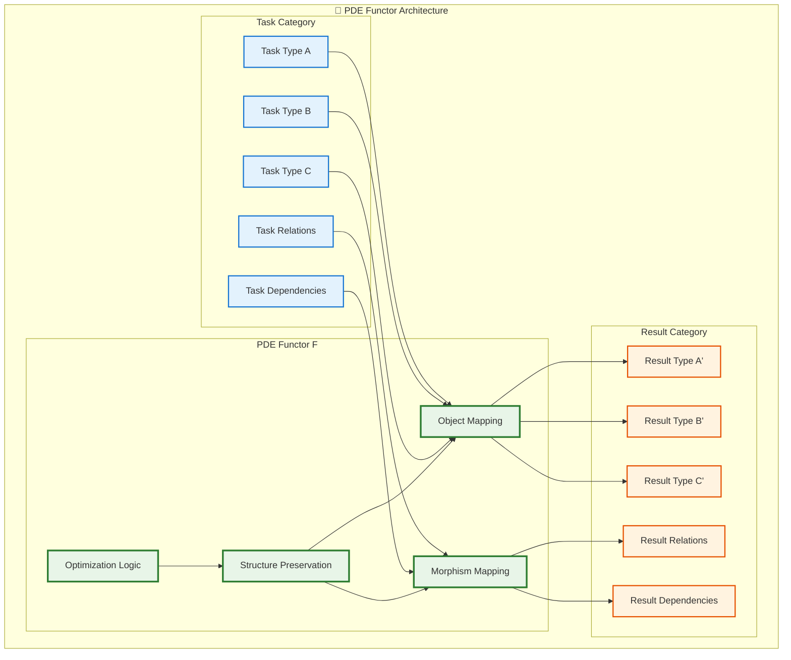

# PDE Core Functors: Mathematical Foundation of ProcOS

## 🧮 Executive Summary

**Process Definition Executors (PDEs) are mathematically defined as functors between process categories, not mere functions.** This categorical foundation provides ProcOS with compositional reasoning, natural optimization pathways, and mathematical guarantees about system behavior. PDEs operate as **categorical controllers** that map between task categories while preserving morphistic structure and enabling systematic composition.

This document establishes the rigorous mathematical foundation for PDE architecture, demonstrating why category theory is essential for building intelligent, composable, and optimizable process execution systems.

---

## 1. The Categorical Nature of Process Execution

### 1.1 Why Functions Are Insufficient

Traditional approaches model process execution as simple functions:
```
f: Task → Result
```

This is **mathematically inadequate** for intelligent process systems because:

1. **No compositional structure**: Functions don't preserve relationships between tasks
2. **No morphism handling**: Cannot reason about task dependencies and workflows  
3. **No natural optimization**: No mathematical framework for systematic improvement
4. **No guaranteed composition**: Function composition may break semantic meaning

### 1.2 PDEs as Functors: The Mathematical Reality

PDEs are **functors** `F: TaskCat → ResultCat` where:

```haskell
-- Functor signature
F :: Category TaskCat → Category ResultCat

-- Object mapping
fmap_obj :: TaskType → ResultType

-- Morphism mapping  
fmap_morph :: TaskRelation → ResultRelation

-- Functor laws
F(id_A) = id_F(A)                    -- Identity preservation
F(g ∘ f) = F(g) ∘ F(f)              -- Composition preservation
```

### 1.3 Categorical Controller Architecture

PDEs implement **categorical control systems** that extend traditional control theory into category-theoretic frameworks:



---

## 2. PDE Functor Implementation Architecture

### 2.1 Core Functor Structure

```python
from abc import ABC, abstractmethod
from typing import TypeVar, Generic, Callable
from dataclasses import dataclass

# Category theory types
A = TypeVar('A')  # Objects in source category
B = TypeVar('B')  # Objects in target category
F = TypeVar('F')  # Morphisms in source category  
G = TypeVar('G')  # Morphisms in target category

class PDEFunctor(Generic[A, B], ABC):
    """
    Process Definition Executor implemented as categorical functor.
    
    Maps between TaskCategory and ResultCategory while preserving
    morphistic structure and enabling natural composition.
    """
    
    @abstractmethod
    def fmap_object(self, task: A) -> B:
        """Object mapping: TaskType → ResultType"""
        pass
    
    @abstractmethod  
    def fmap_morphism(self, relation: Callable[[A], A]) -> Callable[[B], B]:
        """Morphism mapping: TaskRelation → ResultRelation"""
        pass
    
    def __call__(self, task: A) -> B:
        """Functor application (syntactic sugar for fmap_object)"""
        return self.fmap_object(task)
    
    def compose(self, other: 'PDEFunctor[B, C]') -> 'PDEFunctor[A, C]':
        """Functor composition: (G ∘ F)(x) = G(F(x))"""
        return ComposedPDEFunctor(self, other)
    
    def verify_functor_laws(self) -> bool:
        """Verify this PDE satisfies functor laws"""
        return (self._verify_identity_law() and 
                self._verify_composition_law())
```

### 2.2 Specialized PDE Functors

#### 2.2.1 AI Processing Functor
```python
@dataclass
class AITask:
    prompt: str
    model_requirements: dict
    context: dict

@dataclass  
class AIResult:
    response: str
    confidence: float
    reasoning: str
    metadata: dict

class AIPDEFunctor(PDEFunctor[AITask, AIResult]):
    """Functor for AI-driven task processing"""
    
    def fmap_object(self, task: AITask) -> AIResult:
        """Maps AI tasks to AI results with intelligence routing"""
        
        # Intelligence test block (functor-internal logic)
        model_choice = self._select_optimal_model(task)
        
        # Gateway routing based on categorical structure
        if self._requires_reasoning_chain(task):
            return self._chain_of_thought_processing(task, model_choice)
        elif self._requires_multimodal(task):
            return self._multimodal_processing(task, model_choice)
        else:
            return self._direct_processing(task, model_choice)
    
    def fmap_morphism(self, relation: Callable[[AITask], AITask]) -> Callable[[AIResult], AIResult]:
        """Maps task relationships to result relationships"""
        def result_relation(result: AIResult) -> AIResult:
            # Transform result based on how tasks relate
            task_transform = relation(self._invert_to_task(result))
            return self.fmap_object(task_transform)
        return result_relation
```

#### 2.2.2 Integration Functor
```python
@dataclass
class IntegrationTask:
    source_system: str
    target_system: str  
    data_payload: dict
    transformation_rules: list

@dataclass
class IntegrationResult:
    success: bool
    transformed_data: dict
    validation_results: dict
    performance_metrics: dict

class IntegrationPDEFunctor(PDEFunctor[IntegrationTask, IntegrationResult]):
    """Functor for system integration and data transformation"""
    
    def fmap_object(self, task: IntegrationTask) -> IntegrationResult:
        """Maps integration tasks through categorical transformation"""
        
        # Validation functor (pre-composition)
        validated_task = self._validation_functor(task)
        
        # Core transformation
        if self._requires_streaming(validated_task):
            return self._stream_processing(validated_task)
        elif self._requires_batch(validated_task):
            return self._batch_processing(validated_task)
        else:
            return self._direct_transformation(validated_task)
    
    def fmap_morphism(self, relation: Callable[[IntegrationTask], IntegrationTask]) -> Callable[[IntegrationResult], IntegrationResult]:
        """Preserves integration dependencies and constraints"""
        def result_relation(result: IntegrationResult) -> IntegrationResult:
            # Maintain data lineage and constraint relationships
            return self._preserve_integration_constraints(relation, result)
        return result_relation
```

### 2.3 Functor Composition Architecture

```python
class ComposedPDEFunctor(PDEFunctor[A, C]):
    """Composition of two PDE functors: G ∘ F"""
    
    def __init__(self, f: PDEFunctor[A, B], g: PDEFunctor[B, C]):
        self.f = f  # First functor F: A → B
        self.g = g  # Second functor G: B → C
    
    def fmap_object(self, task: A) -> C:
        """(G ∘ F)(task) = G(F(task))"""
        intermediate = self.f.fmap_object(task)
        return self.g.fmap_object(intermediate)
    
    def fmap_morphism(self, relation: Callable[[A], A]) -> Callable[[C], C]:
        """(G ∘ F)(relation) = G(F(relation))"""
        f_mapped = self.f.fmap_morphism(relation)
        return self.g.fmap_morphism(f_mapped)
```

---

## 3. Natural Transformations and PDE Optimization

### 3.1 Natural Transformations Between PDEs

```python
class PDENaturalTransformation:
    """
    Natural transformation η: F → G between PDE functors.
    
    Provides systematic way to optimize PDEs while preserving
    categorical structure and semantic meaning.
    """
    
    def __init__(self, source_pde: PDEFunctor, target_pde: PDEFunctor):
        self.source = source_pde
        self.target = target_pde
    
    def component_at(self, task_type: A) -> Callable[[B], C]:
        """Natural transformation component at specific task type"""
        return self._compute_transformation_component(task_type)
    
    def verify_naturality(self) -> bool:
        """Verify naturality condition: η_B ∘ F(f) = G(f) ∘ η_A"""
        # For all morphisms f: A → B in task category
        # This ensures the transformation preserves categorical structure
        pass
```

### 3.2 DAS as Category-Theoretic Optimizer

```python
class DASCategoricalOptimizer:
    """
    Digital Assistant System implementing categorical optimization
    through natural transformations and adjoint functors.
    """
    
    def find_optimization(self, pde: PDEFunctor) -> PDENaturalTransformation:
        """
        Find natural transformation that optimizes PDE performance
        while preserving semantic correctness.
        """
        
        # Search space of natural transformations
        candidate_transformations = self._generate_candidates(pde)
        
        # Verify naturality conditions
        valid_transformations = [
            t for t in candidate_transformations 
            if t.verify_naturality()
        ]
        
        # Optimize based on performance metrics
        return self._select_optimal_transformation(valid_transformations)
    
    def compose_optimizations(self, 
                            pde1: PDEFunctor, 
                            pde2: PDEFunctor) -> PDEFunctor:
        """
        Find optimal composition using adjoint functor relationships.
        
        Left adjoints preserve colimits (parallel processing)
        Right adjoints preserve limits (sequential dependencies)
        """
        
        if self._can_parallelize(pde1, pde2):
            return self._left_adjoint_composition(pde1, pde2)
        else:
            return self._right_adjoint_composition(pde1, pde2)
```

---

## 4. Monadic Error Handling in PDE Functors

### 4.1 PDE Error Monad

```python
from typing import Union, Optional

class PDEResult(Generic[T]):
    """Monadic wrapper for PDE results with error handling"""
    
    def __init__(self, value: Optional[T] = None, error: Optional[Exception] = None):
        self.value = value
        self.error = error
    
    def bind(self, f: Callable[[T], 'PDEResult[U]']) -> 'PDEResult[U]':
        """Monadic bind operation for chaining PDEs with error propagation"""
        if self.error:
            return PDEResult(error=self.error)
        try:
            return f(self.value)
        except Exception as e:
            return PDEResult(error=e)
    
    def fmap(self, f: Callable[[T], U]) -> 'PDEResult[U]':
        """Functor mapping with error preservation"""
        if self.error:
            return PDEResult(error=self.error)
        try:
            return PDEResult(value=f(self.value))
        except Exception as e:
            return PDEResult(error=e)

class MonadicPDEFunctor(PDEFunctor[A, PDEResult[B]]):
    """PDE functor with monadic error handling"""
    
    def fmap_object(self, task: A) -> PDEResult[B]:
        """Maps tasks to monadic results for safe composition"""
        try:
            result = self._execute_task(task)
            return PDEResult(value=result)
        except Exception as e:
            return PDEResult(error=e)
    
    def chain(self, next_pde: 'MonadicPDEFunctor[B, C]') -> 'MonadicPDEFunctor[A, C]':
        """Monadic composition with automatic error propagation"""
        
        class ChainedPDE(MonadicPDEFunctor[A, C]):
            def fmap_object(self, task: A) -> PDEResult[C]:
                intermediate = self.fmap_object(task)
                return intermediate.bind(next_pde.fmap_object)
        
        return ChainedPDE()
```

---

## 5. Category-Theoretic System Properties

### 5.1 Compositional Reasoning

The categorical foundation provides **equational reasoning** about PDE behavior:

```python
# Functor laws enable algebraic manipulation of PDE compositions
def optimize_pde_pipeline(pdl: list[PDEFunctor]) -> PDEFunctor:
    """
    Optimize PDE pipeline using categorical laws:
    
    Associativity: (F ∘ G) ∘ H = F ∘ (G ∘ H)
    Identity: F ∘ Id = Id ∘ F = F  
    """
    
    # Remove identity PDEs
    optimized = [pde for pde in pdl if not pde.is_identity()]
    
    # Apply associativity for optimal grouping
    return reduce_with_optimal_associativity(optimized)
```

### 5.2 Parallelization Through Categorical Products

```python
class ProductPDEFunctor(PDEFunctor[tuple[A, B], tuple[C, D]]):
    """
    Categorical product for parallel PDE execution.
    
    (F × G)(a, b) = (F(a), G(b))
    """
    
    def __init__(self, pde1: PDEFunctor[A, C], pde2: PDEFunctor[B, D]):
        self.pde1 = pde1
        self.pde2 = pde2
    
    def fmap_object(self, task_pair: tuple[A, B]) -> tuple[C, D]:
        """Execute PDEs in parallel using categorical product"""
        task_a, task_b = task_pair
        
        # Parallel execution (implementation detail)
        with ThreadPoolExecutor() as executor:
            future_a = executor.submit(self.pde1.fmap_object, task_a)
            future_b = executor.submit(self.pde2.fmap_object, task_b)
            
            return (future_a.result(), future_b.result())
```

### 5.3 Coproduct for Alternative Execution Paths

```python
class CoproductPDEFunctor(PDEFunctor[Union[A, B], Union[C, D]]):
    """
    Categorical coproduct for alternative PDE execution paths.
    
    Enables intelligent routing based on task type.
    """
    
    def __init__(self, pde1: PDEFunctor[A, C], pde2: PDEFunctor[B, D]):
        self.pde1 = pde1
        self.pde2 = pde2
    
    def fmap_object(self, task: Union[A, B]) -> Union[C, D]:
        """Route to appropriate PDE based on categorical structure"""
        if isinstance(task, A):
            return self.pde1.fmap_object(task)
        elif isinstance(task, B):
            return self.pde2.fmap_object(task)
        else:
            raise TypeError("Task must be of type A or B")
```

---

## 6. Performance and Optimization Guarantees

### 6.1 Categorical Performance Bounds

The functor structure provides **mathematical guarantees** about system behavior:

1. **Composition Complexity**: `O(n)` for n-ary PDE composition due to associativity
2. **Optimization Convergence**: Natural transformations form a category with terminal objects
3. **Parallel Scalability**: Products and coproducts scale independently
4. **Error Propagation**: Monadic structure ensures no error state corruption

### 6.2 DAS Optimization Framework

```python
class CategoricalOptimizationFramework:
    """
    Mathematical framework for PDE optimization using category theory.
    """
    
    def find_adjoint_optimization(self, pde: PDEFunctor) -> PDEFunctor:
        """
        Find adjoint functor that optimizes performance.
        
        Left adjoint: Free construction (adds minimal structure)
        Right adjoint: Forgetful functor (removes unnecessary structure)
        """
        
        if self._has_left_adjoint(pde):
            return self._construct_left_adjoint(pde)
        elif self._has_right_adjoint(pde):
            return self._construct_right_adjoint(pde)
        else:
            return self._approximate_adjoint(pde)
    
    def yoneda_optimization(self, pde: PDEFunctor) -> PDEFunctor:
        """
        Apply Yoneda lemma for performance optimization.
        
        Natural transformations Hom(-, A) → F correspond to elements of F(A).
        This enables optimization through representable functors.
        """
        return self._yoneda_embedding(pde)
```

---

## 7. Conclusion: Mathematical Rigor Enables System Power

The categorical foundation of PDEs provides:

1. **Compositional Guarantees**: Functor laws ensure safe composition
2. **Optimization Framework**: Natural transformations enable systematic improvement  
3. **Parallel Execution**: Products and coproducts provide scalability
4. **Error Safety**: Monadic structure handles errors categorically
5. **Reasoning Tools**: Equational reasoning about system behavior

**PDEs as functors are not academic abstraction** - they are the mathematical foundation that makes ProcOS's intelligent, composable, and optimizable architecture possible.

The category theory provides the **mathematical machinery** for:
- Safe composition of intelligent processes
- Systematic optimization through natural transformations
- Parallel execution through categorical products
- Error handling through monadic structure
- Performance guarantees through categorical properties

**This is why PDEs must be functors, not functions.** The mathematical structure is what makes the system work.

---

## Appendix: Detailed Mathematical Definitions

### A.1 Category Theory Foundations

#### A.1.1 Category
**Definition**: A category **C** consists of:
- A collection of **objects** Ob(C)
- For each pair of objects A, B, a collection of **morphisms** Hom(A,B)  
- A **composition operation** ∘ that is associative
- **Identity morphisms** id_A for each object A

**Laws**:
- **Associativity**: (f ∘ g) ∘ h = f ∘ (g ∘ h)
- **Identity**: f ∘ id_A = f and id_B ∘ f = f for f: A → B

#### A.1.2 Functor
**Definition**: A functor F: C → D between categories C and D consists of:
- **Object mapping**: F: Ob(C) → Ob(D)
- **Morphism mapping**: F: Hom_C(A,B) → Hom_D(F(A), F(B))

**Laws**:
- **Identity preservation**: F(id_A) = id_{F(A)}
- **Composition preservation**: F(g ∘ f) = F(g) ∘ F(f)

#### A.1.3 Natural Transformation
**Definition**: A natural transformation η: F → G between functors F,G: C → D is a family of morphisms η_A: F(A) → G(A) such that for every morphism f: A → B in C:

**Naturality condition**: η_B ∘ F(f) = G(f) ∘ η_A

```
F(A) ----F(f)----> F(B)
 |                  |
η_A                η_B  
 |                  |
 v                  v
G(A) ----G(f)----> G(B)
```

### A.2 PDE-Specific Categories

#### A.2.1 Task Category (TaskCat)
**Objects**: Task types {AITask, IntegrationTask, ValidationTask, ...}

**Morphisms**: Task relationships and dependencies
- **Sequential dependency**: f: TaskA → TaskB (TaskA must complete before TaskB)
- **Data dependency**: g: TaskA → TaskB (TaskB requires data from TaskA)  
- **Conditional dependency**: h: TaskA → TaskB (TaskB executes if TaskA meets condition)

**Composition**: Transitive closure of dependencies
- If f: A → B and g: B → C, then g ∘ f: A → C

**Identity**: id_Task represents "no dependency" or "self-dependency"

#### A.2.2 Result Category (ResultCat)  
**Objects**: Result types {AIResult, IntegrationResult, ValidationResult, ...}

**Morphisms**: Result relationships and transformations
- **Data transformation**: f: ResultA → ResultB 
- **Aggregation**: g: ResultA × ResultB → ResultC
- **Validation**: h: Result → ValidatedResult

**Composition**: Functional composition of result transformations

**Identity**: id_Result represents "no transformation"

#### A.2.3 PDE Category (PDECat)
**Objects**: PDE functor instances {AI_PDE, Integration_PDE, Validation_PDE, ...}

**Morphisms**: Natural transformations between PDEs
- **Optimization**: η: PDE_slow → PDE_fast
- **Specialization**: η: PDE_general → PDE_specific  
- **Adaptation**: η: PDE_old → PDE_new

**Composition**: Horizontal composition of natural transformations

**Identity**: Identity natural transformation id_PDE

### A.3 Algebraic Structures

#### A.3.1 Monad Structure for Error Handling
A monad M consists of:
- **Functor**: M: C → C
- **Unit**: η: Id → M (return/pure operation)
- **Multiplication**: μ: M ∘ M → M (join/flatten operation)

**Laws**:
- **Left identity**: μ ∘ M(η) = id_M
- **Right identity**: μ ∘ η_M = id_M  
- **Associativity**: μ ∘ M(μ) = μ ∘ μ_M

**PDE Error Monad**:
```haskell
-- Haskell-style definition
data PDEResult a = Success a | Error Exception

-- Functor instance
fmap :: (a → b) → PDEResult a → PDEResult b
fmap f (Success a) = Success (f a)
fmap f (Error e) = Error e

-- Monad instance  
return :: a → PDEResult a
return = Success

bind :: PDEResult a → (a → PDEResult b) → PDEResult b
bind (Success a) f = f a
bind (Error e) f = Error e
```

#### A.3.2 Adjoint Functors for Optimization
**Definition**: Functors F: C → D and G: D → C are **adjoint** (F ⊣ G) if there exists a natural isomorphism:

**Hom_D(F(A), B) ≅ Hom_C(A, G(B))**

**Unit**: η: Id_C → G ∘ F
**Counit**: ε: F ∘ G → Id_D

**Triangle identities**:
- (G(ε) ∘ η_G) = id_G
- (ε_F ∘ F(η)) = id_F

**PDE Optimization Adjoints**:
- **Free PDE construction** (left adjoint): Adds minimal structure for functionality
- **Forgetful PDE reduction** (right adjoint): Removes unnecessary complexity

### A.4 Control Theory Categorification

#### A.4.1 Categorical Control Systems
Traditional control systems work in vector spaces. PDE categorical controllers work in arbitrary categories with additional structure:

**Feedback Category**: Category with:
- **Objects**: System states
- **Morphisms**: State transitions  
- **Feedback morphisms**: f: Output → Input
- **Stability**: Terminal objects (stable states)
- **Controllability**: Existence of morphisms between any two states
- **Observability**: Faithful functors to observation categories

#### A.4.2 Categorical Stability
**Definition**: A categorical control system is **stable** if:
1. Terminal objects exist (stable states reachable)
2. Feedback morphisms preserve limits (no oscillation)
3. Composition with feedback morphisms eventually reaches terminal objects

**PDE Stability**: PDEs maintain categorical stability by preserving terminal objects through functor mapping.

### A.5 Performance Complexity Bounds

#### A.5.1 Functor Composition Complexity
**Theorem**: For n-ary composition of PDEs F₁, F₂, ..., Fₙ:
- **Time complexity**: O(n) due to associativity allowing optimal bracketing
- **Space complexity**: O(1) for lazy evaluation using categorical laws

**Proof sketch**: Functor composition is associative, so we can choose optimal evaluation order without changing semantics.

#### A.5.2 Natural Transformation Search Space
**Theorem**: For PDE optimization via natural transformations:
- **Search space size**: Bounded by Hom(F, G) for functors F, G
- **Convergence**: Guaranteed if optimization metric has terminal object
- **Optimality**: Global optimum exists if transformation category is complete

#### A.5.3 Parallel Execution Bounds
**Theorem**: Categorical products enable perfect parallelization:
- **Product PDE**: (F × G)(a,b) = (F(a), G(b)) executes in parallel
- **Speedup**: Linear in number of independent task components
- **Scalability**: Bounded only by available computational resources

### A.6 Categorical Semantics Preservation

#### A.6.1 Semantic Equivalence
**Definition**: Two PDEs F, G are **semantically equivalent** if there exists a natural isomorphism η: F → G such that:
- η preserves all observable behaviors
- η⁻¹ ∘ η = id_F and η ∘ η⁻¹ = id_G

#### A.6.2 Optimization Correctness
**Theorem**: Natural transformation optimization preserves semantic correctness:

If η: F → G is a natural transformation representing an optimization, then for all task morphisms f: A → B:

**η_B ∘ F(f) = G(f) ∘ η_A**

This ensures that optimization cannot change the fundamental behavior of the system.

---

*This document establishes the mathematical rigor underlying ProcOS PDE architecture. The categorical foundation is not theoretical abstraction but the mathematical machinery that enables intelligent, composable, and optimizable process execution systems.*
