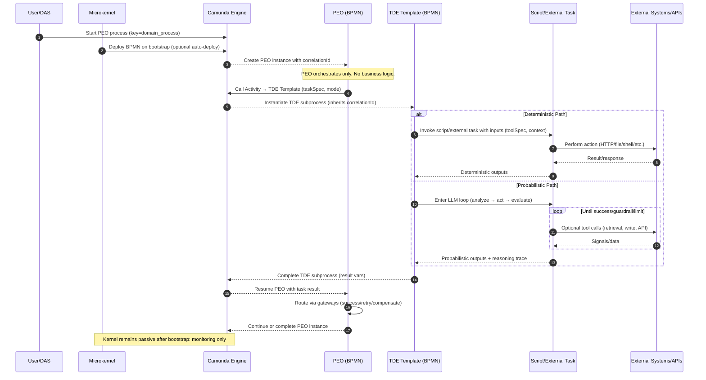
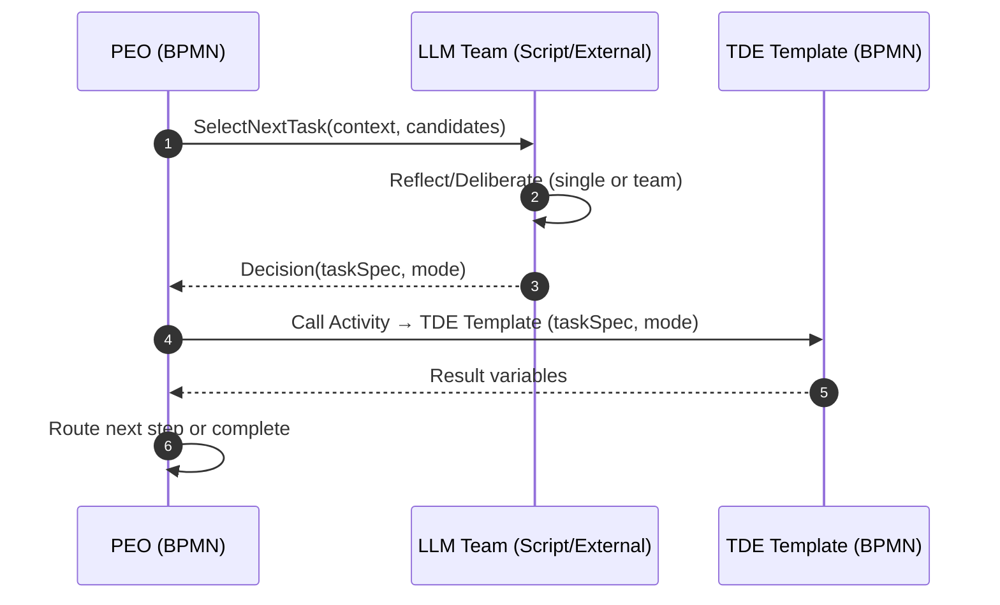

# BPMN-First PEO/TDE Model — Use Cases and Sequence

Version: 0.1 (Draft)
Date: 2025-01
Status: Draft for review

---

## Purpose

This paper defines the BPMN-first execution model for ProcOS using two core roles:

- **PEO (Process Execution Orchestrator)**: Responsible for orchestration only — routing, state, error boundaries, compensation, and delegation to task engines. No business logic.
- **TDE (Task Definition Executor)**: Responsible for executing an individual task in either deterministic (tool/adapter) or probabilistic (LLM-guided) mode.

The design aligns with ProcOS principles in `docs/architecture/ProcOS_Architecture_Specification.md` and the minimal microkernel in `src/microkernel/procos_kernel.py` where BPMN is the kernel language and the microkernel only boots, deploys, and monitors.

---

## Glossary

- **BPMN-first**: Behavior is defined in BPMN; code is limited to small, testable adapters (no imperative orchestration in code).
- **PEO**: BPMN process that orchestrates a business or system scenario. It delegates work; it does not implement work.
- **TDE Template (BPMN)**: BPMN subprocess (or called activity) that encapsulates a single task life-cycle (deterministic/probabilistic branches, retries, and governance).
- **Script/External Task (BPMN)**: A BPMN script or external task used by the TDE template to invoke deterministic tools (HTTP, file I/O, shell, Scilab/Python runner), with no Python-side TDE runtime.
- **Camunda Engine**: Provides stateful process execution, external task pattern, and history.
- **Correlation ID**: End-to-end identifier that flows kernel → PEO → TDE → adapters → logs/metrics.
- **PDO (Process Definition Orchestrator)**: Deterministic orchestrator flavor of a process that routes purely by explicit rules. PDOs select TDEs based on task settings (e.g., `type: python|http|file`, `mode: deterministic`) without probabilistic decision-making.
- **Probabilistic PEO**: A PEO that uses one or more LLM agents to select/sequence tasks based on context, team deliberation, or policies, while still keeping the orchestration itself in BPMN.

---

## High-Level Runtime Sequence

The following sequence shows a typical end-to-end execution where a PEO delegates to a TDE that may choose deterministic or probabilistic execution, then returns control to the PEO for continued orchestration.



---

## Variant: Probabilistic PEO Task Selection (LLM Team)

In some flows, the PEO itself can use a probabilistic step to select the next task based on input context and team decisions. The orchestration remains BPMN-first; the decision-making is delegated to a script/external task that runs one or more LLM agents and returns a structured decision.



Notes:
- The PEO remains a BPMN orchestrator; probabilistic selection is a contained step.
- Guardrails: iteration/time limits, structured outputs, and explainability artifacts.

---

## Object Responsibilities (Step-by-Step)

### Microkernel (`src/microkernel/procos_kernel.py`)
1. Validate environment and configuration (engine URL, health intervals).
2. Wait for Camunda readiness and write a readiness marker.
3. Deploy BPMN models from `src/processes` when `AUTO_DEPLOY_PROCESSES=true`.
4. Optionally start a root orchestrator (if present), e.g., `system_orchestrator`.
5. Enter monitoring mode; no orchestration or business logic at runtime.

### Camunda Engine
1. Persist process definitions and instances; track all tokens and variables.
2. Execute BPMN semantics for PEO and TDE templates.
3. Provide the External Task pattern for adapters if used.
4. Emit history for auditing (who/what/when + variables).

### PEO (Process Execution Orchestrator) — BPMN process
1. Receive start event and initialize `correlationId` and context variables.
2. Select next task via BPMN gateways (business rules in BPMN, not code).
3. Delegate actual work to a TDE Template via Call Activity or Subprocess.
4. Handle normal/exceptional outcomes through explicit BPMN boundary events.
5. Apply compensation/rollback flows where required.
6. Emit observability events to logs/metrics as variables or external tasks.
7. Optional: Use probabilistic selection steps (single or team LLMs) to choose `taskSpec` based on context; enforce governance (limits, auditing, determinism toggles).

### PDO (Process Definition Orchestrator) — Deterministic BPMN process
1. Deterministically select TDE based on task settings (e.g., `type: python`, `mode: deterministic`).
2. Maintain explicit routing tables or gateway rules; no probabilistic loops.
3. Delegate to TDE Template and map inputs/outputs to process variables.
4. Handle retries/compensations with BPMN boundary events and subprocesses.
5. Emit governance and audit variables consistently with PEO/TDE conventions.

### TDE Template — BPMN subprocess for a single task
1. Accept inputs: `taskSpec`, `mode` = `deterministic | probabilistic`, `correlationId`.
2. Branch by mode using an exclusive gateway.
3. Deterministic: Call adapter service task(s) for concrete actions (HTTP, file, etc.).
4. Probabilistic: Enter a governed loop (limits, guardrails) for LLM-guided actions; optionally invoke adapters.
5. Capture outputs and structured traces (decisions, tool calls, errors) into variables.
6. On failure, raise BPMN error to PEO, or apply local retry per policy.

### Script/External Task — BPMN
1. Encapsulate deterministic actions as BPMN script or external task steps.
2. Deterministic: Execute a single action (HTTP/file/shell/Scilab/Python runner) and set process variables.
3. Probabilistic: Optional tool calls can still be mediated via script/external tasks within the TDE loop.
4. Do not embed orchestration; return control to the TDE BPMN immediately.

---

## Core Use Cases

- **UC-1: Deterministic Tool Call**
  - PEO delegates to TDE with `mode=deterministic` and `toolSpec=http.post`.
  - TDE invokes adapter → performs HTTP call → returns response JSON → PEO routes next step.

- **UC-2: Probabilistic Content Generation**
  - PEO delegates with `mode=probabilistic` and a prompt/context.
  - TDE runs an LLM loop with guardrails and optional retrieval; returns draft → PEO routes to review or auto-approve.

- **UC-3: Retry and Compensation**
  - TDE raises BPMN error on adapter failure; PEO catches and routes to retry or compensation subprocess.

- **UC-4: Parallelization**
  - PEO spawns multiple TDE call activities (multi-instance) for fan-out; joins on completion; routes aggregate result.

- **UC-5: Probabilistic PEO with LLM Team**
  - PEO uses an LLM team step to select next `taskSpec` given ambiguous context; returns a structured decision with rationale; PEO calls TDE accordingly.

- **UC-6: PDO Deterministic Routing**
  - PDO reads task settings (e.g., `type:python`, `mode:deterministic`) and routes to a specific TDE template instance without any probabilistic components.

---

## Governance and Guardrails

- Deterministic adapters must be idempotent (performing an operation more than once yields the same result) where feasible; otherwise provide compensations.
- Probabilistic loops must enforce limits (iterations, time) and capture reasoning traces.
- All paths must propagate `correlationId` and key variables for end-to-end auditing.
- Errors should be explicit BPMN errors, not silent failures; prefer boundary events.

---

## Correlation and Observability

- Generate `correlationId` at process start; store as a root variable.
- Include `correlationId` in adapter calls, logs, and metrics snapshots.
- Use kernel metrics for health and lightweight counters; use BPMN history for state.

---

## Implementation Notes

- The microkernel intentionally contains no imperative orchestration. See `_deploy_processes` and `_start_root_orchestrator` for bootstrap only.
- Keep PEO BPMN definitions readable: gateways for rules, boundary events for errors, and call activities for TDE templates.
- Keep adapters tiny and testable; avoid embedding orchestration or decision logic in code.
- No Python TDE runtime is required; prefer BPMN script/external tasks. Add a small adapter library later only if needed for deterministic tools.
- Both PEO and PDO are valid orchestrator flavors: choose PEO when probabilistic selection adds value; choose PDO when strict determinism and predictability are required.

---

## Example: Minimal TDE Template (Conceptual)

This conceptual BPMN layout (not the full XML) illustrates a TDE with two branches:

```
Start → Exclusive Gateway (mode)
  → [deterministic] Service Task (Adapter Call) → End
  → [probabilistic] Subprocess (LLM Loop + Guardrails) → End
```

Represent each step explicitly in BPMN to keep execution transparent and auditable.

---

## Next Steps

- Add reference BPMN models under `src/processes/`:
  - `peo_example.bpmn` (orchestration only)
  - `tde_task_template.bpmn` (deterministic/probabilistic branches)
- Wire minimal deterministic adapter (HTTP/file) and end-to-end test scenario.
- Expand governance (timeouts, retries, compensations) as formal templates.


## Actor Model Analogy

- **PEO as supervising actor**: The PEO instance behaves like a parent/supervisor actor. It owns orchestration state, routes messages (via BPMN gateways), supervises task lifecycles, and applies explicit fault handling strategies (boundary events, retries, compensations). It delegates work; it does not implement work.
- **TDE instances as child actors**: Each TDE invocation acts like a short-lived child actor created to handle one task. It can execute deterministically (adapter call) or probabilistically (LLM-guided loop), then replies with structured outputs. PEO can fan out multiple TDEs (multi-instance) and join on their completion.
- **Engine as runtime + mailbox**: The Camunda engine provides durable state, message delivery, and scheduling akin to an actor runtime/mailbox. It persists variables, correlates messages, handles retries/backoff, and resumes after failures or restarts.
- **Addresses and messages**: `correlationId` functions like an address/trace identifier; BPMN variables, message correlations, and signals are the message mediums. There is no shared memory; all communication is explicit and persisted.
- **Supervision and fault tolerance**: BPMN boundary events and compensations correspond to actor supervision strategies and sagas. Failures are handled through explicit routes, not hidden exceptions.

Limitations of the analogy:
- PEO/TDE are durable and can span minutes to days; classic actors/threads are typically ephemeral.
- Work may execute across distributed services; there is no shared address space.
- Governance (guardrails, auditing, explainability for probabilistic paths) is first-class here and not inherent in typical actor frameworks.

One-liner: PEO is a supervising actor that spawns child actors (TDEs) to perform tasks and report back, while the engine acts as the durable runtime and mailbox that moves messages and persists state.
