# ProcOS Architecture Specification
## Process-Driven Virtual Operating System

**Version**: 1.0  
**Date**: January 2025  
**Authors**: Architecture Team  
**Template**: ARC42 adapted for Process-Driven Systems

---

## Table of Contents

1. [Introduction and Goals](#1-introduction-and-goals)
2. [Constraints](#2-constraints)
3. [Context and Scope](#3-context-and-scope)
4. [Solution Strategy](#4-solution-strategy)
5. [Building Blocks](#5-building-blocks)
6. [Runtime View](#6-runtime-view)
7. [Deployment View](#7-deployment-view)
8. [Cross-Cutting Concerns](#8-cross-cutting-concerns)
9. [Design Decisions](#9-design-decisions)
10. [Quality Scenarios](#10-quality-scenarios)
11. [Risks and Technical Debt](#11-risks-and-technical-debt)
12. [Glossary](#12-glossary)

---

## 1. Introduction and Goals

### 1.1 What is ProcOS?

**ProcOS** (Process-Oriented Operating System) is a revolutionary Virtual Operating System (VOS) that fundamentally reimagines computing as a **process-native ecosystem**. Like a smart car that's simple to drive, easy to work on, and continuously improves itself, ProcOS provides different levels of interaction for different users while maintaining a unified foundation where **everything is a process definition**.

At its core, ProcOS features:
- **Process Definition Executors (PDEs)**: CPU-like intelligent execution units that process individual tasks
- **Universal Process Architecture**: System processes, user processes, and worker processes all use BPMN
- **Self-Growing Intelligence**: Digital Assistant System (DAS) that continuously improves the system 24/7
- **Composable Execution**: Every component can be combined, customized, and evolved through process definitions

### 1.2 Core Philosophy: "Processes Drive Everything"

In ProcOS, **every system operation is a process**:
- System boot? A BPMN process
- File management? BPMN processes
- User interactions? BPMN-orchestrated workflows
- Service communications? Process-driven messaging
- Error handling? Recovery processes defined in BPMN

This process-centric approach provides unprecedented **flexibility** and **extensibility** while maintaining clear **separation of concerns** through well-defined process boundaries.

### 1.3 Key Quality Goals

| Priority | Quality Goal | Description |
|----------|-------------|-------------|
| 1 | **Intelligent Adaptability** | PDEs and DAS continuously optimize execution strategies and system performance |
| 2 | **Universal Composability** | Everything is a process - system, user, and worker processes can be combined seamlessly |
| 3 | **Self-Improvement** | System grows and improves 24/7 through DAS innovation cycles |
| 4 | **Multi-Level Accessibility** | Serves drivers, mechanics, and specialists with appropriate interfaces |
| 5 | **Process Transparency** | Complete visibility into task execution through PDE pipelines and process monitoring |
| 6 | **Horizontal Scalability** | PDEs scale like CPU cores, processes scale like applications |

### 1.4 Stakeholders

ProcOS serves three primary user archetypes, like a smart car that accommodates different levels of expertise:

| Role | Car Analogy | Expectations | ProcOS Interface |
|------|-------------|-------------|------------------|
| **Drivers (End Users)** | Use steering wheel, gas, brake | Simple business workflows | Pre-built process templates, dashboard UI |
| **Mechanics (Super Users)** | Open hood, work on components | Customize system processes | RAG pipelines, monitoring configs, integration workflows |  
| **Specialists (Developers)** | Tune engine internals | Optimize execution architecture | PDE tuning, custom worker processes, endpoint optimization |
| **Digital Assistant (DAS)** | Onboard computer helping everyone | Continuous system improvement | 24/7 monitoring, optimization suggestions, automatic enhancements |

### 1.5 The Bootstrap Challenge

ProcOS solves the fundamental "chicken-and-egg" problem of process-driven systems through a **minimal microkernel** approach:

```
Traditional OS: Hardware → Kernel → System Services → Applications
ProcOS:        Hardware → Microkernel → Camunda Engine → BPMN Processes → Everything
```

The microkernel is intentionally minimal, providing only the essential bootstrapping functionality to launch Camunda and load the root orchestration processes.

---

## 2. Constraints

### 2.1 Technical Constraints

#### 2.1.1 Camunda Engine Dependencies
- **Java Runtime Requirement**: Camunda requires JVM, adding memory and startup overhead
- **Database Dependency**: Camunda needs persistent storage for process instances and history
- **Version Coupling**: System tied to Camunda's release cycle and compatibility matrix

#### 2.1.2 Integration Limitations
- **Python Bridge Complexity**: Python-Java integration introduces serialization and error handling complexity
- **Performance Overhead**: Process-mediated operations inherently slower than direct function calls
- **External Task Polling**: Polling-based external tasks introduce latency and resource consumption

#### 2.1.3 Platform Constraints
- **Container-First**: Designed primarily for containerized deployments
- **Network-Dependent**: Distributed nature requires reliable network infrastructure
- **Resource Requirements**: Higher baseline resource usage than traditional kernels

### 2.2 Conceptual Constraints

#### 2.2.1 Process Complexity Management
- **Recursion Depth Limits**: Deep process nesting can impact performance and debugging
- **State Management**: Complex state must be externalized to maintain process idempotency
- **Error Propagation**: Error handling strategies must be embedded in process definitions

#### 2.2.2 Security Model
- **Process-Level Security**: Security policies defined at process granularity
- **Sandboxing Requirements**: External code execution must be properly isolated
- **Trust Boundaries**: Clear definition of trusted vs. untrusted process zones

### 2.3 Business Constraints

#### 2.3.1 Operational Constraints
- **Learning Curve**: Teams must understand BPMN modeling and process thinking
- **Tooling Dependency**: Heavy reliance on BPMN modeling tools and Camunda ecosystem
- **Migration Complexity**: Porting existing systems to process-driven architecture

---

## 3. Context and Scope

### 3.1 System Context

```
┌─────────────────────────────────────────────────────────────────┐
│                        ProcOS System Context                    │
├─────────────────────────────────────────────────────────────────┤
│                                                                 │
│  ┌─────────────┐    ┌─────────────────────────────────────┐     │
│  │   Users     │◄──►│         ProcOS Core                 │     │
│  │             │    │  ┌─────────────────────────────┐    │     │
│  │ • Process   │    │  │      Camunda Engine        │    │     │
│  │   Engineers │    │  │   (BPMN Execution)         │    │     │
│  │ • Operators │    │  └─────────────────────────────┘    │     │
│  │ • End Users │    │  ┌─────────────────────────────┐    │     │
│  └─────────────┘    │  │    Process Orchestrators    │    │     │
│                     │  │  (Root System Processes)    │    │     │
│  ┌─────────────┐    │  └─────────────────────────────┘    │     │
│  │   External  │◄──►│  ┌─────────────────────────────┐    │     │
│  │   Systems   │    │  │     Generic Workers         │    │     │
│  │             │    │  │   (Task Dispatchers)       │    │     │
│  │ • APIs      │    │  └─────────────────────────────┘    │     │
│  │ • Databases │    └─────────────────────────────────────┘     │
│  │ • Services  │                      │                         │
│  └─────────────┘                      │                         │
│                     ┌─────────────────▼─────────────────┐       │
│  ┌─────────────┐    │        Service Ecosystem          │       │
│  │  Monitoring │◄──►│                                   │       │
│  │   & Logging │    │  ┌─────────┐ ┌─────────┐ ┌──────┐ │       │
│  │             │    │  │ Python  │ │ Scilab  │ │ AI   │ │       │
│  │ • Metrics   │    │  │ Scripts │ │ Compute │ │ LLMs │ │       │
│  │ • Traces    │    │  └─────────┘ └─────────┘ └──────┘ │       │
│  │ • Logs      │    │  ┌─────────┐ ┌─────────┐ ┌──────┐ │       │
│  └─────────────┘    │  │  Email  │ │   Web   │ │ More │ │       │
│                     │  │ Service │ │   APIs  │ │ ... │ │       │
│                     │  └─────────┘ └─────────┘ └──────┘ │       │
│                     └───────────────────────────────────┘       │
└─────────────────────────────────────────────────────────────────┘
```

### 3.2 Scope Definition

#### 3.2.1 What ProcOS IS
- **Process-Driven Kernel**: BPMN processes define all system behavior
- **Service Orchestrator**: Coordinates distributed microservices through processes
- **Execution Platform**: Provides runtime environment for process-based applications
- **Integration Hub**: Unifies heterogeneous services through common process interface

#### 3.2.2 What ProcOS IS NOT
- **Traditional OS**: Not a replacement for Linux/Windows kernel
- **Performance-Optimized**: Prioritizes flexibility over raw execution speed
- **Standalone System**: Requires underlying container/OS infrastructure
- **Code-First Platform**: Business logic expressed in BPMN, not programming languages

### 3.3 External Interfaces

#### 3.3.1 Process Definition Interface
- **BPMN 2.0 XML**: Primary interface for defining system processes
- **Camunda Modeler**: Graphical process design environment
- **REST API**: Process deployment and management operations

#### 3.3.2 External Task Interface
- **HTTP/REST**: Standard protocol for external task workers
- **Message Queues**: Asynchronous task distribution (RabbitMQ, Apache Kafka)
- **Custom Protocols**: Plugin architecture for specialized communications

#### 3.3.3 Service Integration Interface
- **Service Adapters**: Standardized wrappers for external services
- **Configuration Management**: Environment-specific service bindings
- **Health Checks**: Service availability monitoring and circuit breakers

---

## 4. Solution Strategy

### 4.1 Fundamental Design Principles

#### 4.1.1 Universal Process Architecture
**Everything is a process definition** - system processes, user processes, and worker processes all use BPMN, creating unprecedented consistency and composability across the entire system.

#### 4.1.2 CPU-like Process Execution
**Process Definition Executors (PDEs)** act as intelligent CPU cores that can:
- Evaluate tasks and route them to optimal endpoints
- Provide built-in testing and validation
- Learn and adapt execution strategies over time
- Scale horizontally like processor cores

#### 4.1.3 Self-Growing Intelligence
**Digital Assistant System (DAS)** operates 24/7 to:
- Monitor system performance and usage patterns
- Build and test improvements in sandbox environments
- Suggest optimizations with transparent benefits
- Deploy successful innovations gradually

#### 4.1.4 Multi-Level User Experience
Like a smart car, ProcOS accommodates different user types:
- **Drivers**: Simple business workflows through intuitive interfaces
- **Mechanics**: System process customization and optimization
- **Specialists**: Deep architectural tuning and custom development

#### 4.1.5 Soft Coding Paradigm: The MATLAB/Simulink Evolution

**Revolutionary Insight**: ProcOS represents the same paradigm shift at the OS level that MATLAB/Simulink brought to modeling & simulation. We've moved beyond the traditional hard coding vs. no-code dichotomy to create a "soft coding" environment.

**The Three Coding Paradigms**:

```mermaid
graph LR
    subgraph "🔒 Hard Coding"
        HC[Specialist + Domain Expert<br/>Full custom development]
        HC --> HC_RESULT[Complete flexibility<br/>High development cost]
    end
    
    subgraph "🎯 Soft Coding (ProcOS)"
        SC[Standard + Specialized Blocks<br/>Created by pros, DAS, power users]
        SC --> SC_UI[UI-level configuration<br/>Like visual programming]
        SC --> SC_RESULT[High flexibility<br/>Low development cost]
    end
    
    subgraph "🚫 No Code"
        NC[Drag & Drop Only<br/>Fixed functionality]
        NC --> NC_RESULT[Limited flexibility<br/>What you get is what you get]
    end
    
    classDef hard fill:#ffebee,stroke:#d32f2f,stroke-width:2px
    classDef soft fill:#e8f5e8,stroke:#2e7d32,stroke-width:3px
    classDef no fill:#fff3e0,stroke:#f57c00,stroke-width:2px
    
    class HC,HC_RESULT hard
    class SC,SC_UI,SC_RESULT soft
    class NC,NC_RESULT no
```



**ProcOS Soft Coding Benefits**:
- **Standard Blocks**: Pre-built, tested, optimized process components
- **Specialized Blocks**: Custom components for specific domains (created by specialists)
- **DAS-Generated Blocks**: AI creates new blocks based on usage patterns
- **Power User Blocks**: Advanced users extend capabilities through process definitions
- **UI-Level Flexibility**: Previously hard-coded logic becomes configurable at the interface

**Example Evolution**:
```
Hard Coding Era:
"I need email integration" → Hire developer → Write custom SMTP code → Deploy → Maintain

No-Code Era:
"I need email integration" → Use pre-built email block → Limited to vendor capabilities

ProcOS Soft Coding Era:
"I need email integration" → Use email worker process → Customize at UI level → DAS suggests optimizations → Power users extend with specialized blocks
```

This approach enables **true composability** where complex systems are built from intelligent, adaptable blocks rather than monolithic code or rigid no-code components.

#### 4.1.6 Minimal Microkernel Bootstrap
A thin Python-based microkernel provides only essential bootstrapping:
```python
# Simplified microkernel bootstrap
def bootstrap_procos():
    """Ultra-minimal bootstrap sequence"""
    1. Initialize logging and basic error handling
    2. Start Camunda engine with minimal configuration
    3. Deploy root orchestration processes from /proc/init/
    4. Transfer control to BPMN-based system management
    5. Monitor and restart on failure
```

#### 4.1.3 External Task Decoupling Pattern
All service interactions use Camunda's external task pattern, ensuring loose coupling:

```
┌─────────────┐    External Task    ┌─────────────┐    Service Call    ┌─────────────┐
│    BPMN     │ ──────────────────► │   Generic   │ ─────────────────► │   Target    │
│   Process   │                    │   Worker    │                    │   Service   │
│             │ ◄────────────────── │             │ ◄───────────────── │             │
└─────────────┘    Task Result     └─────────────┘    Service Result  └─────────────┘
```

#### 4.1.4 Event-Driven Communication
All inter-process and inter-service communication flows through message brokers, enabling:
- **Async Processing**: Non-blocking operation execution
- **Event Sourcing**: Complete audit trail of system events
- **Scaling**: Independent scaling of producers and consumers
- **Resilience**: Message persistence and retry mechanisms

### 4.2 Key Architectural Patterns

#### 4.2.1 Process Hierarchy Pattern
```
Root Orchestrator Process
├── System Management Processes
│   ├── Boot Process
│   ├── Shutdown Process
│   └── Health Monitoring Process
├── Application Processes
│   ├── User Management Process
│   ├── Data Processing Process
│   └── Integration Process
└── Infrastructure Processes
    ├── Logging Process
    ├── Metrics Collection Process
    └── Backup Process
```

#### 4.2.2 Generic Worker Pattern
Ultra-simple workers that route tasks based on type configuration:

```python
class GenericWorker:
    """Configurable task router"""
    
    def __init__(self, task_config):
        self.task_handlers = load_handlers(task_config)
    
    def handle_external_task(self, task):
        handler = self.task_handlers.get(task.topic)
        if handler:
            return handler.execute(task.variables)
        else:
            raise UnknownTaskTypeError(task.topic)
```

#### 4.2.3 Service Adapter Pattern
Standardized wrappers that translate between external task variables and service APIs:

```python
class ServiceAdapter:
    """Standard interface for external services"""
    
    def execute(self, task_variables):
        # 1. Validate input variables
        # 2. Transform to service-specific format
        # 3. Execute service call with error handling
        # 4. Transform response to process variables
        # 5. Return standardized result
        pass
```

### 4.3 Security Strategy

#### 4.3.1 BPMN-Defined Security Policies
Security rules embedded directly in process definitions:
- **Allowable Tasks**: Processes define which external tasks they can invoke
- **Data Access Control**: Variable scoping and encryption within processes
- **Execution Boundaries**: Process-level sandboxing and resource limits

#### 4.3.2 Sandboxed Code Execution
```
┌─────────────────────────────────────────────────────────────┐
│                 Sandboxed Execution Environment             │
├─────────────────────────────────────────────────────────────┤
│  ┌─────────────┐  ┌─────────────┐  ┌─────────────┐         │
│  │   Python    │  │   Scilab    │  │     AI      │         │
│  │  Container  │  │  Container  │  │  Container  │         │
│  │             │  │             │  │             │         │
│  │ • Resource  │  │ • CPU/Mem   │  │ • API Rate  │         │
│  │   Limits    │  │   Limits    │  │   Limits    │         │
│  │ • Network   │  │ • File      │  │ • Model     │         │
│  │   Isolation │  │   Access    │  │   Access    │         │
│  └─────────────┘  └─────────────┘  └─────────────┘         │
└─────────────────────────────────────────────────────────────┘
```

---

## 5. Building Blocks

### 5.1 Level 1: System Overview


### 5.2 Level 2: Core Components

#### 5.2.1 Process Definition Executor (PDE) - The Heart of ProcOS

**Revolutionary Concept**: PDEs act as CPU-like execution units that intelligently process individual tasks from process definitions.

**PDE Internal Architecture**:
```mermaid
graph TB
    subgraph "🔄 PDE Internal Pipeline"
        START[Start Block<br/>Initialize Context]
        TEST[Test Block<br/>Built-In Test (BIT)]
        GATE[Gateway Block<br/>Intelligent Routing]
        VALID[Validation Block<br/>Quality Control]
        COMPLETE[Completion Block<br/>Return Results]
        
        START --> TEST
        TEST --> GATE
        GATE --> VALID
        VALID --> COMPLETE
    end
    
    subgraph "🧠 Intelligence Layer"
        EVAL[Task Evaluator]
        ROUTER[Endpoint Router]
        VALIDATOR[Result Validator]
        LEARNER[Adaptive Learner]
    end
    
    subgraph "🔌 Worker Process Endpoints"
        AI_WP[AI Worker Process]
        HTTP_WP[HTTP Worker Process]
        PY_WP[Python Worker Process]
        CUSTOM_WP[Custom Worker Processes]
    end
    
    TEST --> EVAL
    GATE --> ROUTER
    VALID --> VALIDATOR
    COMPLETE --> LEARNER
    
    ROUTER --> AI_WP
    ROUTER --> HTTP_WP
    ROUTER --> PY_WP
    ROUTER --> CUSTOM_WP
    
    classDef pipeline fill:#e8f5e8,stroke:#2e7d32,stroke-width:2px
    classDef intelligence fill:#e3f2fd,stroke:#1976d2,stroke-width:2px
    classDef worker fill:#fff3e0,stroke:#f57c00,stroke-width:2px
    
    class START,TEST,GATE,VALID,COMPLETE pipeline
    class EVAL,ROUTER,VALIDATOR,LEARNER intelligence
    class AI_WP,HTTP_WP,PY_WP,CUSTOM_WP worker
```

**PDE Types and Specialization**:
- **General Purpose PDE**: Handles any task type with multi-endpoint capabilities
- **AI Specialized PDE**: Optimized for AI workflows with intelligent model selection
- **Integration PDE**: Focused on API calls, data processing, and system integration
- **Meta-PDE**: Orchestrates other PDEs for complex multi-step operations

#### 5.2.2 Workers as Process Definitions

**Revolutionary Insight**: Instead of hardcoded worker classes, workers are BPMN process definitions that can be monitored, scaled, and evolved like any other process.

**Benefits**:
- **Dynamic Creation**: DAS can create new worker processes overnight
- **Unified Monitoring**: Worker health = Process health
- **Process Composition**: Workers can call other worker processes
- **Git Integration**: Pull worker scripts as process definitions

#### 5.2.3 Digital Assistant System (DAS) - 24/7 Self-Improvement

**Continuous Innovation Cycle**:

```mermaid
graph TB
    subgraph "🧪 DAS Innovation Laboratory"
        OBSERVE[Monitor Everything<br/>Usage patterns, performance, errors]
        ANALYZE[Analyze Patterns<br/>Identify improvement opportunities]
        EXPERIMENT[Build & Test<br/>Sandbox environment with real data]
        VALIDATE[Validate Results<br/>Statistical significance testing]
        SUGGEST[Suggest to Users<br/>Transparent benefits and rollback]
        DEPLOY[Gradual Deployment<br/>Monitor adoption and performance]
    end
    
    OBSERVE --> ANALYZE
    ANALYZE --> EXPERIMENT
    EXPERIMENT --> VALIDATE
    VALIDATE --> SUGGEST
    SUGGEST --> DEPLOY
    DEPLOY --> OBSERVE
    
    classDef das fill:#fff3e0,stroke:#f57c00,stroke-width:2px
    class OBSERVE,ANALYZE,EXPERIMENT,VALIDATE,SUGGEST,DEPLOY das
```


#### 5.2.4 Microkernel Component

**Responsibilities:**
- System bootstrap and initialization
- Camunda engine lifecycle management
- Root process deployment
- System-level monitoring and recovery

**Implementation:**
```python
#!/usr/bin/env python3
"""
ProcOS Microkernel - Minimal bootstrap for process-driven OS
"""

import logging
import subprocess
import signal
import time
from pathlib import Path

class ProcOSMicrokernel:
    """Minimal microkernel for ProcOS bootstrap"""
    
    def __init__(self):
        self.camunda_process = None
        self.running = True
        
    def bootstrap(self):
        """Main bootstrap sequence"""
        try:
            self._setup_logging()
            self._validate_environment()
            self._start_camunda_engine()
            self._deploy_root_processes()
            self._setup_signal_handlers()
            self._monitor_system()
        except Exception as e:
            logging.critical(f"Bootstrap failed: {e}")
            self._emergency_shutdown()
    
    def _start_camunda_engine(self):
        """Start Camunda engine with minimal configuration"""
        camunda_cmd = [
            "java", "-jar", "/opt/procos/camunda-run.jar",
            "--configuration", "/etc/procos/camunda.yml"
        ]
        self.camunda_process = subprocess.Popen(camunda_cmd)
        
        # Wait for Camunda to be ready
        self._wait_for_camunda_ready()
    
    def _deploy_root_processes(self):
        """Deploy root orchestration processes"""
        root_processes = Path("/proc/init/").glob("*.bpmn")
        for process_file in root_processes:
            self._deploy_process(process_file)
    
    def _monitor_system(self):
        """Simple monitoring loop"""
        while self.running:
            if self.camunda_process.poll() is not None:
                logging.error("Camunda engine died, restarting...")
                self._start_camunda_engine()
            time.sleep(5)

if __name__ == "__main__":
    kernel = ProcOSMicrokernel()
    kernel.bootstrap()
```

#### 5.2.2 Generic Worker Component

**Responsibilities:**
- External task polling and execution
- Task routing based on configuration
- Result handling and error management
- Service adapter coordination

**Implementation:**
```python
"""
Generic Worker - Configurable external task processor
"""

import asyncio
import logging
from typing import Dict, Any
from dataclasses import dataclass

@dataclass
class TaskConfig:
    """External task configuration"""
    topic: str
    handler_type: str
    handler_config: Dict[str, Any]
    max_retries: int = 3
    timeout: int = 30

class GenericWorker:
    """Configurable external task worker"""
    
    def __init__(self, worker_config: Dict[str, TaskConfig]):
        self.task_configs = worker_config
        self.handlers = self._load_handlers()
    
    async def start(self):
        """Start polling for external tasks"""
        while True:
            try:
                tasks = await self._fetch_and_lock_tasks()
                await asyncio.gather(*[
                    self._execute_task(task) for task in tasks
                ])
            except Exception as e:
                logging.error(f"Worker error: {e}")
                await asyncio.sleep(5)
    
    async def _execute_task(self, task):
        """Execute a single external task"""
        config = self.task_configs.get(task.topic)
        if not config:
            await self._complete_task_with_error(
                task, f"No handler for topic: {task.topic}"
            )
            return
        
        handler = self.handlers[config.handler_type]
        try:
            result = await handler.execute(task.variables, config.handler_config)
            await self._complete_task(task, result)
        except Exception as e:
            await self._handle_task_error(task, e, config)
    
    def _load_handlers(self):
        """Load available task handlers"""
        return {
            'python_script': PythonScriptHandler(),
            'http_request': HttpRequestHandler(),
            'email_send': EmailServiceHandler(),
            'ai_query': AIServiceHandler(),
            'scilab_compute': ScilabHandler(),
        }
```

#### 5.2.3 Service Adapter Components

**Standard Service Adapter Interface:**
```python
from abc import ABC, abstractmethod
from typing import Dict, Any

class ServiceAdapter(ABC):
    """Base class for all service adapters"""
    
    @abstractmethod
    async def execute(self, 
                     variables: Dict[str, Any], 
                     config: Dict[str, Any]) -> Dict[str, Any]:
        """Execute service operation and return result variables"""
        pass
    
    @abstractmethod
    def validate_config(self, config: Dict[str, Any]) -> bool:
        """Validate adapter configuration"""
        pass
    
    @abstractmethod
    def health_check(self) -> bool:
        """Check if underlying service is available"""
        pass

class PythonScriptAdapter(ServiceAdapter):
    """Adapter for executing Python scripts"""
    
    async def execute(self, variables, config):
        script_path = config['script_path']
        timeout = config.get('timeout', 30)
        
        # Prepare sandboxed environment
        env = self._create_sandbox_env(variables)
        
        # Execute script with resource limits
        result = await self._run_script_sandboxed(
            script_path, env, timeout
        )
        
        return {'result': result, 'status': 'success'}
    
    def _create_sandbox_env(self, variables):
        """Create isolated execution environment"""
        # Implement sandboxing logic
        pass

class AIServiceAdapter(ServiceAdapter):
    """Adapter for AI service interactions"""
    
    async def execute(self, variables, config):
        provider = config['provider']  # 'openai', 'ollama', etc.
        model = config['model']
        prompt = variables['prompt']
        
        client = self._get_ai_client(provider, config)
        response = await client.generate(
            model=model,
            prompt=prompt,
            max_tokens=config.get('max_tokens', 1000)
        )
        
        return {
            'ai_response': response.text,
            'tokens_used': response.usage.total_tokens,
            'model_used': model
        }
```

### 5.3 Level 3: Process Definitions

#### 5.3.1 Root Orchestration Process

```xml
<?xml version="1.0" encoding="UTF-8"?>
<bpmn:definitions xmlns:bpmn="http://www.omg.org/spec/BPMN/20100524/MODEL">
  <bpmn:process id="root_orchestrator" name="ProcOS Root Orchestrator">
    
    <bpmn:startEvent id="system_start" name="System Start">
      <bpmn:outgoing>to_init_services</bpmn:outgoing>
    </bpmn:startEvent>
    
    <bpmn:serviceTask id="init_core_services" name="Initialize Core Services">
      <bpmn:extensionElements>
        <camunda:externalTask topic="system_init"/>
      </bpmn:extensionElements>
      <bpmn:incoming>to_init_services</bpmn:incoming>
      <bpmn:outgoing>to_start_monitoring</bpmn:outgoing>
    </bpmn:serviceTask>
    
    <bpmn:serviceTask id="start_monitoring" name="Start System Monitoring">
      <bpmn:extensionElements>
        <camunda:externalTask topic="start_monitoring"/>
      </bpmn:extensionElements>
      <bpmn:incoming>to_start_monitoring</bpmn:incoming>
      <bpmn:outgoing>to_wait_for_requests</bpmn:outgoing>
    </bpmn:serviceTask>
    
    <bpmn:intermediateCatchEvent id="wait_for_requests" name="Wait for Requests">
      <bpmn:messageEventDefinition messageRef="user_request"/>
      <bpmn:incoming>to_wait_for_requests</bpmn:incoming>
      <bpmn:outgoing>to_process_request</bpmn:outgoing>
    </bpmn:intermediateCatchEvent>
    
    <bpmn:callActivity id="process_user_request" name="Process User Request">
      <bpmn:extensionElements>
        <camunda:calledElement>general_process_handler</camunda:calledElement>
      </bpmn:extensionElements>
      <bpmn:incoming>to_process_request</bpmn:incoming>
      <bpmn:outgoing>to_wait_for_requests</bpmn:outgoing>
    </bpmn:callActivity>
    
  </bpmn:process>
</bpmn:definitions>
```

#### 5.3.2 General Process Example (AI Query)

```xml
<?xml version="1.0" encoding="UTF-8"?>
<bpmn:definitions xmlns:bpmn="http://www.omg.org/spec/BPMN/20100524/MODEL">
  <bpmn:process id="ai_query_process" name="AI Query Process">
    
    <bpmn:startEvent id="ai_query_start" name="AI Query Request">
      <bpmn:outgoing>to_validate_input</bpmn:outgoing>
    </bpmn:startEvent>
    
    <bpmn:serviceTask id="validate_input" name="Validate Query Input">
      <bpmn:extensionElements>
        <camunda:externalTask topic="input_validation">
          <camunda:inputOutput>
            <camunda:inputParameter name="validation_rules">
              ${ai_query_validation_rules}
            </camunda:inputParameter>
          </camunda:inputOutput>
        </camunda:externalTask>
      </bpmn:extensionElements>
      <bpmn:incoming>to_validate_input</bpmn:incoming>
      <bpmn:outgoing>to_route_query</bpmn:outgoing>
    </bpmn:serviceTask>
    
    <bpmn:exclusiveGateway id="route_by_provider" name="Route by AI Provider">
      <bpmn:incoming>to_route_query</bpmn:incoming>
      <bpmn:outgoing>to_openai</bpmn:outgoing>
      <bpmn:outgoing>to_ollama</bpmn:outgoing>
    </bpmn:exclusiveGateway>
    
    <bpmn:serviceTask id="query_openai" name="Query OpenAI">
      <bpmn:extensionElements>
        <camunda:externalTask topic="ai_query">
          <camunda:inputOutput>
            <camunda:inputParameter name="provider">openai</camunda:inputParameter>
            <camunda:inputParameter name="model">${openai_model}</camunda:inputParameter>
          </camunda:inputOutput>
        </camunda:externalTask>
      </bpmn:extensionElements>
      <bpmn:incoming>to_openai</bpmn:incoming>
      <bpmn:outgoing>to_format_response</bpmn:outgoing>
    </bpmn:serviceTask>
    
    <bpmn:serviceTask id="query_ollama" name="Query Ollama">
      <bpmn:extensionElements>
        <camunda:externalTask topic="ai_query">
          <camunda:inputOutput>
            <camunda:inputParameter name="provider">ollama</camunda:inputParameter>
            <camunda:inputParameter name="model">${ollama_model}</camunda:inputParameter>
          </camunda:inputOutput>
        </camunda:externalTask>
      </bpmn:extensionElements>
      <bpmn:incoming>to_ollama</bpmn:incoming>
      <bpmn:outgoing>to_format_response</bpmn:outgoing>
    </bpmn:serviceTask>
    
    <bpmn:serviceTask id="format_response" name="Format Response">
      <bpmn:extensionElements>
        <camunda:externalTask topic="response_formatting"/>
      </bpmn:extensionElements>
      <bpmn:incoming>to_format_response</bpmn:incoming>
      <bpmn:outgoing>to_end</bpmn:outgoing>
    </bpmn:serviceTask>
    
    <bpmn:endEvent id="ai_query_end" name="Query Complete">
      <bpmn:incoming>to_end</bpmn:incoming>
    </bpmn:endEvent>
    
  </bpmn:process>
</bpmn:definitions>
```

---

## 6. Runtime View

### 6.1 System Boot Sequence

```
Step 1: Microkernel Bootstrap
┌─────────────┐
│ Hardware/   │  Starts
│ Container   │────────────┐
│ Platform    │            │
└─────────────┘            ▼
                   ┌─────────────┐
                   │ ProcOS      │  1. Setup logging
                   │ Microkernel │  2. Validate environment
                   │ (Python)    │  3. Start Camunda
                   └─────────────┘  4. Deploy root processes
                           │        5. Enter monitoring loop
Step 2: Process Engine     │
                           ▼
                   ┌─────────────┐
                   │ Camunda     │  • Load BPMN definitions
                   │ Engine      │  • Initialize process engine
                   │ (Java)      │  • Start external task polling
                   └─────────────┘  • Begin root orchestrator
                           │
Step 3: Root Processes     │
                           ▼
                   ┌─────────────┐
                   │ Root        │  • Initialize core services
                   │ Orchestrator│  • Start system monitoring
                   │ Process     │  • Begin request handling
                   └─────────────┘  • Health check processes
                           │
Step 4: Service Workers    │
                           ▼
                   ┌─────────────┐
                   │ Generic     │  • Start external task polling
                   │ Workers     │  • Load service adapters
                   │ (Multiple)  │  • Connect to message brokers
                   └─────────────┘  • Begin processing requests
```

### 6.2 Request Processing Flow

**Scenario**: User submits AI query "Analyze sales data trends"

```
1. Request Ingestion
   User Request ────► Message Queue ────► Root Orchestrator Process

2. Process Instantiation
   Root Orchestrator ────► Camunda Engine ────► New AI Query Process Instance

3. External Task Distribution
   ┌─────────────────────────────────────────────────────────────┐
   │                  AI Query Process                           │
   ├─────────────────────────────────────────────────────────────┤
   │                                                             │
   │  Input Validation ────► Provider Routing ────► AI Service  │
   │         │                       │                    │     │
   │         ▼                       ▼                    ▼     │
   │  External Task         External Task         External Task │
   │  Topic: "validate"     Topic: "route"       Topic: "ai"   │
   │                                                             │
   └─────────────────────────────────────────────────────────────┘
                     │                    │                │
                     ▼                    ▼                ▼
   ┌─────────────┐  ┌─────────────┐  ┌─────────────┐  ┌─────────────┐
   │  Worker A   │  │  Worker B   │  │  Worker C   │  │  Worker D   │
   │ Validation  │  │ Routing     │  │ OpenAI      │  │ Response    │
   │ Handler     │  │ Handler     │  │ Handler     │  │ Formatter   │
   └─────────────┘  └─────────────┘  └─────────────┘  └─────────────┘
                     │                    │                │
                     ▼                    ▼                ▼
   ┌─────────────┐  ┌─────────────┐  ┌─────────────┐  ┌─────────────┐
   │ Input       │  │ AI Provider │  │ OpenAI      │  │ Formatted   │
   │ Validation  │  │ Selection   │  │ API Call    │  │ Response    │
   │ Service     │  │ Logic       │  │ Service     │  │ Ready       │
   └─────────────┘  └─────────────┘  └─────────────┘  └─────────────┘

4. Result Aggregation
   All external tasks complete ────► Process instance completes ────► Response returned
```

### 6.3 Error Handling and Recovery

```
Error Detection
┌─────────────────────────────────────────────────────────────────┐
│                     Error Sources                               │
├─────────────────────────────────────────────────────────────────┤
│  • External task failures (service unavailable, timeout)       │
│  • Process instance errors (invalid data, logic exceptions)    │
│  • Infrastructure failures (Camunda down, broker unavailable)  │
│  • Resource exhaustion (memory, CPU, connection limits)        │
└─────────────────────────────────────────────────────────────────┘
                              │
                              ▼
┌─────────────────────────────────────────────────────────────────┐
│                   Error Handling Strategy                       │
├─────────────────────────────────────────────────────────────────┤
│                                                                 │
│  Task Level:     Process Level:      System Level:              │
│  ┌─────────┐    ┌─────────────┐     ┌─────────────────┐         │
│  │ Retry   │    │ Compensation│     │ Process         │         │
│  │ Logic   │    │ Events      │     │ Migration       │         │
│  │         │    │             │     │                 │         │
│  │ • 3x    │    │ • Rollback  │     │ • Camunda       │         │
│  │ • Exp   │    │ • Cleanup   │     │   Restart       │         │
│  │   Backoff│   │ • Notify    │     │ • Process       │         │
│  └─────────┘    └─────────────┘     │   Recovery      │         │
│                                     │ • Failover      │         │
│                                     └─────────────────┘         │
│                                                                 │
└─────────────────────────────────────────────────────────────────┘
```

**Error Recovery Process Definition:**
```xml
<bpmn:process id="error_recovery_process">
  <bpmn:serviceTask id="detect_error" name="Detect Error">
    <bpmn:extensionElements>
      <camunda:externalTask topic="error_detection"/>
    </bpmn:extensionElements>
  </bpmn:serviceTask>
  
  <bpmn:exclusiveGateway id="error_severity" name="Assess Severity">
    <bpmn:incoming>from_detect</bpmn:incoming>
    <bpmn:outgoing>to_retry</bpmn:outgoing>
    <bpmn:outgoing>to_escalate</bpmn:outgoing>
    <bpmn:outgoing>to_restart</bpmn:outgoing>
  </bpmn:exclusiveGateway>
  
  <bpmn:serviceTask id="retry_operation" name="Retry Operation">
    <bpmn:extensionElements>
      <camunda:externalTask topic="operation_retry"/>
    </bpmn:extensionElements>
  </bpmn:serviceTask>
  
  <bpmn:serviceTask id="escalate_to_admin" name="Escalate to Administrator">
    <bpmn:extensionElements>
      <camunda:externalTask topic="admin_notification"/>
    </bpmn:extensionElements>
  </bpmn:serviceTask>
  
  <bpmn:serviceTask id="system_restart" name="Restart System Component">
    <bpmn:extensionElements>
      <camunda:externalTask topic="component_restart"/>
    </bpmn:extensionElements>
  </bpmn:serviceTask>
</bpmn:process>
```

---

## 7. Deployment View

### 7.1 Container Architecture

```
┌─────────────────────────────────────────────────────────────────┐
│                        Kubernetes Cluster                       │
├─────────────────────────────────────────────────────────────────┤
│                                                                 │
│  ┌─────────────────────────────────────────────────────────┐    │
│  │                    ProcOS Namespace                     │    │
│  │                                                         │    │
│  │  ┌─────────────┐  ┌─────────────┐  ┌─────────────┐     │    │
│  │  │ Microkernel │  │  Camunda    │  │  Database   │     │    │
│  │  │     Pod     │  │    Pod      │  │     Pod     │     │    │
│  │  │             │  │             │  │ (PostgreSQL)│     │    │
│  │  │ • Bootstrap │  │ • Engine    │  │ • Process   │     │    │
│  │  │ • Monitor   │  │ • REST API  │  │   State     │     │    │
│  │  │ • Control   │  │ • Webapps   │  │ • History   │     │    │
│  │  └─────────────┘  └─────────────┘  └─────────────┘     │    │
│  │                                                         │    │
│  │  ┌─────────────┐  ┌─────────────┐  ┌─────────────┐     │    │
│  │  │   Worker    │  │   Worker    │  │   Worker    │     │    │
│  │  │   Pool A    │  │   Pool B    │  │   Pool C    │     │    │
│  │  │             │  │             │  │             │     │    │
│  │  │ • Python    │  │ • AI Tasks  │  │ • Generic   │     │    │
│  │  │   Scripts   │  │ • OpenAI    │  │   Services  │     │    │
│  │  │ • Scilab    │  │ • Ollama    │  │ • Email     │     │    │
│  │  │ • Computing │  │ • Models    │  │ • HTTP      │     │    │
│  │  └─────────────┘  └─────────────┘  └─────────────┘     │    │
│  │                                                         │    │
│  │  ┌─────────────┐  ┌─────────────┐  ┌─────────────┐     │    │
│  │  │   Message   │  │   Storage   │  │  Monitoring │     │    │
│  │  │   Broker    │  │   Layer     │  │    Stack    │     │    │
│  │  │ (RabbitMQ)  │  │ (Volumes)   │  │             │     │    │
│  │  │             │  │             │  │ • Prometheus│     │    │
│  │  │ • Task      │  │ • Process   │  │ • Grafana   │     │    │
│  │  │   Queues    │  │   Files     │  │ • Jaeger    │     │    │
│  │  │ • Events    │  │ • Logs      │  │ • ELK       │     │    │
│  │  └─────────────┘  └─────────────┘  └─────────────┘     │    │
│  │                                                         │    │
│  └─────────────────────────────────────────────────────────┘    │
│                                                                 │
│  ┌─────────────────────────────────────────────────────────┐    │
│  │                  External Services                      │    │
│  │                                                         │    │
│  │  ┌─────────────┐  ┌─────────────┐  ┌─────────────┐     │    │
│  │  │   Python    │  │   Scilab    │  │     AI      │     │    │
│  │  │   Runtime   │  │   Engine    │  │   Services  │     │    │
│  │  │   Service   │  │   Service   │  │             │     │    │
│  │  └─────────────┘  └─────────────┘  └─────────────┘     │    │
│  │                                                         │    │
│  └─────────────────────────────────────────────────────────┘    │
└─────────────────────────────────────────────────────────────────┘
```

### 7.2 Deployment Configuration

#### 7.2.1 Docker Compose Development Setup

```yaml
# docker-compose.yml - Development deployment
version: '3.8'

services:
  # Core ProcOS Components
  procos-microkernel:
    build: ./microkernel
    depends_on:
      - postgres
      - rabbitmq
    environment:
      - CAMUNDA_DB_URL=jdbc:postgresql://postgres:5432/procos
      - RABBITMQ_URL=amqp://rabbitmq:5672
    volumes:
      - ./processes:/proc/init:ro
      - procos-logs:/var/log/procos
    restart: unless-stopped

  camunda:
    image: camunda/camunda-bpm-platform:latest
    ports:
      - "8080:8080"
    depends_on:
      - postgres
    environment:
      - DB_DRIVER=org.postgresql.Driver
      - DB_URL=jdbc:postgresql://postgres:5432/procos
      - DB_USERNAME=procos
      - DB_PASSWORD=procos_pass
    volumes:
      - camunda-data:/camunda/webapps

  # Infrastructure Services
  postgres:
    image: postgres:13
    environment:
      - POSTGRES_DB=procos
      - POSTGRES_USER=procos
      - POSTGRES_PASSWORD=procos_pass
    volumes:
      - postgres-data:/var/lib/postgresql/data

  rabbitmq:
    image: rabbitmq:3-management
    ports:
      - "15672:15672"
    environment:
      - RABBITMQ_DEFAULT_USER=procos
      - RABBITMQ_DEFAULT_PASS=procos_pass
    volumes:
      - rabbitmq-data:/var/lib/rabbitmq

  # Worker Pools
  python-worker:
    build: ./workers/python
    deploy:
      replicas: 3
    depends_on:
      - camunda
      - rabbitmq
    environment:
      - CAMUNDA_URL=http://camunda:8080/engine-rest
      - WORKER_ID=python-worker
    volumes:
      - ./scripts:/app/scripts:ro

  ai-worker:
    build: ./workers/ai
    deploy:
      replicas: 2
    depends_on:
      - camunda
    environment:
      - OPENAI_API_KEY=${OPENAI_API_KEY}
      - OLLAMA_URL=${OLLAMA_URL}
      - CAMUNDA_URL=http://camunda:8080/engine-rest

  generic-worker:
    build: ./workers/generic
    deploy:
      replicas: 5
    depends_on:
      - camunda
      - rabbitmq
    environment:
      - CAMUNDA_URL=http://camunda:8080/engine-rest
      - RABBITMQ_URL=amqp://rabbitmq:5672

  # External Services
  scilab-service:
    build: ./services/scilab
    ports:
      - "8081:8080"
    volumes:
      - scilab-workspace:/workspace

  # Monitoring
  prometheus:
    image: prom/prometheus
    ports:
      - "9090:9090"
    volumes:
      - ./monitoring/prometheus.yml:/etc/prometheus/prometheus.yml

  grafana:
    image: grafana/grafana
    ports:
      - "3000:3000"
    volumes:
      - grafana-data:/var/lib/grafana

volumes:
  postgres-data:
  rabbitmq-data:
  camunda-data:
  procos-logs:
  scilab-workspace:
  grafana-data:
```

#### 7.2.2 Kubernetes Production Deployment

```yaml
# k8s-deployment.yml - Production deployment
apiVersion: apps/v1
kind: Deployment
metadata:
  name: procos-core
  namespace: procos
spec:
  replicas: 1
  selector:
    matchLabels:
      app: procos-core
  template:
    metadata:
      labels:
        app: procos-core
    spec:
      containers:
      - name: microkernel
        image: procos/microkernel:v1.0
        resources:
          requests:
            memory: "256Mi"
            cpu: "100m"
          limits:
            memory: "512Mi"
            cpu: "500m"
        env:
        - name: CAMUNDA_DB_URL
          valueFrom:
            secretKeyRef:
              name: procos-secrets
              key: db-url
        volumeMounts:
        - name: process-definitions
          mountPath: /proc/init
          readOnly: true
      
      - name: camunda
        image: camunda/camunda-bpm-platform:latest
        ports:
        - containerPort: 8080
        resources:
          requests:
            memory: "1Gi"
            cpu: "500m"
          limits:
            memory: "2Gi"
            cpu: "1000m"
        env:
        - name: DB_URL
          valueFrom:
            secretKeyRef:
              name: procos-secrets
              key: db-url
        livenessProbe:
          httpGet:
            path: /camunda/app/welcome/default/
            port: 8080
          initialDelaySeconds: 60
          periodSeconds: 30
        readinessProbe:
          httpGet:
            path: /camunda/app/welcome/default/
            port: 8080
          initialDelaySeconds: 30
          periodSeconds: 10
      
      volumes:
      - name: process-definitions
        configMap:
          name: procos-processes

---
apiVersion: apps/v1
kind: Deployment
metadata:
  name: procos-workers
  namespace: procos
spec:
  replicas: 10
  selector:
    matchLabels:
      app: procos-worker
  template:
    metadata:
      labels:
        app: procos-worker
    spec:
      containers:
      - name: generic-worker
        image: procos/generic-worker:v1.0
        resources:
          requests:
            memory: "128Mi"
            cpu: "100m"
          limits:
            memory: "256Mi"
            cpu: "200m"
        env:
        - name: CAMUNDA_URL
          value: "http://procos-core:8080/engine-rest"
        - name: WORKER_ID
          valueFrom:
            fieldRef:
              fieldPath: metadata.name
```

### 7.3 Scaling Strategy

#### 7.3.1 Horizontal Scaling

```
Component Scaling Rules:
┌─────────────────────────────────────────────────────────────────┐
│  Component          │ Scaling Trigger     │ Scale Target        │
├─────────────────────────────────────────────────────────────────┤
│  Camunda Engine     │ Process queue > 100 │ 1-3 replicas       │
│  Generic Workers    │ Task queue > 50     │ 5-50 replicas      │
│  Python Workers     │ CPU > 70%           │ 2-10 replicas      │
│  AI Workers         │ Queue depth > 20    │ 1-5 replicas       │
│  Database           │ Connection > 80%    │ Read replicas      │
│  Message Broker     │ Memory > 70%        │ Cluster mode       │
└─────────────────────────────────────────────────────────────────┘
```

#### 7.3.2 Auto-scaling Configuration

```yaml
# Horizontal Pod Autoscaler
apiVersion: autoscaling/v2
kind: HorizontalPodAutoscaler
metadata:
  name: procos-worker-hpa
  namespace: procos
spec:
  scaleTargetRef:
    apiVersion: apps/v1
    kind: Deployment
    name: procos-workers
  minReplicas: 5
  maxReplicas: 50
  metrics:
  - type: Resource
    resource:
      name: cpu
      target:
        type: Utilization
        averageUtilization: 70
  - type: Resource
    resource:
      name: memory
      target:
        type: Utilization
        averageUtilization: 80
  behavior:
    scaleUp:
      stabilizationWindowSeconds: 60
      policies:
      - type: Percent
        value: 100
        periodSeconds: 15
    scaleDown:
      stabilizationWindowSeconds: 300
      policies:
      - type: Percent
        value: 10
        periodSeconds: 60
```

---

## 8. Cross-Cutting Concerns

### 8.1 Security Architecture

#### 8.1.1 Security Layers

```
┌─────────────────────────────────────────────────────────────────┐
│                        Security Model                           │
├─────────────────────────────────────────────────────────────────┤
│                                                                 │
│  Network Security:                                              │
│  ┌─────────────────────────────────────────────────────────┐    │
│  │ • TLS/mTLS for all inter-service communication         │    │
│  │ • Network policies isolating worker pools             │    │
│  │ • VPN/firewall for external service access            │    │
│  └─────────────────────────────────────────────────────────┘    │
│                                                                 │
│  Process Security:                                              │
│  ┌─────────────────────────────────────────────────────────┐    │
│  │ • BPMN-defined task allowlists                        │    │
│  │ • Process-level access control                        │    │
│  │ • Variable encryption for sensitive data              │    │
│  └─────────────────────────────────────────────────────────┘    │
│                                                                 │
│  Execution Security:                                            │
│  ┌─────────────────────────────────────────────────────────┐    │
│  │ • Sandboxed code execution environments               │    │
│  │ • Resource limits and quotas                          │    │
│  │ • Container security scanning                         │    │
│  └─────────────────────────────────────────────────────────┘    │
│                                                                 │
│  Data Security:                                                 │
│  ┌─────────────────────────────────────────────────────────┐    │
│  │ • Encryption at rest for database                     │    │
│  │ • Encrypted message queues                            │    │
│  │ • Secret management (Vault/K8s secrets)               │    │
│  └─────────────────────────────────────────────────────────┘    │
│                                                                 │
└─────────────────────────────────────────────────────────────────┘
```

#### 8.1.2 BPMN-Defined Security Policies

```xml
<!-- Example: Security-aware process definition -->
<bpmn:process id="secure_data_process" name="Secure Data Processing">
  
  <!-- Security configuration -->
  <bpmn:extensionElements>
    <procos:security>
      <procos:allowedTasks>
        <procos:task topic="data_validation" sandboxLevel="high"/>
        <procos:task topic="encrypt_data" sandboxLevel="medium"/>
        <procos:task topic="store_data" sandboxLevel="low"/>
      </procos:allowedTasks>
      <procos:dataClassification level="confidential"/>
      <procos:accessControl roles="data_processor,admin"/>
    </procos:security>
  </bpmn:extensionElements>
  
  <bpmn:serviceTask id="validate_input" name="Validate Input Data">
    <bpmn:extensionElements>
      <camunda:externalTask topic="data_validation">
        <camunda:inputOutput>
          <!-- Encrypted variable passing -->
          <camunda:inputParameter name="data">
            ${encrypted(sensitive_data)}
          </camunda:inputParameter>
          <camunda:inputParameter name="sandbox_config">
            {
              "memory_limit": "256MB",
              "cpu_limit": "500m",
              "network_access": false,
              "file_access": "readonly"
            }
          </camunda:inputParameter>
        </camunda:inputOutput>
      </camunda:externalTask>
    </bpmn:extensionElements>
  </bpmn:serviceTask>
  
</bpmn:process>
```

#### 8.1.3 Sandboxed Execution Implementation

```python
"""
Secure execution environment for external tasks
"""

import docker
import tempfile
import json
from pathlib import Path

class SecureExecutor:
    """Sandboxed code execution with resource limits"""
    
    def __init__(self):
        self.docker_client = docker.from_env()
    
    async def execute_python_script(self, script_content, variables, sandbox_config):
        """Execute Python script in isolated container"""
        
        # Create temporary workspace
        with tempfile.TemporaryDirectory() as temp_dir:
            
            # Prepare execution environment
            script_path = Path(temp_dir) / "script.py"
            input_path = Path(temp_dir) / "input.json"
            output_path = Path(temp_dir) / "output.json"
            
            # Write script and input data
            script_path.write_text(script_content)
            input_path.write_text(json.dumps(variables))
            
            # Configure security constraints
            security_opts = [
                "no-new-privileges:true",
                "seccomp:unconfined",  # Could be more restrictive
            ]
            
            # Run in isolated container
            try:
                container = self.docker_client.containers.run(
                    image="procos/python-sandbox:latest",
                    command=[
                        "python", "/workspace/script.py",
                        "--input", "/workspace/input.json",
                        "--output", "/workspace/output.json"
                    ],
                    volumes={
                        temp_dir: {"bind": "/workspace", "mode": "rw"}
                    },
                    working_dir="/workspace",
                    mem_limit=sandbox_config.get("memory_limit", "256m"),
                    cpu_period=100000,
                    cpu_quota=int(sandbox_config.get("cpu_limit", "0.5") * 100000),
                    network_disabled=not sandbox_config.get("network_access", False),
                    security_opt=security_opts,
                    user="nobody",
                    read_only=True,
                    tmpfs={"/tmp": "size=10m,noexec"},
                    remove=True,
                    timeout=sandbox_config.get("timeout", 30)
                )
                
                # Read results
                if output_path.exists():
                    return json.loads(output_path.read_text())
                else:
                    raise ExecutionError("Script produced no output")
                    
            except Exception as e:
                raise SecurityError(f"Sandboxed execution failed: {e}")
```

### 8.2 Performance Considerations

#### 8.2.1 Performance Philosophy
ProcOS explicitly **prioritizes flexibility over performance**. The system accepts higher latency and resource overhead in exchange for:
- **Runtime reconfigurability** without system restarts
- **Clear separation of concerns** through process boundaries
- **Complete auditability** of all system operations
- **Easier debugging** through visual process traces

#### 8.2.2 Performance Optimization Strategies

```
Optimization Layer 1: Process Engine
┌─────────────────────────────────────────────────────────────────┐
│ • Camunda performance tuning (connection pools, caches)        │
│ • Process instance cleanup (completed instance archival)       │
│ • Database optimization (indexes, partitioning)               │
│ • JVM tuning (heap size, GC configuration)                    │
└─────────────────────────────────────────────────────────────────┘

Optimization Layer 2: External Task Processing
┌─────────────────────────────────────────────────────────────────┐
│ • Worker pool sizing based on load                            │
│ • Task batching to reduce HTTP overhead                       │
│ • Connection pooling for external services                    │
│ • Intelligent retry strategies with backoff                   │
└─────────────────────────────────────────────────────────────────┘

Optimization Layer 3: Service Execution
┌─────────────────────────────────────────────────────────────────┐
│ • Container warmup for frequently used services               │
│ • Result caching for expensive computations                   │
│ • Asynchronous processing where possible                      │
│ • Resource pre-allocation for predictable workloads           │
└─────────────────────────────────────────────────────────────────┘
```

#### 8.2.3 Performance Monitoring

```python
"""
Performance metrics collection for ProcOS
"""

from prometheus_client import Counter, Histogram, Gauge
import time

# Core metrics
process_instances_total = Counter(
    'procos_process_instances_total', 
    'Total number of process instances', 
    ['process_key', 'status']
)

external_task_duration = Histogram(
    'procos_external_task_duration_seconds',
    'External task execution time',
    ['task_topic', 'worker_type'],
    buckets=[0.1, 0.5, 1.0, 2.0, 5.0, 10.0, 30.0, 60.0]
)

active_workers = Gauge(
    'procos_active_workers',
    'Number of active external task workers',
    ['worker_type']
)

class PerformanceMonitor:
    """Tracks system performance metrics"""
    
    def track_process_completion(self, process_key, duration, status):
        """Track process instance completion"""
        process_instances_total.labels(
            process_key=process_key,
            status=status
        ).inc()
    
    def track_external_task(self, task_topic, worker_type, duration):
        """Track external task execution"""
        external_task_duration.labels(
            task_topic=task_topic,
            worker_type=worker_type
        ).observe(duration)
    
    def update_worker_count(self, worker_type, count):
        """Update active worker count"""
        active_workers.labels(worker_type=worker_type).set(count)
```

### 8.3 Logging and Observability

#### 8.3.1 Structured Logging Strategy

```
Logging Layers:
┌─────────────────────────────────────────────────────────────────┐
│  Level 1: Process Execution Logs                               │
│  • Process instance start/completion                           │
│  • Task assignments and completions                            │
│  • Variable changes and data flow                              │
│  • Error conditions and compensations                          │
└─────────────────────────────────────────────────────────────────┘
┌─────────────────────────────────────────────────────────────────┐
│  Level 2: Worker Activity Logs                                 │
│  • External task polling and locking                           │
│  • Service adapter invocations                                 │
│  • Execution environment operations                            │
│  • Resource utilization and performance                        │
└─────────────────────────────────────────────────────────────────┘
┌─────────────────────────────────────────────────────────────────┐
│  Level 3: Infrastructure Logs                                  │
│  • Microkernel operations                                      │
│  • Camunda engine internal events                             │
│  • Database operations and performance                         │
│  • Network connectivity and errors                             │
└─────────────────────────────────────────────────────────────────┘
```

#### 8.3.2 Distributed Tracing

```python
"""
Distributed tracing implementation for ProcOS
"""

from opentelemetry import trace
from opentelemetry.exporter.jaeger.thrift import JaegerExporter
from opentelemetry.sdk.trace import TracerProvider
from opentelemetry.sdk.trace.export import BatchSpanProcessor

class ProcOSTracer:
    """Distributed tracing for process execution"""
    
    def __init__(self):
        # Configure tracing
        trace.set_tracer_provider(TracerProvider())
        tracer_provider = trace.get_tracer_provider()
        
        # Add Jaeger exporter
        jaeger_exporter = JaegerExporter(
            agent_host_name="jaeger-agent",
            agent_port=6831,
        )
        
        span_processor = BatchSpanProcessor(jaeger_exporter)
        tracer_provider.add_span_processor(span_processor)
        
        self.tracer = trace.get_tracer(__name__)
    
    def trace_process_execution(self, process_instance_id, process_key):
        """Create trace for entire process execution"""
        return self.tracer.start_span(
            f"process_execution:{process_key}",
            attributes={
                "procos.process.instance_id": process_instance_id,
                "procos.process.key": process_key,
                "procos.component": "camunda_engine"
            }
        )
    
    def trace_external_task(self, task_id, task_topic, worker_id):
        """Create trace for external task execution"""
        return self.tracer.start_span(
            f"external_task:{task_topic}",
            attributes={
                "procos.task.id": task_id,
                "procos.task.topic": task_topic,
                "procos.worker.id": worker_id,
                "procos.component": "external_worker"
            }
        )
    
    def trace_service_call(self, service_name, operation):
        """Create trace for service adapter calls"""
        return self.tracer.start_span(
            f"service_call:{service_name}",
            attributes={
                "procos.service.name": service_name,
                "procos.service.operation": operation,
                "procos.component": "service_adapter"
            }
        )

# Usage example
tracer = ProcOSTracer()

async def execute_external_task(task):
    with tracer.trace_external_task(task.id, task.topic, worker_id):
        # Task execution
        with tracer.trace_service_call("openai", "chat_completion"):
            result = await openai_service.complete(task.variables)
        return result
```

### 8.4 Configuration Management

#### 8.4.1 Hierarchical Configuration

```
Configuration Hierarchy:
┌─────────────────────────────────────────────────────────────────┐
│  Level 1: System Configuration                                 │
│  • Microkernel bootstrap settings                              │
│  • Camunda engine configuration                               │
│  • Database connection parameters                             │
│  • Security policies and secrets                              │
└─────────────────────────────────────────────────────────────────┘
┌─────────────────────────────────────────────────────────────────┐
│  Level 2: Process Configuration                                │
│  • Process-specific variables                                  │
│  • Service endpoint mappings                                   │
│  • Task timeout and retry policies                            │
│  • Security and sandbox settings                              │
└─────────────────────────────────────────────────────────────────┘
┌─────────────────────────────────────────────────────────────────┐
│  Level 3: Runtime Configuration                                │
│  • Worker pool sizing                                         │
│  • Dynamic service discovery                                  │
│  • Performance tuning parameters                              │
│  • Feature flags and experiments                              │
└─────────────────────────────────────────────────────────────────┘
```

#### 8.4.2 Configuration Examples

```yaml
# System Configuration (procos-config.yml)
microkernel:
  log_level: INFO
  bootstrap_timeout: 60
  process_directory: /proc/init
  monitoring:
    enabled: true
    metrics_port: 9090

camunda:
  database:
    url: jdbc:postgresql://postgres:5432/procos
    username: procos
    password_secret: procos-db-password
  engine:
    job_executor_threads: 10
    history_level: FULL
    batch_operation_history_time_to_live: P30D

workers:
  default_timeout: 30
  max_retries: 3
  poll_interval: 5
  
  pools:
    - name: python-workers
      replicas: 5
      topics: [python_script, data_processing]
      resources:
        memory: 256Mi
        cpu: 200m
    
    - name: ai-workers  
      replicas: 2
      topics: [ai_query, text_generation]
      resources:
        memory: 512Mi
        cpu: 500m

services:
  openai:
    api_key_secret: openai-api-key
    default_model: gpt-4
    timeout: 30
    max_tokens: 2000
  
  ollama:
    base_url: http://ollama-service:11434
    default_model: llama2
    timeout: 60
  
  email:
    smtp_host: smtp.company.com
    smtp_port: 587
    username_secret: email-username
    password_secret: email-password
```

---

## 9. Design Decisions

### 9.1 Core Architectural Decisions

#### 9.1.1 Decision: BPMN as Kernel Language

**Context**: Traditional operating systems use imperative code for system operations, while ProcOS needs maximum flexibility and runtime reconfigurability.

**Decision**: Use BPMN 2.0 as the primary abstraction for all system operations.

**Rationale**:
- **Visual Clarity**: BPMN provides intuitive visual representation of system behavior
- **Standard Compliance**: BPMN 2.0 is an established OMG standard with tool ecosystem
- **Runtime Modification**: Process definitions can be updated without system restarts
- **Audit Trail**: Complete execution history through process instances
- **Business Alignment**: Business analysts can understand and modify system behavior

**Consequences**:
- ✅ **Pros**: Unprecedented flexibility, clear behavior definition, business accessibility
- ❌ **Cons**: Performance overhead, learning curve, dependency on BPMN tooling
- 🔧 **Mitigation**: Accept performance trade-off, invest in BPMN training

#### 9.1.2 Decision: External Tasks vs. Inline Scripts

**Context**: Camunda supports both external tasks (polling-based) and embedded scripts (direct execution).

**Decision**: Use external tasks exclusively for service integration.

**Rationale**:
- **Decoupling**: External tasks provide clean separation between process and implementation
- **Language Flexibility**: Workers can be implemented in any language
- **Scaling**: Workers can be scaled independently of process engine
- **Fault Isolation**: Worker failures don't crash the process engine
- **Security**: Sandboxed execution of potentially untrusted code

**Consequences**:
- ✅ **Pros**: Clean architecture, language flexibility, independent scaling
- ❌ **Cons**: Polling overhead, increased complexity, network dependency
- 🔧 **Mitigation**: Optimize polling intervals, implement efficient batching

#### 9.1.3 Decision: Minimal Microkernel Bootstrap

**Context**: Process-driven systems face chicken-and-egg problem: processes need engine, engine needs bootstrap.

**Decision**: Implement minimal Python microkernel that only bootstraps Camunda and deploys root processes.

**Rationale**:
- **Simplicity**: Minimal code reduces bootstrap failure points
- **Process Transfer**: Quickly transfer control to BPMN-defined behavior
- **Maintainability**: Less imperative code means fewer bugs
- **Flexibility**: System behavior defined in processes, not code

**Consequences**:
- ✅ **Pros**: Simple bootstrap, process-defined behavior, easy maintenance
- ❌ **Cons**: Dependency on Camunda availability, limited bootstrap capabilities
- 🔧 **Mitigation**: Robust Camunda monitoring, emergency recovery procedures

### 9.2 Technology Selection Decisions

#### 9.2.1 Decision: Camunda vs. Alternative BPMN Engines

**Alternatives Considered**:
- **Flowable**: Open source, similar feature set
- **Zeebe**: Cloud-native, high-performance
- **jBPM**: Red Hat-backed, rule engine integration
- **Activiti**: Lightweight, simpler deployment

**Decision**: Camunda Community Edition

**Rationale**:
- **Maturity**: Most mature BPMN 2.0 implementation
- **Ecosystem**: Rich tooling and community support
- **External Tasks**: Excellent support for external task pattern
- **REST API**: Comprehensive API for all operations
- **Documentation**: Superior documentation and examples

#### 9.2.2 Decision: Python for Microkernel vs. Java/Go

**Alternatives Considered**:
- **Java**: Native Camunda integration, better performance
- **Go**: Excellent concurrency, fast startup
- **Rust**: Memory safety, performance
- **Node.js**: JavaScript ecosystem, async I/O

**Decision**: Python 3.9+

**Rationale**:
- **Simplicity**: Python's clarity reduces bootstrap complexity
- **Ecosystem**: Rich library ecosystem for system operations
- **Integration**: Good Java integration options (py4j, subprocess)
- **Familiarity**: Team expertise and rapid development
- **Flexibility**: Easy to modify and extend

### 9.3 Implementation Pattern Decisions

#### 9.3.1 Decision: Generic Workers vs. Specialized Workers

**Context**: External tasks can be handled by topic-specific workers or configurable generic workers.

**Decision**: Primary use of generic workers with configurable routing.

**Rationale**:
- **Deployment Simplicity**: Single worker type reduces operational complexity
- **Resource Efficiency**: Dynamic task routing reduces idle workers
- **Configuration Flexibility**: Worker behavior defined by configuration, not code
- **Scaling Efficiency**: Unified worker pools scale more efficiently

**Consequences**:
- ✅ **Pros**: Simpler deployment, efficient resource use, flexible configuration
- ❌ **Cons**: Potential resource contention, complex routing logic
- 🔧 **Mitigation**: Support both patterns, use specialized workers for high-load topics

#### 9.3.2 Decision: Message Broker Integration

**Context**: External task polling provides eventual consistency but may not meet real-time requirements.

**Decision**: Hybrid approach using both external task polling and message broker integration.

**Rationale**:
- **Reliability**: External tasks provide guaranteed delivery
- **Performance**: Message brokers enable real-time responsiveness
- **Flexibility**: Different patterns for different use cases
- **Evolution Path**: Can optimize specific workflows with messaging

**Implementation**:
```python
class HybridTaskHandler:
    """Supports both polling and message-driven task handling"""
    
    def __init__(self, config):
        self.polling_topics = config.get('polling_topics', [])
        self.messaging_topics = config.get('messaging_topics', [])
        
    async def start(self):
        # Start both polling and message handling
        await asyncio.gather(
            self.start_polling_loop(),
            self.start_message_handling()
        )
```

---

## 10. Quality Scenarios

### 10.1 Flexibility Scenarios

#### 10.1.1 Scenario: Runtime Process Modification

**Scenario**: During operation, business requirements change requiring modification of a decision process.

**Quality Goal**: System behavior can be updated without service interruption.

**Stimulus**: Business analyst updates BPMN process definition in Camunda Modeler.

**Response**: 
1. New process version deployed to Camunda engine
2. Running instances continue with old version
3. New instances use updated process definition
4. No system restart required

**Response Measure**: 
- Deployment time < 30 seconds
- Zero downtime for running processes
- All new instances use updated logic immediately

```python
# Example: Hot deployment of process updates
async def deploy_process_update(process_file, version_policy="latest"):
    """Deploy updated process definition without downtime"""
    
    # Parse and validate new process
    process_definition = parse_bpmn(process_file)
    validation_result = validate_process(process_definition)
    
    if not validation_result.valid:
        raise ProcessValidationError(validation_result.errors)
    
    # Deploy new version
    deployment = await camunda_client.deploy_process(
        process_definition, 
        version_policy=version_policy
    )
    
    # Update worker configurations if needed
    await update_worker_configurations(deployment.process_key)
    
    return deployment
```

#### 10.1.2 Scenario: New Service Integration

**Scenario**: Integration with new external service (e.g., Slack notifications).

**Quality Goal**: New services can be integrated without modifying core system.

**Implementation**:
1. Create new service adapter
2. Deploy worker with Slack adapter
3. Add Slack tasks to BPMN processes
4. Update worker configuration

```python
class SlackServiceAdapter(ServiceAdapter):
    """Adapter for Slack messaging service"""
    
    async def execute(self, variables, config):
        slack_client = self._get_slack_client(config)
        
        message = variables.get('message')
        channel = variables.get('channel', '#general')
        
        response = await slack_client.send_message(
            channel=channel,
            text=message
        )
        
        return {
            'message_id': response.ts,
            'channel': channel,
            'status': 'sent'
        }
```

### 10.2 Maintainability Scenarios

#### 10.2.1 Scenario: Process Debugging

**Scenario**: Production process instance fails with unclear error.

**Quality Goal**: Root cause can be identified through process execution trace.

**Capabilities**:
- Visual process instance diagram showing completed/failed tasks
- Complete variable history at each process step
- External task execution logs with correlation IDs
- Service adapter call traces

```python
# Example: Process debugging support
class ProcessDebugger:
    """Debug failed process instances"""
    
    async def analyze_failure(self, process_instance_id):
        """Generate detailed failure analysis"""
        
        # Get process instance history
        history = await camunda_client.get_process_instance_history(
            process_instance_id
        )
        
        # Find failed activities
        failed_activities = [
            activity for activity in history.activities
            if activity.state == 'FAILED'
        ]
        
        # Analyze each failure
        failure_analysis = []
        for activity in failed_activities:
            analysis = await self.analyze_activity_failure(activity)
            failure_analysis.append(analysis)
        
        return ProcessFailureReport(
            process_instance_id=process_instance_id,
            failed_activities=failed_activities,
            failure_analysis=failure_analysis,
            variables_at_failure=history.variables_at_failure,
            suggested_fixes=self.generate_fix_suggestions(failure_analysis)
        )
```

### 10.3 Scalability Scenarios

#### 10.3.1 Scenario: High Load Processing

**Scenario**: System receives 1000+ concurrent process requests.

**Quality Goal**: System maintains response times under high load through horizontal scaling.

**Response Strategy**:
1. Auto-scale worker pools based on queue depth
2. Load-balance across multiple Camunda instances
3. Partition database for process instances
4. Cache frequently accessed process definitions

```yaml
# Auto-scaling configuration
scaling_policies:
  external_workers:
    metric: queue_depth
    target_value: 50
    scale_up:
      min_step: 2
      max_step: 10
      cooldown: 60s
    scale_down:
      min_step: 1
      max_step: 5
      cooldown: 300s
  
  camunda_instances:
    metric: process_creation_rate
    target_value: 100
    max_replicas: 5
```

### 10.4 Reliability Scenarios

#### 10.4.1 Scenario: Worker Failure Recovery

**Scenario**: External task worker crashes during task execution.

**Quality Goal**: Tasks are automatically retried without data loss.

**Recovery Process**:
1. Camunda detects worker timeout
2. Task lock expires automatically
3. Another worker picks up task
4. Task retries with original variables
5. After max retries, incident created

```python
class RobustWorker:
    """Worker with comprehensive error handling"""
    
    async def execute_task_safely(self, task):
        """Execute task with full error handling"""
        
        try:
            # Validate task inputs
            self.validate_task_inputs(task)
            
            # Execute with timeout
            result = await asyncio.wait_for(
                self.execute_task_logic(task),
                timeout=task.timeout
            )
            
            # Validate results
            self.validate_task_outputs(result)
            
            # Complete task
            await self.complete_task(task, result)
            
        except ValidationError as e:
            await self.handle_validation_error(task, e)
        except TimeoutError as e:
            await self.handle_timeout_error(task, e)
        except Exception as e:
            await self.handle_unexpected_error(task, e)
    
    async def handle_validation_error(self, task, error):
        """Handle validation errors (non-retryable)"""
        await self.complete_task_with_error(
            task, 
            f"Validation failed: {error}",
            retryable=False
        )
    
    async def handle_timeout_error(self, task, error):
        """Handle timeout errors (retryable)"""
        await self.complete_task_with_error(
            task,
            f"Task timeout: {error}",
            retryable=True
        )
```

---

## 11. Risks and Technical Debt

### 11.1 Identified Risks

#### 11.1.1 High-Impact Risks

| Risk | Probability | Impact | Mitigation Strategy |
|------|-------------|--------|-------------------|
| **Camunda Engine Failure** | Medium | Critical | • Multi-instance deployment<br/>• Database clustering<br/>• Health monitoring<br/>• Emergency recovery procedures |
| **Performance Degradation** | High | High | • Performance testing<br/>• Resource monitoring<br/>• Optimization roadmap<br/>• Alternative execution paths |
| **Process Complexity Explosion** | High | Medium | • Process governance<br/>• Complexity metrics<br/>• Refactoring guidelines<br/>• Training programs |
| **Security Vulnerabilities** | Medium | High | • Security audits<br/>• Sandboxing validation<br/>• Penetration testing<br/>• Security training |

#### 11.1.2 Operational Risks

**Risk**: External Task Polling Overhead
- **Description**: High-frequency polling creates unnecessary load
- **Impact**: Resource waste, potential service degradation
- **Mitigation**: 
  - Intelligent polling intervals based on load
  - Message broker integration for critical paths
  - Connection pooling and batching

**Risk**: Process Definition Sprawl
- **Description**: Uncontrolled growth of process definitions
- **Impact**: Maintenance burden, performance degradation
- **Mitigation**:
  - Process lifecycle management
  - Automated testing and validation
  - Regular cleanup and archiving

### 11.2 Technical Debt Areas

#### 11.2.1 Current Technical Debt

**Bootstrap Simplicity vs. Robustness**
- **Debt**: Minimal microkernel lacks sophisticated error handling
- **Impact**: Limited recovery options during bootstrap failures
- **Repayment Plan**: 
  - Phase 1: Add basic retry and fallback mechanisms
  - Phase 2: Implement emergency recovery modes
  - Phase 3: Advanced bootstrap orchestration

**Generic Worker Limitations**
- **Debt**: Single worker type may not optimal for all task types
- **Impact**: Resource contention, suboptimal performance
- **Repayment Plan**:
  - Monitor worker performance by task type
  - Identify bottlenecks requiring specialized workers
  - Implement hybrid worker deployment strategy

#### 11.2.2 Acceptable Technical Debt

**Performance vs. Flexibility Trade-off**
- **Decision**: Accept higher latency for runtime flexibility
- **Rationale**: System goals prioritize adaptability over performance
- **Monitoring**: Track performance impact, optimize critical paths

**BPMN Learning Curve**
- **Decision**: Accept initial productivity impact during team training
- **Rationale**: Long-term benefits outweigh short-term costs
- **Investment**: Comprehensive training program and tooling

### 11.3 Risk Mitigation Strategies

#### 11.3.1 Monitoring and Early Warning

```python
"""
Risk monitoring and alerting system
"""

class RiskMonitor:
    """Monitor system health and risk indicators"""
    
    def __init__(self):
        self.metrics = PrometheusMetrics()
        self.alerts = AlertManager()
    
    async def monitor_process_engine_health(self):
        """Monitor Camunda engine health indicators"""
        
        # Check response times
        response_time = await self.measure_engine_response_time()
        if response_time > 5.0:  # 5 second threshold
            await self.alerts.send_alert(
                "HIGH_ENGINE_LATENCY",
                f"Engine response time: {response_time}s"
            )
        
        # Check process queue depth
        queue_depth = await self.get_process_queue_depth()
        if queue_depth > 1000:
            await self.alerts.send_alert(
                "HIGH_PROCESS_QUEUE",
                f"Process queue depth: {queue_depth}"
            )
        
        # Check database connections
        db_connections = await self.get_database_connections()
        if db_connections.utilization > 0.8:
            await self.alerts.send_alert(
                "HIGH_DB_UTILIZATION",
                f"DB connection utilization: {db_connections.utilization}"
            )
    
    async def monitor_worker_health(self):
        """Monitor external worker health"""
        
        worker_stats = await self.get_worker_statistics()
        
        for worker_type, stats in worker_stats.items():
            # Check failure rates
            if stats.failure_rate > 0.1:  # 10% threshold
                await self.alerts.send_alert(
                    "HIGH_WORKER_FAILURE_RATE",
                    f"Worker {worker_type} failure rate: {stats.failure_rate}"
                )
            
            # Check response times
            if stats.avg_response_time > 30.0:  # 30 second threshold
                await self.alerts.send_alert(
                    "HIGH_WORKER_LATENCY",
                    f"Worker {worker_type} avg response: {stats.avg_response_time}s"
                )
```

#### 11.3.2 Disaster Recovery Planning

```yaml
# Disaster Recovery Procedures
disaster_recovery:
  scenarios:
    - name: "Camunda Engine Failure"
      detection:
        - Health check failures > 3 consecutive
        - Process creation failures > 90%
      response:
        1. Activate standby Camunda instance
        2. Redirect traffic to backup
        3. Investigate primary failure
        4. Restore service with minimal data loss
      rto: 5 minutes  # Recovery Time Objective
      rpo: 1 minute   # Recovery Point Objective
    
    - name: "Database Corruption"
      detection:
        - Database consistency check failures
        - Data access errors > 50%
      response:
        1. Stop all process creation
        2. Activate read-only mode
        3. Restore from latest backup
        4. Replay recent transactions
      rto: 30 minutes
      rpo: 15 minutes
    
    - name: "Complete System Failure"
      detection:
        - Multiple component failures
        - Network connectivity issues
      response:
        1. Activate disaster recovery site
        2. Restore from backups
        3. Reconfigure networking
        4. Validate system integrity
      rto: 2 hours
      rpo: 1 hour

backup_strategy:
  database:
    frequency: "every 15 minutes"
    retention: "30 days"
    validation: "daily consistency checks"
  
  process_definitions:
    frequency: "on every deployment"
    retention: "all versions"
    validation: "automated testing"
  
  configuration:
    frequency: "on every change"
    retention: "90 days"
    validation: "configuration drift detection"
```

---

## 12. Glossary

### Core Concepts

**Business Process Model and Notation (BPMN)**
: Industry standard graphical notation for defining business processes. In ProcOS, BPMN serves as the "kernel language" for defining all system operations.

**External Task**
: Camunda pattern where work is performed by external workers that poll for tasks, rather than embedded scripts. Provides loose coupling between process definition and implementation.

**General Process**
: User-defined BPMN process that implements specific business logic or system operations. Executed on demand through the orchestration layer.

**Generic Worker**
: Configurable external task worker that can handle multiple task types through pluggable service adapters, rather than being specialized for a single task type.

**Microkernel**
: Minimal bootstrap component that provides only essential system initialization - starting Camunda engine and deploying root processes. All other functionality defined in BPMN processes.

**Orchestration Process**
: System-level BPMN process responsible for coordinating general processes and managing overall system behavior. Examples include boot process, monitoring process, and user request handlers.

**Process-Driven Architecture**
: Architectural approach where system behavior is primarily defined through process definitions rather than imperative code. Enables runtime reconfiguration and clear separation of concerns.

**Service Adapter**
: Standardized wrapper component that translates between external task variables and specific service APIs. Enables consistent integration patterns across heterogeneous services.

**Virtual Operating System (VOS)**
: Operating system abstraction that runs on top of traditional OS infrastructure (containers, VMs) but provides its own process management, resource allocation, and execution model.

### Technical Terms

**Camunda Engine**
: Java-based BPMN 2.0 execution engine that provides process instance lifecycle management, external task distribution, and event correlation capabilities.

**External Task Polling**
: Pattern where worker processes periodically query the process engine for available tasks, rather than receiving push notifications. Provides reliability at cost of latency.

**Process Instance**
: Runtime execution of a specific process definition with its own variable scope and execution state. Multiple instances of the same process definition can run concurrently.

**Process Definition**
: BPMN 2.0 XML specification that defines the structure, flow, and tasks of a business process. Serves as template for creating process instances.

**Sandboxed Execution**
: Security pattern where potentially untrusted code executes in isolated environment with limited access to system resources, preventing security breaches.

**Task Topic**
: String identifier that classifies external tasks for routing to appropriate workers. Workers subscribe to specific topics based on their capabilities.

### Operational Terms

**Deployment**
: Process of uploading new or updated BPMN process definitions to the Camunda engine, making them available for instantiation.

**Incident**
: Camunda concept representing a process execution problem that requires manual intervention, such as technical failures or business rule violations.

**Lock Duration**
: Time period during which an external task is reserved for a specific worker, preventing other workers from processing the same task.

**Process Migration**
: Capability to move running process instances from one process definition version to another, enabling updates without losing execution state.

**Variable Scope**
: Visibility rules for process variables, determining which parts of a process can access specific data elements.

### Quality Attributes

**Extensibility**
: System's ability to accommodate new functionality through process definitions and service adapters without modifying core components.

**Flexibility**
: Capability to modify system behavior through process definition updates without requiring code changes or system restarts.

**Observability**
: Degree to which system internal state and behavior can be monitored and understood through process execution traces, metrics, and logs.

**Process Governance**
: Practices and tools for managing process definition lifecycle, including version control, testing, approval workflows, and quality assurance.

**Runtime Reconfigurability**
: Ability to modify system behavior and deploy new capabilities while the system continues operating without service interruption.

---

## Document Information

**Document Status**: Draft v1.0  
**Last Updated**: January 2025  
**Next Review**: March 2025  
**Approval Required**: Architecture Review Board  

**Related Documents**:
- ProcOS Process Design Guidelines
- External Task Development Guide  
- Security Architecture Specification
- Deployment Operations Manual

**Change History**:
| Version | Date | Author | Changes |
|---------|------|--------|---------|
| 1.0 | Jan 2025 | Architecture Team | Initial specification |

---

*This document represents the foundational architecture for ProcOS, a revolutionary process-driven virtual operating system. The architecture prioritizes flexibility and extensibility through BPMN-defined system behavior, accepting performance trade-offs in favor of unprecedented runtime reconfigurability.*