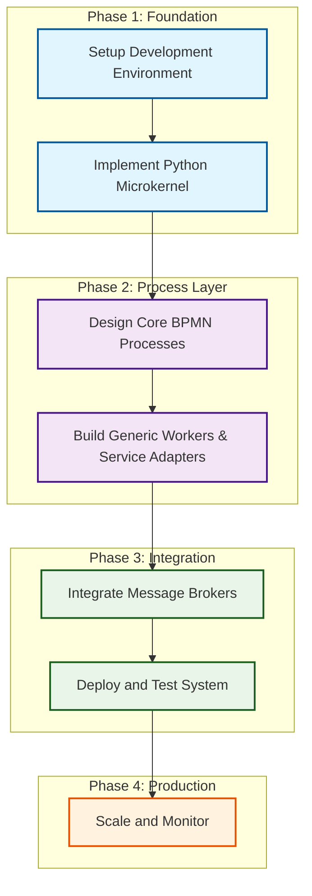
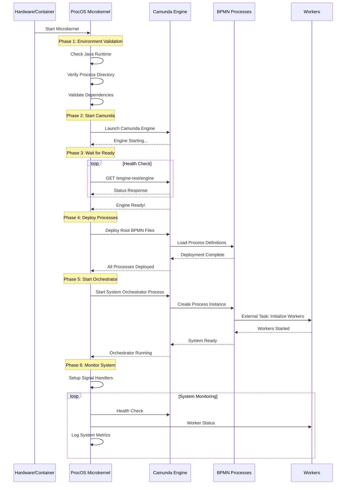
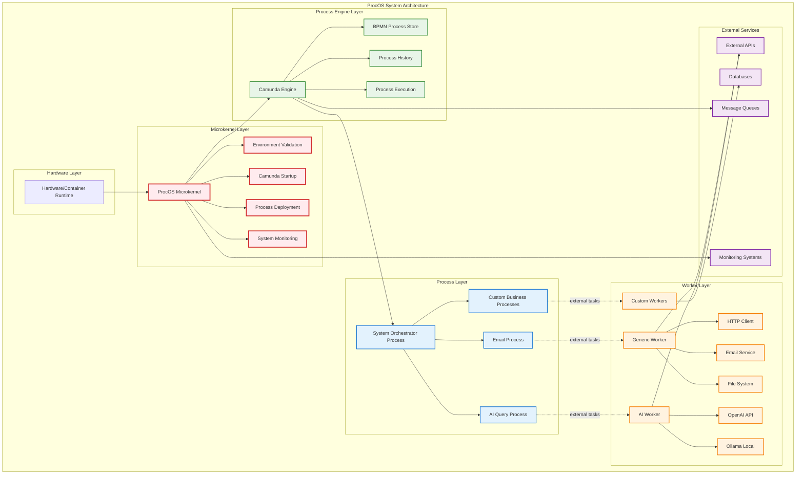
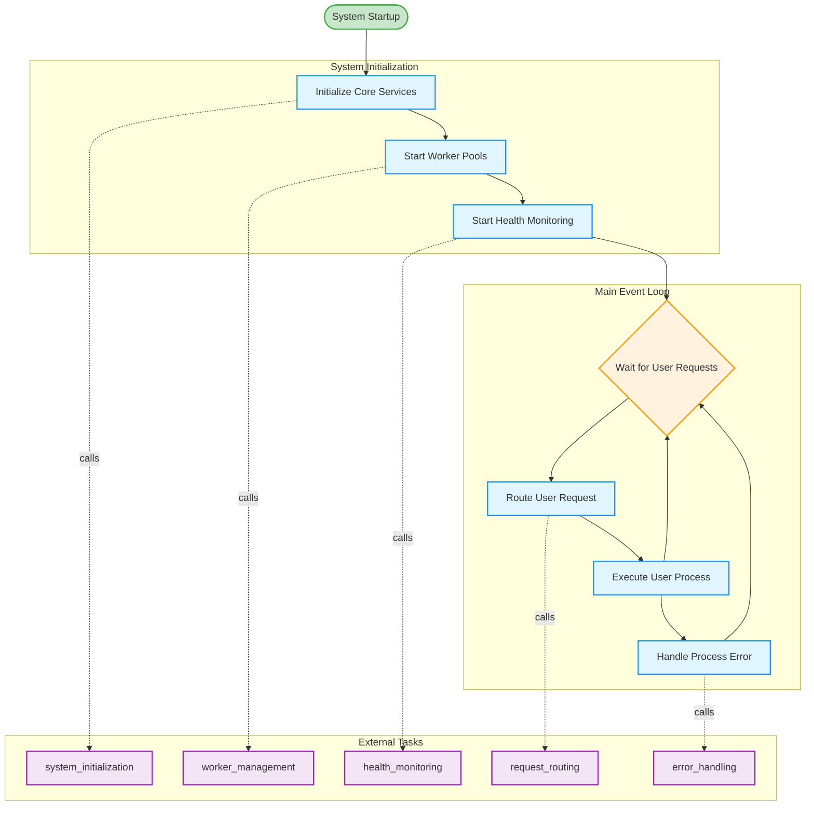

# ProcOS Implementation Guide
## Building a Process-Driven Virtual Operating System

**Version**: 1.0  
**Date**: January 2025  
**Target Audience**: System Architects, DevOps Engineers, BPMN Developers

---

## Table of Contents

1. [Introduction](#1-introduction)
2. [System Requirements and Setup](#2-system-requirements-and-setup)
3. [Microkernel Implementation](#3-microkernel-implementation)
4. [BPMN Design and Deployment](#4-bpmn-design-and-deployment)
5. [Generic Worker and Adapters](#5-generic-worker-and-adapters)
6. [Integration with Microservices](#6-integration-with-microservices)
7. [Runtime Scenarios](#7-runtime-scenarios)
8. [Deployment and Scaling](#8-deployment-and-scaling)
9. [Testing and Debugging](#9-testing-and-debugging)
10. [Appendix](#10-appendix)

---

## 1. Introduction

### 1.1 ProcOS Goals

**ProcOS** (Process-Oriented Operating System) revolutionizes computing by making **BPMN processes the fundamental abstraction** for all system operations. Unlike traditional operating systems that rely on imperative code, ProcOS treats Business Process Model and Notation (BPMN) as the "kernel language" that defines system behavior.

**Core Principles:**
- **Processes Drive Everything**: Every system operation expressed as BPMN process
- **Runtime Flexibility**: Modify system behavior by updating process definitions
- **Visual Transparency**: All system operations visible through process diagrams
- **Loose Coupling**: Services interact only through external task interfaces

### 1.2 Prerequisites

Before implementing ProcOS, ensure you have:

**Technical Skills:**
- Python 3.9+ development experience
- Basic BPMN 2.0 knowledge
- Docker and containerization familiarity
- Message broker concepts (RabbitMQ, Apache Kafka)
- REST API development

**Domain Knowledge:**
- Process orchestration patterns
- Microservices architecture
- Event-driven systems
- Container orchestration (Kubernetes basics)

### 1.3 Implementation Overview



**ProcOS Implementation Flow**:
1. **Setup Development Environment** - Install Java, Python, Docker, Camunda
2. **Implement Python Microkernel** - Bootstrap system and process engine
3. **Design Core BPMN Processes** - Create system orchestration workflows
4. **Build Generic Workers & Service Adapters** - Handle external tasks
5. **Integrate Message Brokers** - Enable microservice communication
6. **Deploy and Test System** - Containerized deployment with testing
7. **Scale and Monitor** - Production scaling and observability

---

## 2. System Requirements and Setup

### 2.1 Hardware Requirements

**Minimum Development Environment:**
- CPU: 4 cores, 2.4 GHz
- RAM: 8 GB (16 GB recommended)
- Storage: 50 GB SSD
- Network: Broadband internet connection

**Production Environment:**
- CPU: 8+ cores, 3.0+ GHz
- RAM: 32+ GB
- Storage: 200+ GB SSD with backup
- Network: High-speed, low-latency networking

### 2.2 Software Dependencies

#### 2.2.1 Core Components

```bash
# Java Runtime for Camunda
sudo apt update
sudo apt install openjdk-11-jdk

# Python 3.9+ with pip
sudo apt install python3.9 python3.9-pip python3.9-venv

# Docker and Docker Compose
curl -fsSL https://get.docker.com -o get-docker.sh
sudo sh get-docker.sh
sudo apt install docker-compose

# Git for version control
sudo apt install git
```

#### 2.2.2 Camunda Installation

**Option 1: Camunda Run (Recommended for Development)**
```bash
# Download Camunda Run
cd /opt
sudo wget https://downloads.camunda.cloud/release/camunda-bpm/run/7.19/camunda-bpm-run-7.19.0.tar.gz
sudo tar -xzf camunda-bpm-run-7.19.0.tar.gz
sudo chown -R $USER:$USER camunda-bpm-run-7.19.0

# Create configuration
cat > /opt/camunda-bpm-run-7.19.0/configuration/default.yml << EOF
camunda.bpm:
  database:
    type: h2
  webapps:
    index-redirect-enabled: false
  run:
    cors:
      enabled: true
      allowed-origins: "*"
server:
  port: 8080
EOF
```

**Option 2: Docker Container**
```bash
# Run Camunda in Docker
docker run -d \
  --name camunda \
  -p 8080:8080 \
  -e DB_DRIVER=org.h2.Driver \
  -e DB_URL=jdbc:h2:mem:camunda \
  camunda/camunda-bpm-platform:latest
```

#### 2.2.3 Message Broker Setup

**RabbitMQ with Docker:**
```bash
docker run -d \
  --name rabbitmq \
  -p 5672:5672 \
  -p 15672:15672 \
  -e RABBITMQ_DEFAULT_USER=procos \
  -e RABBITMQ_DEFAULT_PASS=procos123 \
  rabbitmq:3-management
```

### 2.3 Development Environment Setup

#### 2.3.1 Project Structure

```bash
mkdir procos-implementation
cd procos-implementation

# Create directory structure
mkdir -p {microkernel,processes,workers,adapters,tests,config,docker}

# Initialize Python virtual environment
python3.9 -m venv venv
source venv/bin/activate
```

#### 2.3.2 Python Dependencies

```bash
# Create requirements.txt
cat > requirements.txt << EOF
camunda-external-task-client-python3==3.5.0
pika==1.3.2
requests==2.31.0
flask==2.3.3
docker==6.1.3
pydantic==2.5.0
python-multipart==0.0.6
uvicorn==0.24.0
fastapi==0.104.1
prometheus-client==0.19.0
opentelemetry-api==1.21.0
opentelemetry-sdk==1.21.0
psutil==5.9.6
asyncio==3.4.3
aiofiles==23.2.1
PyYAML==6.0.1
EOF

# Install dependencies
pip install -r requirements.txt
```

---

## 3. Microkernel Implementation

### 3.1 Core Microkernel Architecture

The ProcOS microkernel is intentionally minimal, providing only essential bootstrapping functionality:

### 3.2 Bootstrap Sequence Flow

The microkernel follows a strict 6-phase bootstrap sequence:



### 3.3 Microkernel Implementation



**Key Architectural Principles**:
- **Minimal Microkernel**: Only handles system bootstrap and monitoring
- **Process-Driven**: All functionality implemented as BPMN processes
- **External Task Pattern**: Workers decouple processes from service implementations
- **Layered Architecture**: Clear separation between kernel, engine, processes, and workers

```python
#!/usr/bin/env python3
"""
ProcOS Microkernel - Minimal bootstrap for process-driven operating system
File: microkernel/procos_kernel.py
"""

import os
import sys
import time
import signal
import logging
import subprocess
import requests
import json
from pathlib import Path
from typing import Dict, List, Optional
from dataclasses import dataclass

@dataclass
class KernelConfig:
    """Microkernel configuration"""
    camunda_url: str = "http://localhost:8080"
    camunda_engine: str = "default"
    process_directory: str = "./processes"
    log_level: str = "INFO"
    startup_timeout: int = 120
    health_check_interval: int = 10

class ProcOSKernel:
    """
    ProcOS Microkernel - Bootstraps Camunda and deploys root processes
    
    Philosophy: Do the absolute minimum to get BPMN processes running,
    then let processes define all system behavior.
    """
    
    def __init__(self, config: KernelConfig = None):
        self.config = config or KernelConfig()
        self.camunda_process: Optional[subprocess.Popen] = None
        self.running = True
        self.root_processes: List[str] = []
        
        # Setup logging
        logging.basicConfig(
            level=getattr(logging, self.config.log_level),
            format='%(asctime)s - ProcOS-Kernel - %(levelname)s - %(message)s'
        )
        self.logger = logging.getLogger(__name__)
    
    def bootstrap(self) -> None:
        """
        Main bootstrap sequence - the ONLY imperative code in ProcOS
        Everything else is defined by BPMN processes
        
        This method implements the 6-phase bootstrap sequence:
        1. Environment validation
        2. Start Camunda engine  
        3. Wait for Camunda to be ready
        4. Deploy root orchestration processes
        5. Start root orchestrator
        6. Enter monitoring mode
        """
        try:
            self.logger.info("🚀 ProcOS Kernel Bootstrap Starting")
            
            # Phase 1: Environment validation
            self._validate_environment()
            
            # Phase 2: Start Camunda engine
            self._start_camunda_engine()
            
            # Phase 3: Wait for Camunda to be ready
            self._wait_for_camunda_ready()
            
            # Phase 4: Deploy root orchestration processes
            self._deploy_root_processes()
            
            # Phase 5: Start root orchestrator
            self._start_root_orchestrator()
            
            # Phase 6: Enter monitoring mode
            self._setup_signal_handlers()
            self._monitor_system()
            
        except Exception as e:
            self.logger.critical(f"💥 Bootstrap failed: {e}")
            self._emergency_shutdown()
            sys.exit(1)
    
    def _validate_environment(self) -> None:
        """Validate required environment and dependencies"""
        self.logger.info("🔍 Validating environment")
        
        # Check Java availability
        try:
            result = subprocess.run(['java', '-version'], 
                                  capture_output=True, text=True)
            if result.returncode != 0:
                raise EnvironmentError("Java not found - required for Camunda")
        except FileNotFoundError:
            raise EnvironmentError("Java not installed")
        
        # Check process directory
        process_dir = Path(self.config.process_directory)
        if not process_dir.exists():
            raise EnvironmentError(f"Process directory not found: {process_dir}")
        
        # Verify root processes exist
        root_processes = list(process_dir.glob("*.bpmn"))
        if not root_processes:
            raise EnvironmentError("No BPMN processes found in process directory")
        
        self.logger.info(f"✅ Environment validated - found {len(root_processes)} processes")
    
    def _start_camunda_engine(self) -> None:
        """Start Camunda engine process"""
        self.logger.info("🏭 Starting Camunda engine")
        
        # Check if Camunda is already running
        if self._is_camunda_running():
            self.logger.info("📊 Camunda already running - skipping start")
            return
        
        # Start Camunda Run
        camunda_cmd = [
            "java", "-jar", "/opt/camunda-bpm-run-7.19.0/camunda-bpm-run-7.19.0.jar"
        ]
        
        try:
            self.camunda_process = subprocess.Popen(
                camunda_cmd,
                stdout=subprocess.PIPE,
                stderr=subprocess.PIPE,
                cwd="/opt/camunda-bpm-run-7.19.0"
            )
            self.logger.info(f"🚀 Camunda process started (PID: {self.camunda_process.pid})")
            
        except Exception as e:
            raise RuntimeError(f"Failed to start Camunda: {e}")
    
    def _is_camunda_running(self) -> bool:
        """Check if Camunda is already running"""
        try:
            response = requests.get(f"{self.config.camunda_url}/engine-rest/engine", 
                                  timeout=5)
            return response.status_code == 200
        except:
            return False
    
    def _wait_for_camunda_ready(self) -> None:
        """Wait for Camunda to be fully ready"""
        self.logger.info("⏳ Waiting for Camunda to be ready")
        
        start_time = time.time()
        while time.time() - start_time < self.config.startup_timeout:
            if self._is_camunda_ready():
                self.logger.info("✅ Camunda is ready")
                return
            
            time.sleep(2)
            self.logger.debug("🔄 Still waiting for Camunda...")
        
        raise TimeoutError("Camunda failed to start within timeout period")
    
    def _is_camunda_ready(self) -> bool:
        """Check if Camunda is fully ready for requests"""
        try:
            # Check engine endpoint
            engines_response = requests.get(
                f"{self.config.camunda_url}/engine-rest/engine",
                timeout=5
            )
            
            # Check deployment endpoint
            deploy_response = requests.get(
                f"{self.config.camunda_url}/engine-rest/deployment",
                timeout=5
            )
            
            return (engines_response.status_code == 200 and 
                    deploy_response.status_code == 200)
        except:
            return False
    
    def _deploy_root_processes(self) -> None:
        """Deploy all root orchestration processes"""
        self.logger.info("📋 Deploying root orchestration processes")
        
        process_dir = Path(self.config.process_directory)
        bpmn_files = list(process_dir.glob("*.bpmn"))
        
        for bpmn_file in bpmn_files:
            try:
                self._deploy_process(bpmn_file)
                self.root_processes.append(bpmn_file.stem)
                self.logger.info(f"✅ Deployed: {bpmn_file.name}")
            except Exception as e:
                self.logger.error(f"❌ Failed to deploy {bpmn_file.name}: {e}")
                raise
        
        self.logger.info(f"🎯 All {len(bpmn_files)} root processes deployed")
    
    def _deploy_process(self, bpmn_file: Path) -> None:
        """Deploy a single BPMN process to Camunda"""
        url = f"{self.config.camunda_url}/engine-rest/deployment/create"
        
        with open(bpmn_file, 'rb') as f:
            files = {
                'upload': (bpmn_file.name, f, 'application/xml')
            }
            
            data = {
                'deployment-name': f'ProcOS-{bpmn_file.stem}',
                'enable-duplicate-filtering': 'true'
            }
            
            response = requests.post(url, files=files, data=data)
            
            if response.status_code != 200:
                raise RuntimeError(f"Deployment failed: {response.text}")
    
    def _start_root_orchestrator(self) -> None:
        """Start the root orchestration process"""
        self.logger.info("🎼 Starting root orchestrator process")
        
        # Start the main system orchestrator process
        url = f"{self.config.camunda_url}/engine-rest/process-definition/key/procos_system_orchestrator/start"
        
        process_variables = {
            "variables": {
                "system_mode": {"value": "production", "type": "String"},
                "kernel_version": {"value": "1.0.0", "type": "String"},
                "startup_time": {"value": int(time.time()), "type": "Long"}
            }
        }
        
        response = requests.post(url, json=process_variables)
        
        if response.status_code == 200:
            result = response.json()
            self.logger.info(f"🎯 Root orchestrator started - Instance ID: {result['id']}")
        else:
            raise RuntimeError(f"Failed to start root orchestrator: {response.text}")
    
    def _setup_signal_handlers(self) -> None:
        """Setup signal handlers for graceful shutdown"""
        signal.signal(signal.SIGINT, self._signal_handler)
        signal.signal(signal.SIGTERM, self._signal_handler)
    
    def _signal_handler(self, signum, frame) -> None:
        """Handle shutdown signals"""
        self.logger.info(f"📡 Received signal {signum} - initiating shutdown")
        self.running = False
    
    def _monitor_system(self) -> None:
        """Main monitoring loop - keep system running"""
        self.logger.info("👁️ Entering system monitoring mode")
        
        while self.running:
            try:
                # Check Camunda health
                if not self._is_camunda_ready():
                    self.logger.error("💔 Camunda engine unhealthy - attempting restart")
                    self._restart_camunda()
                
                # Check process health (this could be a BPMN process!)
                self._check_process_health()
                
                time.sleep(self.config.health_check_interval)
                
            except Exception as e:
                self.logger.error(f"🚨 Monitor error: {e}")
                time.sleep(5)
        
        self.logger.info("🛑 Monitoring stopped - initiating shutdown")
        self._graceful_shutdown()
    
    def _check_process_health(self) -> None:
        """Check health of running processes"""
        try:
            url = f"{self.config.camunda_url}/engine-rest/process-instance"
            response = requests.get(url, timeout=5)
            
            if response.status_code == 200:
                instances = response.json()
                active_count = len([p for p in instances if not p.get('ended')])
                self.logger.debug(f"📊 Active process instances: {active_count}")
        except Exception as e:
            self.logger.warning(f"⚠️ Health check failed: {e}")
    
    def _restart_camunda(self) -> None:
        """Restart Camunda engine"""
        self.logger.info("🔄 Restarting Camunda engine")
        
        if self.camunda_process:
            self.camunda_process.terminate()
            self.camunda_process.wait(timeout=30)
        
        self._start_camunda_engine()
        self._wait_for_camunda_ready()
        self.logger.info("✅ Camunda restart complete")
    
    def _graceful_shutdown(self) -> None:
        """Gracefully shutdown the system"""
        self.logger.info("🛑 Initiating graceful shutdown")
        
        # This could trigger a BPMN shutdown process!
        try:
            url = f"{self.config.camunda_url}/engine-rest/process-definition/key/procos_system_shutdown/start"
            requests.post(url, json={"variables": {}}, timeout=10)
            self.logger.info("📋 Shutdown process triggered")
        except:
            self.logger.warning("⚠️ Could not trigger shutdown process")
        
        if self.camunda_process:
            self.camunda_process.terminate()
            self.camunda_process.wait(timeout=30)
        
        self.logger.info("✅ ProcOS Kernel shutdown complete")
    
    def _emergency_shutdown(self) -> None:
        """Emergency shutdown for critical failures"""
        self.logger.critical("🚨 EMERGENCY SHUTDOWN")
        
        if self.camunda_process:
            self.camunda_process.kill()
        
        sys.exit(1)

# Entry point
if __name__ == "__main__":
    import argparse
    
    parser = argparse.ArgumentParser(description='ProcOS Microkernel')
    parser.add_argument('--config', help='Configuration file path')
    parser.add_argument('--process-dir', default='./processes', 
                       help='BPMN process directory')
    args = parser.parse_args()
    
    config = KernelConfig(process_directory=args.process_dir)
    kernel = ProcOSKernel(config)
    kernel.bootstrap()
```

### 3.2 Configuration Management

```python
# File: microkernel/config.py
"""
Configuration management for ProcOS
"""

import os
import yaml
from typing import Dict, Any
from dataclasses import dataclass, asdict

@dataclass
class ServiceConfig:
    """Configuration for external services"""
    name: str
    endpoint: str
    timeout: int = 30
    retries: int = 3
    enabled: bool = True

@dataclass
class WorkerConfig:
    """Configuration for generic workers"""
    worker_id: str
    topics: list[str]
    max_tasks: int = 10
    poll_interval: int = 5000  # milliseconds
    lock_duration: int = 30000  # milliseconds

@dataclass
class ProcOSConfig:
    """Complete ProcOS configuration"""
    # Kernel settings
    kernel: KernelConfig
    
    # Service configurations
    services: Dict[str, ServiceConfig]
    
    # Worker configurations
    workers: Dict[str, WorkerConfig]
    
    # Security settings
    security: Dict[str, Any]
    
    @classmethod
    def from_yaml(cls, config_path: str) -> 'ProcOSConfig':
        """Load configuration from YAML file"""
        with open(config_path, 'r') as f:
            data = yaml.safe_load(f)
        
        return cls(
            kernel=KernelConfig(**data.get('kernel', {})),
            services={k: ServiceConfig(**v) for k, v in data.get('services', {}).items()},
            workers={k: WorkerConfig(**v) for k, v in data.get('workers', {}).items()},
            security=data.get('security', {})
        )

# Example configuration file (config/procos.yml)
example_config = """
kernel:
  camunda_url: "http://localhost:8080"
  process_directory: "./processes"
  log_level: "INFO"
  startup_timeout: 120

services:
  openai:
    name: "OpenAI API"
    endpoint: "https://api.openai.com/v1"
    timeout: 30
    enabled: true
  
  ollama:
    name: "Ollama Local"
    endpoint: "http://localhost:11434"
    timeout: 60
    enabled: true
  
  python_executor:
    name: "Python Script Executor"
    endpoint: "http://localhost:8001"
    timeout: 120
    enabled: true

workers:
  ai_worker:
    worker_id: "ai-worker-01"
    topics: ["ai_query", "text_generation", "code_analysis"]
    max_tasks: 5
    poll_interval: 3000
  
  python_worker:
    worker_id: "python-worker-01"
    topics: ["python_script", "data_processing"]
    max_tasks: 3
    poll_interval: 5000
  
  generic_worker:
    worker_id: "generic-worker-01"
    topics: ["email_send", "http_request", "file_operation"]
    max_tasks: 10
    poll_interval: 2000

security:
  sandbox_enabled: true
  max_execution_time: 300
  resource_limits:
    memory: "512MB"
    cpu: "500m"
"""
```

---

## 4. BPMN Design and Deployment

### 4.1 Root System Orchestrator

The heart of ProcOS is the root system orchestrator that manages all system operations:



**Process Flow**:
1. **System Startup** → Triggered when ProcOS microkernel starts the orchestrator
2. **Initialize Core Services** → External task to setup system components
3. **Start Worker Pools** → External task to launch all worker processes
4. **Start Health Monitoring** → External task to begin system health checks
5. **Main Loop** → Waits for user requests and routes them to appropriate processes
6. **Error Handling** → Processes any failures with recovery mechanisms

```xml
<?xml version="1.0" encoding="UTF-8"?>
<bpmn:definitions xmlns:bpmn="http://www.omg.org/spec/BPMN/20100524/MODEL" 
                  xmlns:camunda="http://camunda.org/schema/1.0/bpmn"
                  targetNamespace="http://procos.org/bpmn">
  
  <bpmn:process id="procos_system_orchestrator" name="ProcOS System Orchestrator" isExecutable="true">
    
    <!-- System Startup Sequence -->
    <bpmn:startEvent id="system_startup" name="System Startup">
      <bpmn:outgoing>to_init_services</bpmn:outgoing>
    </bpmn:startEvent>
    
    <bpmn:serviceTask id="initialize_core_services" name="Initialize Core Services">
      <bpmn:extensionElements>
        <camunda:externalTask topic="system_initialization"/>
      </bpmn:extensionElements>
      <bpmn:incoming>to_init_services</bpmn:incoming>
      <bpmn:outgoing>to_start_workers</bpmn:outgoing>
    </bpmn:serviceTask>
    
    <bpmn:serviceTask id="start_worker_pools" name="Start Worker Pools">
      <bpmn:extensionElements>
        <camunda:externalTask topic="worker_management">
          <camunda:inputOutput>
            <camunda:inputParameter name="action">start_all</camunda:inputParameter>
          </camunda:inputOutput>
        </camunda:externalTask>
      </bpmn:extensionElements>
      <bpmn:incoming>to_start_workers</bpmn:incoming>
      <bpmn:outgoing>to_health_monitoring</bpmn:outgoing>
    </bpmn:serviceTask>
    
    <!-- Health Monitoring Loop -->
    <bpmn:serviceTask id="start_health_monitoring" name="Start Health Monitoring">
      <bpmn:extensionElements>
        <camunda:externalTask topic="health_monitoring"/>
      </bpmn:extensionElements>
      <bpmn:incoming>to_health_monitoring</bpmn:incoming>
      <bpmn:outgoing>to_main_loop</bpmn:outgoing>
    </bpmn:serviceTask>
    
    <!-- Main System Loop -->
    <bpmn:intermediateCatchEvent id="wait_for_requests" name="Wait for User Requests">
      <bpmn:messageEventDefinition messageRef="user_request_message"/>
      <bpmn:incoming>to_main_loop</bpmn:incoming>
      <bpmn:incoming>from_process_completion</bpmn:incoming>
      <bpmn:outgoing>to_route_request</bpmn:outgoing>
    </bpmn:intermediateCatchEvent>
    
    <bpmn:businessRuleTask id="route_user_request" name="Route User Request">
      <bpmn:extensionElements>
        <camunda:externalTask topic="request_routing"/>
      </bpmn:extensionElements>
      <bpmn:incoming>to_route_request</bpmn:incoming>
      <bpmn:outgoing>to_execute_process</bpmn:outgoing>
    </bpmn:businessRuleTask>
    
    <bpmn:callActivity id="execute_user_process" name="Execute User Process">
      <bpmn:extensionElements>
        <camunda:calledElement>${process_to_execute}</camunda:calledElement>
        <camunda:in businessKey="#{execution.processBusinessKey}"/>
        <camunda:in variables="all"/>
        <camunda:out variables="all"/>
      </bpmn:extensionElements>
      <bpmn:incoming>to_execute_process</bpmn:incoming>
      <bpmn:outgoing>from_process_completion</bpmn:outgoing>
    </bpmn:callActivity>
    
    <!-- Error Handling -->
    <bpmn:boundaryEvent id="process_error" name="Process Error" attachedToRef="execute_user_process">
      <bpmn:errorEventDefinition/>
      <bpmn:outgoing>to_error_handling</bpmn:outgoing>
    </bpmn:boundaryEvent>
    
    <bpmn:serviceTask id="handle_process_error" name="Handle Process Error">
      <bpmn:extensionElements>
        <camunda:externalTask topic="error_handling"/>
      </bpmn:extensionElements>
      <bpmn:incoming>to_error_handling</bpmn:incoming>
      <bpmn:outgoing>from_process_completion</bpmn:outgoing>
    </bpmn:serviceTask>
    
    <!-- Define sequence flows -->
    <bpmn:sequenceFlow id="to_init_services" sourceRef="system_startup" targetRef="initialize_core_services"/>
    <bpmn:sequenceFlow id="to_start_workers" sourceRef="initialize_core_services" targetRef="start_worker_pools"/>
    <bpmn:sequenceFlow id="to_health_monitoring" sourceRef="start_worker_pools" targetRef="start_health_monitoring"/>
    <bpmn:sequenceFlow id="to_main_loop" sourceRef="start_health_monitoring" targetRef="wait_for_requests"/>
    <bpmn:sequenceFlow id="to_route_request" sourceRef="wait_for_requests" targetRef="route_user_request"/>
    <bpmn:sequenceFlow id="to_execute_process" sourceRef="route_user_request" targetRef="execute_user_process"/>
    <bpmn:sequenceFlow id="from_process_completion" sourceRef="execute_user_process" targetRef="wait_for_requests"/>
    <bpmn:sequenceFlow id="to_error_handling" sourceRef="process_error" targetRef="handle_process_error"/>
    
  </bpmn:process>
  
  <!-- Message Definitions -->
  <bpmn:message id="user_request_message" name="UserRequest"/>
  
</bpmn:definitions>
```

### 4.2 General Process Example: AI Query

```xml
<?xml version="1.0" encoding="UTF-8"?>
<bpmn:definitions xmlns:bpmn="http://www.omg.org/spec/BPMN/20100524/MODEL" 
                  xmlns:camunda="http://camunda.org/schema/1.0/bpmn"
                  targetNamespace="http://procos.org/bpmn">
  
  <bpmn:process id="ai_query_process" name="AI Query Process" isExecutable="true">
    
    <bpmn:startEvent id="ai_query_start" name="AI Query Request">
      <bpmn:outgoing>to_validate_input</bpmn:outgoing>
    </bpmn:startEvent>
    
    <!-- Input Validation -->
    <bpmn:serviceTask id="validate_query_input" name="Validate Query Input">
      <bpmn:extensionElements>
        <camunda:externalTask topic="input_validation">
          <camunda:inputOutput>
            <camunda:inputParameter name="validation_schema">
              {
                "required": ["user_query", "ai_provider"],
                "properties": {
                  "user_query": {"type": "string", "minLength": 1, "maxLength": 4000},
                  "ai_provider": {"enum": ["openai", "ollama", "auto"]},
                  "model": {"type": "string"},
                  "max_tokens": {"type": "integer", "minimum": 1, "maximum": 4000}
                }
              }
            </camunda:inputParameter>
          </camunda:inputOutput>
        </camunda:externalTask>
      </bpmn:extensionElements>
      <bpmn:incoming>to_validate_input</bpmn:incoming>
      <bpmn:outgoing>to_route_provider</bpmn:outgoing>
    </bpmn:serviceTask>
    
    <!-- AI Provider Routing -->
    <bpmn:exclusiveGateway id="route_ai_provider" name="Route AI Provider">
      <bpmn:incoming>to_route_provider</bpmn:incoming>
      <bpmn:outgoing>to_openai</bpmn:outgoing>
      <bpmn:outgoing>to_ollama</bpmn:outgoing>
      <bpmn:outgoing>to_auto_select</bpmn:outgoing>
    </bpmn:exclusiveGateway>
    
    <!-- OpenAI Path -->
    <bpmn:serviceTask id="query_openai" name="Query OpenAI">
      <bpmn:extensionElements>
        <camunda:externalTask topic="ai_query">
          <camunda:inputOutput>
            <camunda:inputParameter name="provider">openai</camunda:inputParameter>
            <camunda:inputParameter name="model">${model != null ? model : "gpt-3.5-turbo"}</camunda:inputParameter>
            <camunda:inputParameter name="max_tokens">${max_tokens != null ? max_tokens : 1000}</camunda:inputParameter>
          </camunda:inputOutput>
        </camunda:externalTask>
      </bpmn:extensionElements>
      <bpmn:incoming>to_openai</bpmn:incoming>
      <bpmn:outgoing>to_format_response</bpmn:outgoing>
    </bpmn:serviceTask>
    
    <!-- Ollama Path -->
    <bpmn:serviceTask id="query_ollama" name="Query Ollama">
      <bpmn:extensionElements>
        <camunda:externalTask topic="ai_query">
          <camunda:inputOutput>
            <camunda:inputParameter name="provider">ollama</camunda:inputParameter>
            <camunda:inputParameter name="model">${model != null ? model : "llama2"}</camunda:inputParameter>
            <camunda:inputParameter name="max_tokens">${max_tokens != null ? max_tokens : 1000}</camunda:inputParameter>
          </camunda:inputOutput>
        </camunda:externalTask>
      </bpmn:extensionElements>
      <bpmn:incoming>to_ollama</bpmn:incoming>
      <bpmn:outgoing>to_format_response</bpmn:outgoing>
    </bpmn:serviceTask>
    
    <!-- Auto-selection Path -->
    <bpmn:serviceTask id="auto_select_provider" name="Auto-Select Provider">
      <bpmn:extensionElements>
        <camunda:externalTask topic="provider_selection">
          <camunda:inputOutput>
            <camunda:inputParameter name="selection_criteria">
              {
                "query_length": "${user_query.length()}",
                "complexity": "${complexity_score}",
                "availability": "check_all"
              }
            </camunda:inputParameter>
          </camunda:inputOutput>
        </camunda:externalTask>
      </bpmn:extensionElements>
      <bpmn:incoming>to_auto_select</bpmn:incoming>
      <bpmn:outgoing>to_format_response</bpmn:outgoing>
    </bpmn:serviceTask>
    
    <!-- Response Formatting -->
    <bpmn:serviceTask id="format_ai_response" name="Format AI Response">
      <bpmn:extensionElements>
        <camunda:externalTask topic="response_formatting">
          <camunda:inputOutput>
            <camunda:inputParameter name="format_type">json</camunda:inputParameter>
            <camunda:inputParameter name="include_metadata">true</camunda:inputParameter>
          </camunda:inputOutput>
        </camunda:externalTask>
      </bpmn:extensionElements>
      <bpmn:incoming>to_format_response</bpmn:incoming>
      <bpmn:outgoing>to_end</bpmn:outgoing>
    </bpmn:serviceTask>
    
    <bpmn:endEvent id="ai_query_end" name="Query Complete">
      <bpmn:incoming>to_end</bpmn:incoming>
    </bpmn:endEvent>
    
    <!-- Sequence Flows -->
    <bpmn:sequenceFlow id="to_validate_input" sourceRef="ai_query_start" targetRef="validate_query_input"/>
    <bpmn:sequenceFlow id="to_route_provider" sourceRef="validate_query_input" targetRef="route_ai_provider"/>
    
    <!-- Conditional flows for AI provider routing -->
    <bpmn:sequenceFlow id="to_openai" sourceRef="route_ai_provider" targetRef="query_openai">
      <bpmn:conditionExpression xsi:type="bpmn:tFormalExpression">
        ${ai_provider == "openai"}
      </bpmn:conditionExpression>
    </bpmn:sequenceFlow>
    
    <bpmn:sequenceFlow id="to_ollama" sourceRef="route_ai_provider" targetRef="query_ollama">
      <bpmn:conditionExpression xsi:type="bpmn:tFormalExpression">
        ${ai_provider == "ollama"}
      </bpmn:conditionExpression>
    </bpmn:sequenceFlow>
    
    <bpmn:sequenceFlow id="to_auto_select" sourceRef="route_ai_provider" targetRef="auto_select_provider">
      <bpmn:conditionExpression xsi:type="bpmn:tFormalExpression">
        ${ai_provider == "auto"}
      </bpmn:conditionExpression>
    </bpmn:sequenceFlow>
    
    <bpmn:sequenceFlow id="to_format_response" sourceRef="query_openai" targetRef="format_ai_response"/>
    <bpmn:sequenceFlow id="to_format_response" sourceRef="query_ollama" targetRef="format_ai_response"/>
    <bpmn:sequenceFlow id="to_format_response" sourceRef="auto_select_provider" targetRef="format_ai_response"/>
    <bpmn:sequenceFlow id="to_end" sourceRef="format_ai_response" targetRef="ai_query_end"/>
    
  </bpmn:process>
</bpmn:definitions>
```

### 4.3 Process Deployment Script

```python
# File: scripts/deploy_processes.py
"""
Script to deploy BPMN processes to Camunda
"""

import requests
import os
from pathlib import Path
import argparse

class ProcessDeployer:
    """Deploy BPMN processes to Camunda engine"""
    
    def __init__(self, camunda_url: str = "http://localhost:8080"):
        self.camunda_url = camunda_url
        self.base_url = f"{camunda_url}/engine-rest"
    
    def deploy_directory(self, process_dir: str) -> None:
        """Deploy all BPMN files in a directory"""
        process_path = Path(process_dir)
        
        if not process_path.exists():
            raise FileNotFoundError(f"Process directory not found: {process_dir}")
        
        bpmn_files = list(process_path.glob("*.bpmn"))
        
        if not bpmn_files:
            print(f"No BPMN files found in {process_dir}")
            return
        
        print(f"Found {len(bpmn_files)} BPMN files to deploy")
        
        for bpmn_file in bpmn_files:
            try:
                self.deploy_process(bpmn_file)
                print(f"✅ Deployed: {bpmn_file.name}")
            except Exception as e:
                print(f"❌ Failed to deploy {bpmn_file.name}: {e}")
    
    def deploy_process(self, bpmn_file: Path) -> dict:
        """Deploy a single BPMN process"""
        url = f"{self.base_url}/deployment/create"
        
        with open(bpmn_file, 'rb') as f:
            files = {
                'upload': (bpmn_file.name, f, 'application/xml')
            }
            
            data = {
                'deployment-name': f'ProcOS-{bpmn_file.stem}',
                'enable-duplicate-filtering': 'true',
                'deploy-changed-only': 'true'
            }
            
            response = requests.post(url, files=files, data=data)
            
            if response.status_code == 200:
                return response.json()
            else:
                raise RuntimeError(f"Deployment failed: {response.text}")
    
    def list_deployments(self) -> list:
        """List all deployments"""
        url = f"{self.base_url}/deployment"
        response = requests.get(url)
        
        if response.status_code == 200:
            return response.json()
        else:
            raise RuntimeError(f"Failed to list deployments: {response.text}")
    
    def list_process_definitions(self) -> list:
        """List all process definitions"""
        url = f"{self.base_url}/process-definition"
        response = requests.get(url)
        
        if response.status_code == 200:
            return response.json()
        else:
            raise RuntimeError(f"Failed to list process definitions: {response.text}")

if __name__ == "__main__":
    parser = argparse.ArgumentParser(description='Deploy BPMN processes to Camunda')
    parser.add_argument('--process-dir', default='./processes', 
                       help='Directory containing BPMN files')
    parser.add_argument('--camunda-url', default='http://localhost:8080',
                       help='Camunda base URL')
    parser.add_argument('--list', action='store_true',
                       help='List deployed processes')
    
    args = parser.parse_args()
    
    deployer = ProcessDeployer(args.camunda_url)
    
    if args.list:
        print("📋 Deployed processes:")
        processes = deployer.list_process_definitions()
        for process in processes:
            print(f"  - {process['key']} (v{process['version']})")
    else:
        deployer.deploy_directory(args.process_dir)
```

**Continue to Part 2**: [ProcOS Implementation Guide - Part 2](./ProcOS_Implementation_Guide_Part2.md)

**Part 2 Covers**:
- **Section 5**: Advanced worker implementations with AI integration (OpenAI, Ollama)
- **Section 6**: Microservice integration with message brokers and service discovery
- **Section 7**: Complete runtime scenarios and end-to-end process execution
- **Section 8**: Production deployment with Docker, Kubernetes, and auto-scaling

**Implementation Status**: Part 1 (Sections 1-4) provides the foundation architecture with microkernel, BPMN processes, and basic worker patterns. Part 2 delivers advanced integration patterns and production deployment strategies for scalable ProcOS systems.