# ProcOS Simplified Overview
## A Process-Oriented Operating System That Anyone Can Use and Customize

**Think of ProcOS like a smart car - simple to drive, easy to work on, with a digital assistant helping everyone**

---

## 🚗 The Car Analogy


## 🎯 What Makes ProcOS Different?

### **Everything is a Process Definition**
- **Drivers** use pre-built business process workflows
- **Mechanics** customize and create system process workflows  
- **Specialists** tune the execution engine process workflows
- **Digital Assistant** helps everyone work with process workflows

### **No Hard-Coded Limitations**
- Want to change how email works? Modify the email process definition
- Need a new AI workflow? Create it as a process definition
- Want to tune the engine? Adjust the PDE process definitions
- All without touching core code!

---

## 👤 For Drivers (End Users)

### What You See: **Simple Business Workflows**


### **Example Use Cases:**

#### **1. AI-Powered Document Analysis**
```
You: "Analyze this contract for key terms"
ProcOS: [Automatically routes to best AI, processes document, highlights key terms]
You: Get results in 30 seconds with confidence scores
```

#### **2. Data Processing Pipeline**
```
You: "Process this sales data and send report to team"
ProcOS: [Cleans data, generates charts, creates report, emails team]
You: Get confirmation when complete with preview link
```

#### **3. Customer Support Workflow**
```
Customer submits ticket → AI analyzes → Routes to right team → Tracks progress → Notifies customer
You just monitor the dashboard and handle exceptions
```

### **What the Digital Assistant Does for You:**
- **Guides you** through creating workflows
- **Suggests improvements** based on your patterns  
- **Handles errors** automatically with smart fallbacks
- **Learns your preferences** and optimizes over time

---

## 🔧 For Mechanics (Super Users)

### What You See: **System Components You Can Customize**

```mermaid
graph TB
    subgraph "🔧 Under the Hood: System Processes You Can Modify"
        RAG[RAG Knowledge Pipeline<br/>📚 How the system finds information]
        DATA[Data Processing Engine<br/>📊 How data gets cleaned and analyzed]
        AI[AI Workflow Manager<br/>🤖 How AI requests get handled]
        HEALTH[System Health Monitor<br/>💓 How the system stays healthy]
        INTEGRATE[Integration Hub<br/>🔌 How external systems connect]
    end
    
    RAG --> |customize knowledge sources| KNOWLEDGE[Knowledge Bases]
    DATA --> |configure data flows| DATABASES[Data Sources]
    AI --> |tune AI models| MODELS[AI Services]
    HEALTH --> |set monitoring rules| ALERTS[Alert Systems]
    INTEGRATE --> |add new connections| APIS[External APIs]
    
    classDef mechanic fill:#fff3e0,stroke:#f57c00,stroke-width:2px
    classDef external fill:#f3e5f5,stroke:#7b1fa2,stroke-width:1px
    
    class RAG,DATA,AI,HEALTH,INTEGRATE mechanic
    class KNOWLEDGE,DATABASES,MODELS,ALERTS,APIS external
```



### **Example Customizations:**

#### **1. Build a Custom RAG Pipeline**
```
Problem: "We need our AI to know about our internal company docs"
Solution: Create a process definition that:
- Monitors company file shares
- Extracts and indexes content
- Makes it available to AI workflows
- Updates automatically when docs change
```

#### **2. Create Industry-Specific Workflows**
```
Problem: "Our medical practice has unique workflow needs"
Solution: Design process definitions for:
- Patient intake with HIPAA compliance
- Insurance verification workflows
- Automated appointment scheduling
- Lab result processing and notifications
```

#### **3. Set Up Smart Monitoring**
```
Problem: "We need to know when things go wrong before users notice"
Solution: Configure monitoring processes that:
- Track system performance in real-time
- Predict potential issues before they happen
- Automatically apply fixes where possible
- Alert humans only when necessary
```

### **What the Digital Assistant Does for You:**
- **Analyzes your current processes** and suggests optimizations
- **Helps design new workflows** based on best practices
- **Monitors system performance** and recommends tuning
- **Learns from other similar organizations** and suggests improvements

---

## ⚙️ For Engine Specialists (Developers)

### What You See: **The Core Engine You Can Tune**

```mermaid
graph TB
    subgraph "⚙️ Engine Internals: What Specialists Can Tune"
        KERNEL[Microkernel<br/>🔥 Starts everything up]
        PDE1[PDE Instance 1<br/>⚡ Executes AI tasks]
        PDE2[PDE Instance 2<br/>⚡ Executes data tasks]  
        PDE3[PDE Instance N<br/>⚡ Executes integration tasks]
        
        KERNEL --> SCHEDULER[PDE Scheduler<br/>🎯 Decides which PDE handles what]
        SCHEDULER --> PDE1
        SCHEDULER --> PDE2
        SCHEDULER --> PDE3
    end
    
            subgraph "🔌 Worker Processes: The Actual Work Gets Done Here"
            OAI[AI Worker Process<br/>🧠 Cloud AI processing workflow]
            OLLAMA[Local AI Worker Process<br/>🏠 Local AI processing workflow]
            PYTHON[Python Worker Process<br/>🐍 Script execution workflow]
            HTTP[HTTP Worker Process<br/>🌐 API call workflow]
            EMAIL[Email Worker Process<br/>📧 Email sending workflow]
            CUSTOM[Custom Worker Processes<br/>🛠️ Your special workflow tools]
        end
    
    PDE1 --> OAI
    PDE1 --> OLLAMA
    PDE2 --> PYTHON
    PDE2 --> HTTP
    PDE3 --> EMAIL
    PDE3 --> CUSTOM
    
    classDef engine fill:#ffebee,stroke:#d32f2f,stroke-width:2px
    classDef endpoint fill:#e8f5e8,stroke:#2e7d32,stroke-width:2px
    
    class KERNEL,SCHEDULER,PDE1,PDE2,PDE3 engine
    class OAI,OLLAMA,PYTHON,HTTP,EMAIL,CUSTOM endpoint
```



### **Example Engine Tuning:**

#### **1. Optimize PDE Performance**
```python
# Tune PDE routing intelligence
pde_config = {
    "ai_specialized": {
        "instances": 4,  # More instances for AI-heavy workloads
        "routing_strategy": "model_performance_based",
        "fallback_chains": ["gpt4 -> gpt3.5 -> ollama"]
    }
}
```

#### **2. Create Custom Endpoints**
```python
# Add a new endpoint for your special hardware
class QuantumProcessorEndpoint:
    def can_handle(self, task):
        return task.requires_quantum_computing()
    
    def execute(self, task):
        return self.quantum_hardware.process(task)
```

#### **3. Design Smart PDE Routing**
```python
# Teach PDEs to route based on task characteristics
def smart_routing_logic(task, available_endpoints):
    if task.is_complex_reasoning():
        return "openai_gpt4"
    elif task.is_code_generation():
        return "ollama_codellama"  
    elif task.needs_privacy():
        return "local_ollama"
    else:
        return "fastest_available"
```

### **What the Digital Assistant Does for You:**
- **Analyzes performance metrics** and suggests engine tuning
- **Identifies bottlenecks** in PDE execution patterns
- **Recommends new worker processes** based on usage patterns
- **Helps optimize resource allocation** across PDEs

### **🔄 Everything is a Process - Even the Workers!**

**Here's the beautiful part:** In ProcOS, even the "workers" that do the actual work are process definitions!


**Why This is Revolutionary:**
- **Workers can evolve** - DAS can improve worker process definitions overnight
- **Workers are transparent** - you can see exactly how every task gets executed
- **Workers are composable** - complex workers built from simpler worker processes
- **Workers are scalable** - more work = more worker process instances

**Example: The Email Worker That Improved Itself**
```
Day 1: Simple email worker process: "Send email via SMTP"
Day 5: DAS notices failures and creates: "Try SMTP, fallback to API, retry logic"
Day 10: DAS adds: "Check recipient preferences, format optimization, delivery tracking"
Day 15: DAS suggests: "Your email success rate improved 40% with the new worker process!"
```

---

## 🎯 Why ProcOS is Like MATLAB/Simulink for Operating Systems

### **The Three Ways to Build Software**

Think about how people build things with computers:

```mermaid
graph LR
    subgraph "🔒 Hard Coding"
        HC[Hire Programmer<br/>Write Everything Custom]
        HC --> HC_TIME[6 Months<br/>$$$$$]
    end
    
    subgraph "🎯 Soft Coding (ProcOS Way)"
        SC[Use Smart Building Blocks<br/>Configure at UI Level]
        SC --> SC_TIME[2 Weeks<br/>$$]
    end
    
    subgraph "🚫 No Code"
        NC[Drag & Drop Only<br/>Take What You Get]
        NC --> NC_TIME[2 Days<br/>$]
    end
    
    classDef expensive fill:#ffebee,stroke:#d32f2f,stroke-width:2px
    classDef perfect fill:#e8f5e8,stroke:#2e7d32,stroke-width:3px
    classDef limited fill:#fff3e0,stroke:#f57c00,stroke-width:2px
    
    class HC,HC_TIME expensive
    class SC,SC_TIME perfect
    class NC,NC_TIME limited
```

### **ProcOS: The Sweet Spot Between Flexibility and Simplicity**

**Like MATLAB changed engineering** (from writing code to connecting blocks), **ProcOS changes operating systems** (from programming to configuring smart blocks).

#### **Real Example: Setting Up Email**

**Old Hard Coding Way:**
```
Need email in your app?
→ Hire developer
→ Write 500 lines of SMTP code  
→ Handle all error cases
→ Test everything
→ Deploy and maintain
→ Cost: $5,000 and 3 months
```

**No-Code Way:**
```
Need email in your app?  
→ Drag email block
→ Enter email address
→ That's it - very limited
→ Cost: $20/month, but can't customize
```

**ProcOS Soft Coding Way:**
```
Need email in your app?
→ Use email worker process (already built and tested)
→ Configure through UI:
  • Which email servers to use
  • How many retries if it fails  
  • What to do with bounces
  • When to send (immediate vs scheduled)
→ DAS suggests improvements based on your usage
→ Cost: Minutes to set up, works exactly how you want
```

### **The Magic: Everything is Built from Smart Blocks**

**Standard Blocks** (Pre-built and ready to use):
- AI conversation blocks
- Email sending blocks  
- Data processing blocks
- File handling blocks

**Specialized Blocks** (Created by experts for specific industries):
- Medical record processing blocks
- Financial analysis blocks
- Legal document blocks
- Scientific calculation blocks

**DAS-Created Blocks** (AI builds new blocks while you sleep):
- "I noticed you always do X then Y, so I created an X+Y block"
- "Your email success rate improved 40% with this new optimization block"
- "Based on 1000 users, here's a better way to handle customer data"

**Power User Blocks** (Advanced users create custom blocks):
- Custom business logic blocks
- Integration with your special systems
- Blocks that other users can then use too

### **Why This is Revolutionary**

**For Business Users:**
- Build powerful workflows without programming
- Customize everything through simple interfaces
- Get AI suggestions to make things better

**For Power Users:**  
- Create new capabilities through visual process design
- Share your innovations with the community
- Extend the system without touching core code

**For Everyone:**
- System gets smarter over time
- What works for one person helps everyone
- No vendor lock-in - everything is standard process definitions

### **The Car Analogy Continues**
- **Hard Coding** = Building a car from raw metal
- **No Code** = Buying a car you can't modify
- **ProcOS** = Having smart, upgradeable car parts you can configure and combine however you want, with an AI mechanic that makes suggestions

---

## 🤖 The Digital Assistant (DAS) - Your Helper at Every Level

### **For Everyone: The AI That Makes Everything Easier**


## 🧬 Self-Growing System: DAS Never Sleeps

### **24/7 Innovation Laboratory**


### **What DAS Creates While You Sleep**

#### **🔄 Process Optimizations**
```
DAS notices: "Users often do X then Y then Z"
DAS builds: A single workflow that combines X+Y+Z
DAS tests: 100 variations in sandbox overnight
DAS suggests: "Try this new streamlined workflow - 40% faster!"
```

#### **🤖 Smart Routing Improvements**
```
DAS observes: "AI tasks fail 15% more when server load is high"
DAS experiments: Different load balancing strategies
DAS discovers: "Route heavy tasks to local Ollama during peak hours"
DAS implements: New routing rules that improve success rate
```

#### **📈 Performance Enhancements**
```
DAS analyzes: PDE execution patterns across thousands of tasks
DAS identifies: "Code generation tasks have 3 common patterns"
DAS creates: Specialized PDEs optimized for each pattern
DAS validates: 60% performance improvement in sandbox
DAS offers: "Want to enable the new high-speed code PDEs?"
```

#### **🔧 New Capabilities**
```
DAS sees: "Users manually copy-paste between 3 different tools"
DAS designs: Integration workflow that connects all 3 tools
DAS tests: Different integration approaches and error handling
DAS perfects: Seamless workflow with 99.5% reliability
DAS presents: "I built something that automates your daily routine"
```

### **The Innovation Cycle**

#### **1. Observe Everything**
- **User behavior patterns** - what are people really trying to accomplish?
- **System performance data** - where are the bottlenecks and inefficiencies?
- **Error patterns** - what fails and why?
- **Usage trends** - what's growing, what's declining?

#### **2. Generate Hypotheses**
- **"What if we combined these workflows?"**
- **"What if we pre-emptively loaded this model?"**
- **"What if we used a different routing strategy?"**
- **"What if we automated this manual step?"**

#### **3. Build and Test Safely**
- **Sandbox environment** with real data but no impact on production
- **Automated testing** of hundreds of variations
- **Safety checks** to ensure new approaches don't break anything
- **Performance validation** with statistical significance

#### **4. Offer Improvements**
- **Gentle suggestions** - "Would you like to try this faster approach?"
- **Transparent benefits** - "This should save you 30 minutes per day"
- **Easy rollback** - "You can switch back anytime"
- **Gradual adoption** - "Let's try this with just a few users first"

### **Real Examples of Self-Growth**

#### **The RAG Pipeline That Taught Itself**
```
Week 1: DAS notices RAG queries are slow for certain topics
Week 2: DAS experiments with different indexing strategies
Week 3: DAS discovers topic-specific optimizations work best
Week 4: DAS suggests deploying specialized RAG pipelines
Result: 70% faster responses for common query types
```

#### **The PDE That Evolved Itself**
```
Month 1: Standard PDE handles all AI tasks with basic routing
Month 2: DAS notices patterns in task complexity and success rates
Month 3: DAS develops specialized routing based on task analysis
Month 4: DAS creates self-tuning PDEs that adapt to workload
Result: 50% better resource utilization, 30% fewer failures
```

#### **The Workflow That Designed Itself**
```
Day 1: Users manually process customer support tickets
Day 2: DAS observes the manual steps and decision points
Day 3: DAS builds automated workflow for common ticket types
Day 4: DAS tests with historical data and refines approach
Day 5: DAS suggests: "I can handle 80% of your tickets automatically"
Result: Support team focuses on complex cases, customers get faster responses
```

### **Why This Matters**

#### **🎯 Always Getting Better**
- Your system **improves while you sleep**
- No waiting for software updates or manual optimizations
- **Continuous innovation** without disruption to daily work

#### **🧠 Learning from Everyone**
- **Collective intelligence** - what works for one team helps everyone
- **Pattern recognition** across thousands of users and use cases
- **Best practices** emerge naturally and get shared automatically

#### **⚡ Proactive Problem Solving**
- **Problems get fixed** before you notice them
- **Optimizations happen** before you need them
- **New capabilities appear** just when you need them

#### **🔒 Safe Innovation**
- **Everything tested** thoroughly before suggestion
- **Rollback mechanisms** if anything doesn't work as expected
- **User control** over which innovations to adopt

## 🌟 Why This Approach Works

### **1. Same Foundation, Different Views**
- Everyone works with **process definitions**
- **Drivers** see business workflows
- **Mechanics** see system components  
- **Specialists** see execution engine
- **Same underlying technology**, different levels of abstraction

### **2. No Artificial Barriers**
- **Curious driver** can peek under the hood
- **Creative mechanic** can tune engine parameters
- **Pragmatic specialist** can create user-friendly workflows
- **Digital assistant** helps everyone learn and grow

### **3. Organic Growth and Learning**
- **System learns** from every interaction
- **Good patterns** get shared automatically
- **Bad patterns** get identified and improved
- **Innovation** can come from any level

### **4. Real-World Benefits**
- **Faster deployment** of new capabilities
- **Lower maintenance** overhead
- **Higher user satisfaction** with intelligent assistance
- **Continuous improvement** without manual intervention

---

## 🚀 Getting Started

### **For Drivers: Jump Right In**
1. Try the sample workflows in the dashboard
2. Ask the assistant to guide you through your first custom process
3. Watch it learn your preferences and get better over time

### **For Mechanics: Open the Hood**
1. Explore the system process definitions
2. Clone and modify a RAG pipeline for your use case
3. Create monitoring rules for your specific environment

### **For Specialists: Tune the Engine**
1. Review the PDE performance metrics
2. Experiment with custom endpoint implementations
3. Design new routing strategies for your workload patterns

### **Everyone: Trust the Assistant**
- **Ask questions** - it loves to explain how things work
- **Try things** - it will guide you and prevent disasters
- **Share feedback** - it gets smarter with every interaction

---

## 💡 The Big Picture

**ProcOS isn't just another operating system - it's a platform that grows with you.**

Whether you're a business user who just wants things to work, a power user who loves to customize and optimize, or a developer who wants to push the boundaries of what's possible, ProcOS meets you where you are and helps you get where you want to go.

**The magic is in the simplicity:** everything is a process definition, everyone gets help from the digital assistant, and the whole system gets smarter over time.

**Welcome to the future of computing - where the operating system is your intelligent partner, not just your tool.**

---

*Ready to take ProcOS for a test drive? Start with the dashboard and let the digital assistant show you around!*