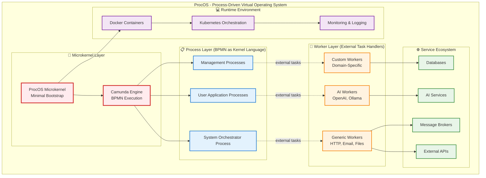

# ProcOS - Process-Oriented Operating System

## 🌟 Overview

**ProcOS** represents the evolution of DADMS into a revolutionary **Process-Oriented Operating System** that treats **BPMN (Business Process Model and Notation)** as the fundamental "kernel language" for all system operations. Unlike traditional operating systems that rely on imperative code, ProcOS defines system behavior entirely through visual process definitions.

## 🧠 Core Philosophy: "Processes Drive Everything"

In ProcOS, **every system operation is a process**:
- ⚙️ **System Boot**: BPMN process orchestrates startup sequence
- 📁 **File Operations**: Process-defined file management workflows  
- 🔄 **Service Communication**: BPMN orchestrates all inter-service messaging
- ❌ **Error Handling**: Recovery processes defined in visual workflows
- 👤 **User Interactions**: Process-driven user experience flows

This creates an unprecedented level of **flexibility** and **runtime reconfigurability** while maintaining complete **auditability** of all system operations.

## 🏗️ ProcOS Architecture Overview



**Key Innovations**:
- 🧠 **BPMN as Kernel**: Process definitions control all system behavior
- 🔬 **Minimal Microkernel**: Only bootstraps Camunda, then steps aside
- 👷 **External Task Pattern**: Decoupled workers handle actual service integration
- 🔄 **Runtime Flexibility**: Update system behavior by deploying new BPMN processes
- 📊 **Complete Observability**: Every operation traced through process instances

## 📚 Documentation

### **[ProcOS for Dummies](./ProcOS_For_Dummies.md)**
🎓 **BEGINNER'S GUIDE**

**Fun, accessible introduction to ProcOS concepts**:
- Simple analogies and easy-to-understand examples
- Step-by-step tutorial for your first process
- Troubleshooting guide with humor and practical tips
- "For Dummies" style with icons, warnings, and friendly tone
- Perfect starting point for newcomers to process-driven computing

### **[ProcOS Implementation Guide - Part 1](./ProcOS_Implementation_Guide_Part1.md)**
🔧 **TECHNICAL IMPLEMENTATION - PART 1**

**Foundation, setup, microkernel & BPMN processes**:
- Complete microkernel implementation in Python
- System requirements and environment setup
- Core BPMN process design and deployment
- Process deployment scripts and configuration

### **[ProcOS Implementation Guide - Part 2](./ProcOS_Implementation_Guide_Part2.md)**
🔧 **TECHNICAL IMPLEMENTATION - PART 2**

**Advanced integration, runtime, deployment & testing**:
- Generic and specialized AI worker implementations
- Service adapters and microservice integration patterns
- Message broker and service discovery systems
- Complete runtime scenarios and execution examples
- Docker containerization and Kubernetes deployment
- Auto-scaling configurations and production deployment
- Testing, debugging, and monitoring strategies

### **[ProcOS Architecture Specification](./ProcOS_Architecture_Specification.md)**
🏛️ **FORMAL SPECIFICATION**

**Complete ARC42-based architecture document** covering:

#### **1. Foundation & Strategy**
- Introduction and goals for process-driven VOS
- Technical and conceptual constraints
- Solution strategy and architectural patterns

#### **2. System Design**
- Context and scope with system boundaries
- Building blocks: microkernel, Camunda engine, workers
- Runtime view with detailed execution scenarios

#### **3. Implementation**
- Deployment view with Docker and Kubernetes configs
- Cross-cutting concerns: security, performance, logging
- Design decisions with detailed rationale

#### **4. Quality & Operations**
- Quality scenarios for flexibility and scalability
- Risk analysis and technical debt management
- Comprehensive glossary of terms

## 🏗️ Key Architectural Innovations

### **🔬 Minimal Microkernel Bootstrap**
Ultra-thin Python microkernel that only:
1. Starts Camunda BPMN engine
2. Deploys root orchestration processes  
3. Transfers control to BPMN-defined behavior
4. Monitors system health

### **🔄 External Task Pattern**
All service interactions use Camunda's external task pattern:
- **Loose Coupling**: Services decoupled from process definitions
- **Language Flexibility**: Workers in any programming language
- **Independent Scaling**: Scale workers separately from process engine
- **Fault Isolation**: Worker failures don't crash process engine

### **🛡️ BPMN-Defined Security**
Security policies embedded directly in process definitions:
- **Allowable Tasks**: Processes define permitted external tasks
- **Sandboxed Execution**: Resource-limited container environments
- **Access Control**: Process-level security and data encryption

### **📊 Complete Observability**
Every system operation traced through process instances:
- **Visual Debugging**: See exactly what happened in failed processes
- **Audit Trails**: Complete history of all system decisions
- **Performance Metrics**: Process-level performance monitoring
- **Distributed Tracing**: End-to-end request tracking

## 🎯 Comparison with Traditional Approaches

### **Traditional Operating System**
```
Hardware → Kernel → System Calls → Applications
• Imperative code defines system behavior
• Limited runtime reconfigurability  
• Complex debugging of system interactions
• Tight coupling between components
```

### **ProcOS Approach**
```
Hardware → Microkernel → Camunda Engine → BPMN Processes → Everything
• Visual processes define system behavior
• Complete runtime reconfigurability
• Clear visual debugging and audit trails
• Loose coupling through external tasks
```

## 🚀 Benefits for Different Stakeholders

### **👩‍💼 For Business Analysts**
- **Visual System Definition**: Understand and modify system behavior through BPMN diagrams
- **Direct Impact**: Change business logic without developer intervention
- **Complete Traceability**: See exactly how decisions flow through the system

### **👨‍💻 For Developers**
- **Clear Interfaces**: Simple external task contracts for service development
- **Language Freedom**: Implement services in any programming language
- **Easy Debugging**: Visual process traces show exactly what happened
- **Flexible Deployment**: Scale and update services independently

### **🔧 For Operations Teams**
- **Observable System**: Complete visibility into all system operations
- **Predictable Behavior**: Process definitions show exactly what will happen
- **Runtime Updates**: Deploy new processes without system restarts
- **Clear Recovery**: Process-defined error handling and recovery procedures

## 🌐 Use Cases and Applications

### **🏢 Enterprise Process Automation**
- Replace rigid workflow engines with flexible process definitions
- Enable business users to modify automation logic directly
- Provide complete audit trails for compliance requirements

### **🤖 Intelligent Decision Systems**
- Orchestrate AI services through visual process definitions
- Create explainable AI pipelines through BPMN workflows
- Enable rapid experimentation with different AI approaches

### **🔗 System Integration**
- Orchestrate complex multi-service interactions
- Provide visual representation of system integration flows
- Enable runtime modification of integration patterns

### **☁️ Cloud-Native Applications**
- Define microservice orchestration through processes
- Provide visual monitoring of distributed system interactions
- Enable flexible service mesh configurations

## 🛣️ Relationship to DADMS

ProcOS represents the **evolutionary next step** for DADMS:

```
DADMS Evolution Path:
├── DADMS 1.0: Decision intelligence with rigid orchestration
├── DADMS 2.0: Microkernel architecture with flexible execution  
└── ProcOS: Complete process-driven operating system paradigm
```

**Key Relationships**:
- **Extends DADMS Architecture**: Builds on microkernel foundations
- **Complements Microkernel Design**: Provides alternative implementation approach
- **Evolves Decision Intelligence**: From decision support to process-driven OS

## 📋 Implementation Status

- ✅ **Architecture Complete**: Comprehensive specification documented
- 📋 **Implementation Planning**: Technical roadmap and deployment strategies defined
- 🔄 **Proof of Concept**: Ready for prototype development
- 🎯 **Production Path**: Clear evolution from DADMS infrastructure

## 🔗 Related Documentation

- **[DADMS Microkernel Architecture](../microkernel/)** - Alternative process-thread execution model
- **[DADMS Architecture Overview](../README.md)** - Complete system architecture documentation
- **[Task Orchestrator Service](../task_orchestrator_specification.md)** - Current orchestration approach

---

**ProcOS represents a fundamental reimagining of how operating systems work, placing human-understandable process definitions at the core of all system operations while maintaining industrial-strength reliability and performance.**