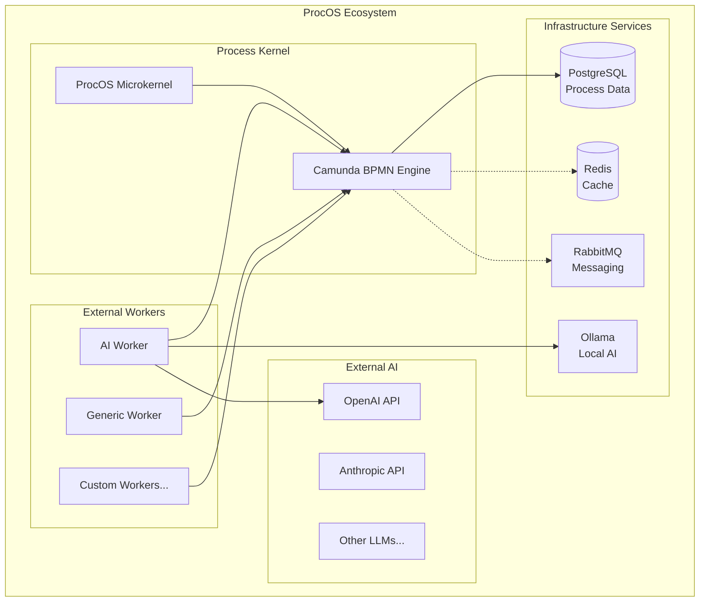
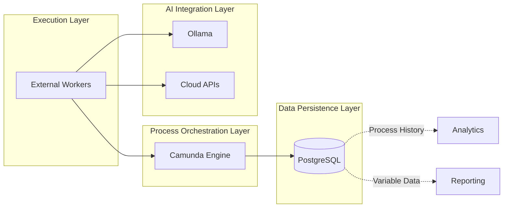
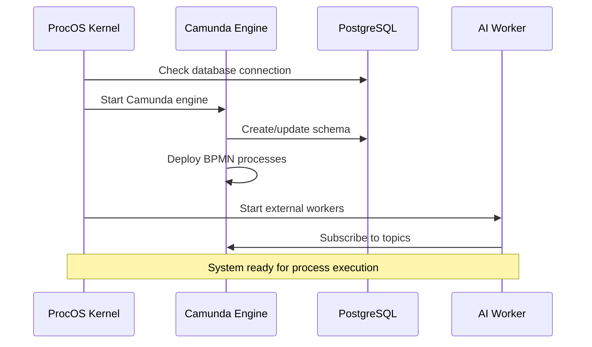
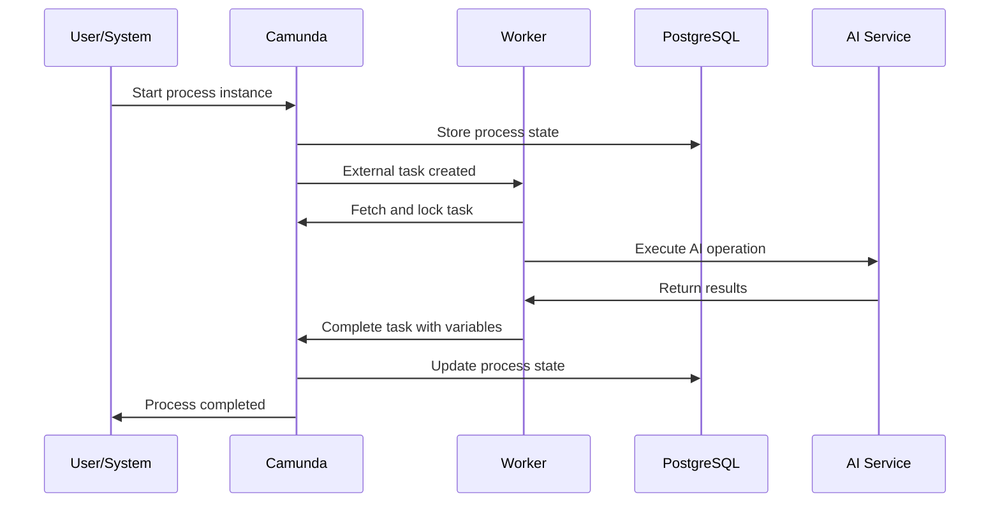

# ProcOS System Architecture Overview

## 🎯 System Vision

ProcOS (Process-Oriented Operating System) is a BPMN-driven microkernel architecture where BPMN processes serve as the "kernel language" and Camunda acts as the execution engine. This creates a process-centric operating environment where complex workflows orchestrate AI workers, data processing, and system operations.

## 🏗️ High-Level Architecture



## 🧠 Core Principles

### **1. BPMN as Kernel Language**
- **All operations** defined as BPMN processes
- **Visual workflow** representation of system behavior
- **Standard notation** enables collaboration and understanding
- **Version control** for process definitions

### **2. External Task Pattern**
- **Decoupled workers** poll for tasks from Camunda
- **Polyglot execution** - workers in any language
- **Horizontal scaling** - multiple workers per task type
- **Fault tolerance** - built-in retry and error handling

### **3. Process-Centric Data Storage**
- **Camunda as primary data store** using process variables
- **PostgreSQL persistence** for all process execution data
- **Automatic versioning** and audit trails
- **Context preservation** across process instances

## 📊 Data Flow Architecture



## 🔄 Process Execution Flow

### **1. Bootstrap Sequence**


### **2. Process Instance Execution**


## 🛠️ Component Responsibilities

### **ProcOS Microkernel**
```yaml
Purpose: Ultra-minimal bootstrap and system coordination
Language: Python
Responsibilities:
  - Start Camunda engine
  - Deploy BPMN processes
  - Coordinate worker startup
  - Monitor system health
  - Handle shutdown sequences

Key Features:
  - 6-phase bootstrap sequence
  - Minimal resource footprint
  - Error handling and recovery
  - Configuration management
```

### **Camunda BPMN Engine**
```yaml
Purpose: Core process orchestration and data storage
Technology: Java-based workflow engine
Responsibilities:
  - Execute BPMN processes
  - Manage external tasks
  - Store process variables
  - Provide REST API
  - Handle process versioning

Key Features:
  - BPMN 2.0 compliance
  - External task pattern
  - Built-in persistence
  - Web-based monitoring
  - Multi-tenancy support
```

### **PostgreSQL Database**
```yaml
Purpose: Persistent storage for all process execution data
Technology: Relational database
Responsibilities:
  - Store process instance state
  - Maintain variable history
  - Preserve task execution records
  - Enable audit trails
  - Support reporting queries

Key Features:
  - ACID compliance
  - Backup and recovery
  - Performance optimization
  - Concurrent access
  - Data integrity
```

### **AI Worker**
```yaml
Purpose: AI-powered task execution with hybrid strategy
Language: Python
Responsibilities:
  - Poll for AI-related external tasks
  - Execute AI operations (OpenAI, Ollama)
  - Handle prompt management
  - Implement fallback strategies
  - Report results to Camunda

Key Features:
  - Multi-provider support (OpenAI, Ollama)
  - Context management
  - Error handling
  - Usage tracking
  - Prompt templating
```

### **Generic Worker**
```yaml
Purpose: Standard automation tasks
Language: Python
Responsibilities:
  - HTTP requests
  - File operations
  - Data validation
  - Email sending
  - Basic transformations

Key Features:
  - Reusable patterns
  - Configuration-driven
  - Error handling
  - Logging and monitoring
```

## 🏛️ Architectural Benefits

### **1. Separation of Concerns**
- **Process logic** defined in BPMN (visual, versionable)
- **Execution logic** implemented in workers (scalable, testable)
- **Data persistence** handled by Camunda/PostgreSQL (reliable, queryable)
- **Infrastructure** managed by Docker (portable, reproducible)

### **2. Scalability Patterns**
- **Horizontal worker scaling** - run multiple instances per task type
- **Process versioning** - gradual rollout of new logic
- **Database partitioning** - separate tenants or process types
- **Caching layers** - Redis for performance optimization

### **3. Development Benefits**
- **Visual process design** accessible to non-developers
- **Language flexibility** for worker implementation
- **Built-in monitoring** via Camunda Cockpit
- **Standard patterns** for common operations

## 📈 Operational Characteristics

### **Performance**
```yaml
Throughput: 1000+ process instances per minute
Latency: <100ms for simple tasks, variable for AI tasks
Scaling: Linear with worker count
Database: Optimized for process workloads
```

### **Reliability**
```yaml
Persistence: All data stored in PostgreSQL
Recovery: Automatic process instance recovery
Retries: Configurable retry policies
Monitoring: Built-in health checks
```

### **Security**
```yaml
Authentication: Configurable (Basic, OAuth2, custom)
Authorization: Role-based access control
Data: Encrypted in transit and at rest
Isolation: Multi-tenant capable
```

## 🚀 Future Expansion

### **Planned Enhancements**
- **Context Manager Service** - Advanced AI prompt management
- **Decision Engine Integration** - DMN rule execution
- **Event Streaming** - Real-time process notifications
- **Analytics Dashboard** - Process performance insights
- **Model Registry** - AI model versioning and deployment

### **Integration Opportunities**
- **Enterprise Systems** - ERP, CRM, HR systems
- **Cloud Services** - AWS, Azure, GCP integrations
- **Monitoring Tools** - Prometheus, Grafana, ELK stack
- **CI/CD Pipelines** - Automated testing and deployment

---

## 🎯 Summary

ProcOS represents a paradigm shift from traditional application architectures to a process-centric operating environment. By using BPMN as the kernel language and Camunda as the execution engine, we create a system that is:

- **Visually comprehensible** through standard BPMN notation
- **Technically robust** with enterprise-grade persistence and monitoring
- **Infinitely extensible** through the external worker pattern
- **AI-ready** with built-in support for multiple AI providers

The PostgreSQL foundation ensures that all process execution data, AI context, and operational history is preserved, making ProcOS suitable for production workloads that require data persistence, audit trails, and reliable process execution.

---

*This architecture provides a solid foundation for building complex, AI-driven process automation systems while maintaining simplicity, reliability, and scalability.*