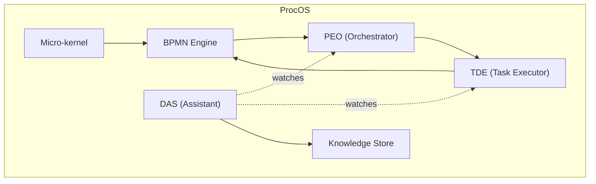

## ProcOS First-Order Summary — Index

### Read this set in order
- Start here: [procos_start_here.md](./procos_start_here.md)
- Architecture (simple): [architecture.md](./architecture.md)
- Digital Assistant Service (DAS): [das.md](./das.md)
- Micro‑kernel: [microkernel.md](./microkernel.md)
- PEO (orchestrator): [peo.md](./peo.md)
- TDE (task executor): [tde.md](./tde.md)
- Use cases: [use_cases.md](./use_cases.md)
- RAG pipeline walkthrough: [rag_walkthrough.md](./rag_walkthrough.md)

### One-picture overview

### What to look for
- Clear roles: micro‑kernel boots, PEO orchestrates, TDE executes, DAS learns
- BPMN‑only growth: change diagrams, not code
- MVP first: start small, add steps safely
- Walkthrough: try the [RAG pipeline](./rag_walkthrough.md)
