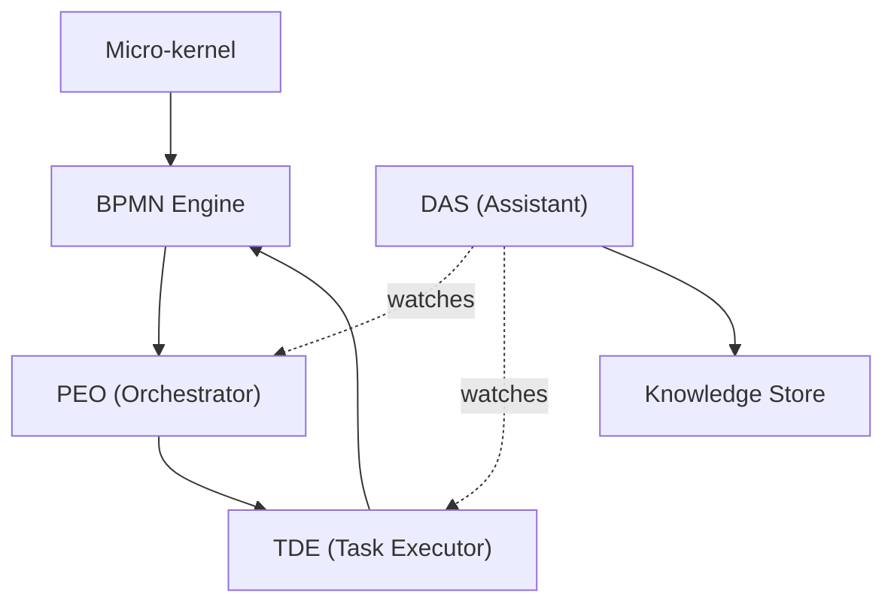

## ProcOS Architecture (simple)

### What it is
- A small core plus simple processes
- Everything runs as BPMN diagrams

### Key parts
- Micro‑kernel: boots and watches the system
- BPMN Engine: runs the diagrams
- PEO: orchestrates a process
- TDE: does one task
- Digital Assistant Service (DAS): sees actions and saves knowledge
- Knowledge Store: discussions, tasks, tests, results

### How it flows
- Micro‑kernel boots → Engine runs PEO → PEO calls TDE → DAS watches and saves

