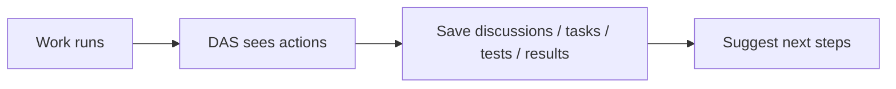

## Digital Assistant Service (DAS)

### In plain words
- DAS watches work as it happens
- It saves discussions, tasks, tests, and results as knowledge
- It suggests next steps when you design, run, or review

### Why it matters
- Knowledge does not get lost
- Teams learn faster with each run
- Changes become easier and safer

