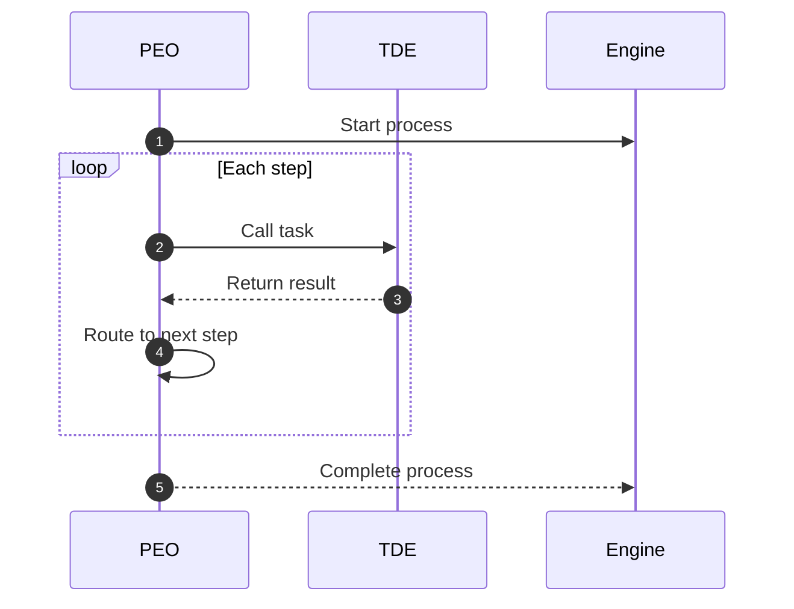

## PEO (Process Execution/Definition Orchestrator)

### In plain words
- PEO runs a process diagram from start to finish
- It routes steps and calls TDEs to do the work
- PEO does not do the work itself

### Simple view

