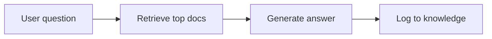
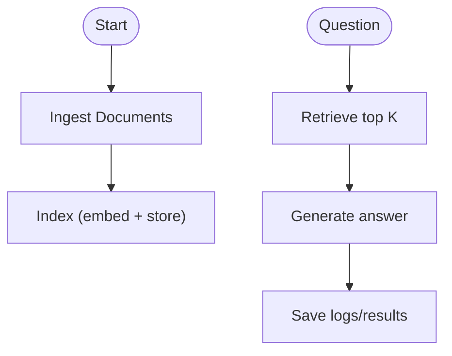
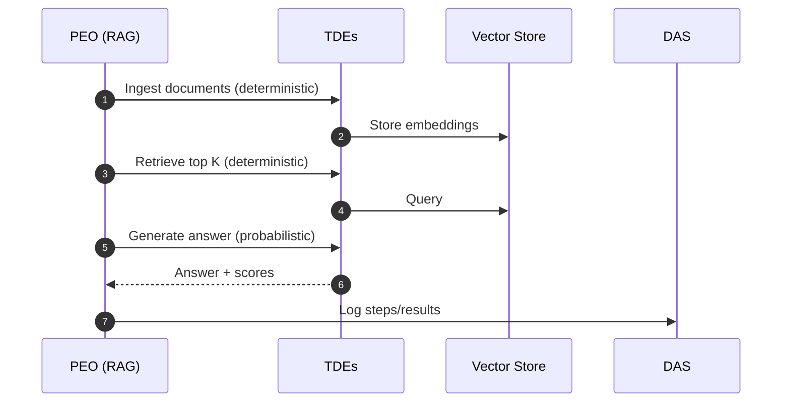
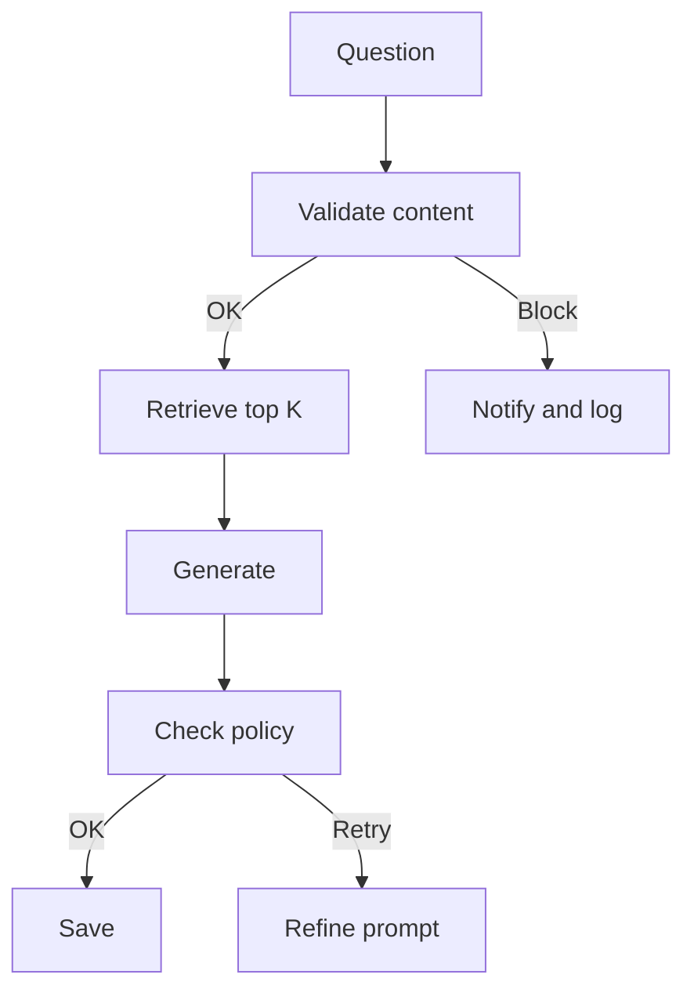

## Walkthrough: Build a Simple RAG Pipeline (ProcOS way)

### Goal
Answer user questions from your own documents. Start simple, then grow.

### What we will build (MVP)
- Ingest files
- Create embeddings and store them
- Retrieve top matches
- Generate an answer
- Log what happened

### Step 1: Describe the steps (plain words)
1) Read files
2) Split into chunks
3) Embed chunks
4) Store embeddings
5) On question: embed query
6) Retrieve top matches
7) Build prompt
8) Generate answer
9) Save results

### Step 2: Let DAS draft a BPMN process
- Say the steps to DAS
- DAS drafts a BPMN diagram of the pipeline
- You review and tweak (names, limits, models)

### Step 3: Wire tasks with TDEs (simple)
- Deterministic TDEs for: read files, split, call embedding API, store, query store
- Probabilistic TDE for: generate answer (LLM with guardrails)

### Step 4: Run, see, learn
- Run the process
- DAS saves discussions, tasks, tests, results
- Review logs and answers

### Why this way is powerful
- You can grow the pipeline without a rewrite
- DAS keeps the build knowledge (what, why, results)
- Each step is swappable (e.g., change embedding model) without breaking others

### Add next: guardrails, security, validation
- Add a “check content” step (e.g., no PII, no profanity)
- Add access checks (who can ask what)
- Add test cases (sample Q&A) and auto‑run them

### Next steps
- Ask DAS to add the guardrail steps
- Add sample tests and track success rate
- Add audit outputs for your compliance team

