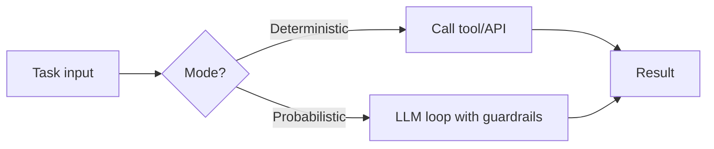

## TDE (Task Definition Executor)

### In plain words
- TDE does one task inside a process step
- It can call a tool (deterministic) or use an LLM loop (probabilistic)
- It reports back and stops

```mermaid
flowchart LR
    In[Task input] --> Mode{Mode?}
    Mode -- Deterministic --> Tool[Call tool/API]
    Mode -- Probabilistic --> Loop[LLM loop with guardrails]
    Tool --> Out[Result]
    Loop --> Out
```

