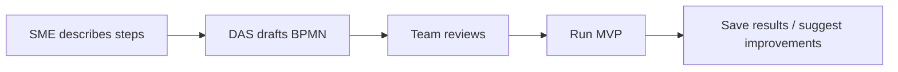
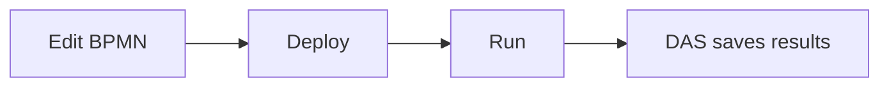
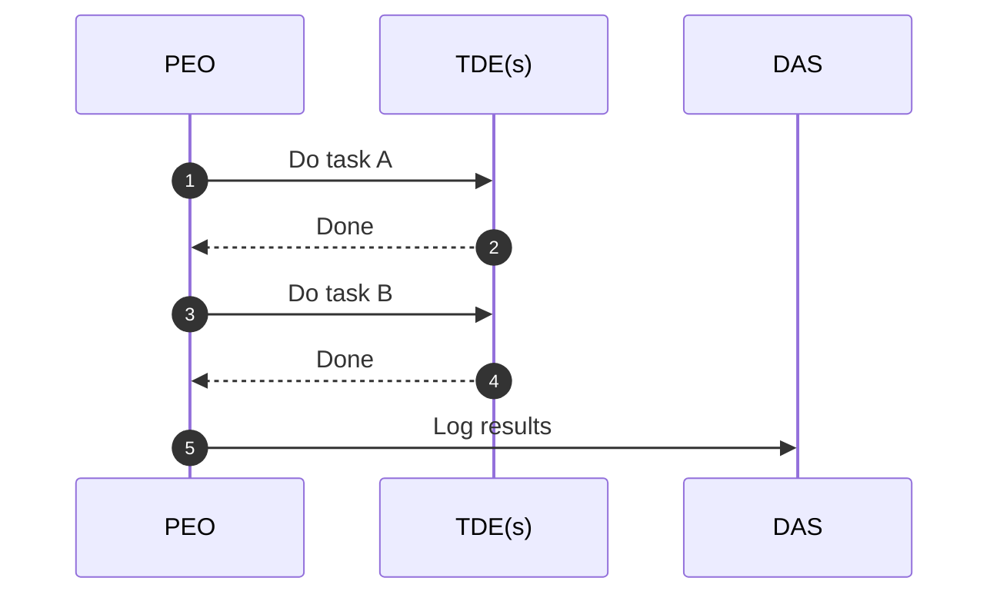

## Use Cases (simple)

### 1) Onboard a new process
- SME writes steps in plain words
- DAS drafts a BPMN diagram
- Team reviews and runs it as an MVP

### 2) Add a new task safely
- Edit the diagram
- TDE handles the new task
- DAS saves what happened

### 3) Repeatable operations
- PEO runs the same steps each time
- TDEs do the work
- Results are tracked and learned from

